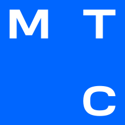

> Проект цифровой трансформации рекламной вертикали adTech МТС Stream

### Оглавление
#### Описание проблемы
* [Бизнес-контекст](01-business-context.md)
* [Бизнес-цели](02-business-goals.md)
* [Архитектурные драйверы](03-architectural-drivers.md)
* [Ограничения технологические и бизнесовые](04-restrictions.md)

#### Описание требований
* [Функциональные требования](05-functional-requirements.md)
* [Стейкхолдеры и их потребности](06-stakeholders.md)
* [Пользовательские сценарии](07-user-scenarios.md)
* [Критические сценарии и их характеристики](08-critical-scenarios-and-their-characteristics.md)
* [Оценка атрибутов качества на основании критичных сценариев](09-evaluation-of-quality-attributes.md)

#### Описание решения
* [Функциональная структура предметной области:](10-functional-structure.md)
* [Функциональная декомпозиция по технической структуре](11-functional-decomposition.md)
* [Область действия и контекст системы, диаграмма контейнеров](12-context-diagram.md)
* [Декомпозиция слоя данных](13-data-layer-decomposition.md)
* [Диаграмма развертывания](14-deployment-diagram.md)
* [Диаграммы последовательности для пользовательских сценариев](15-sequence-diagrams.md)
* [Лог архитектурных решений (ADR)](16-adr.md)