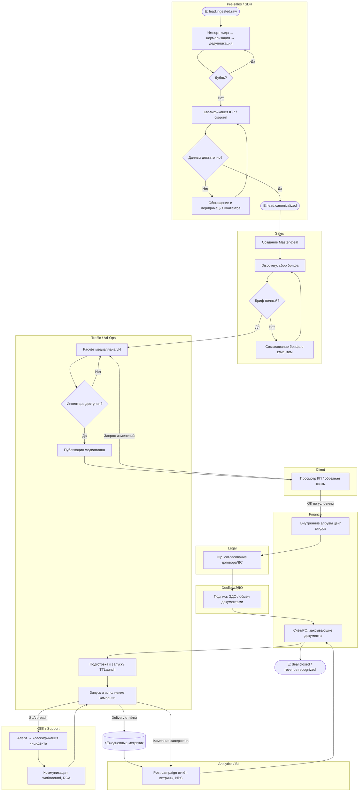
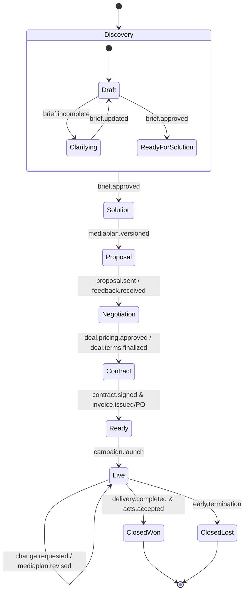
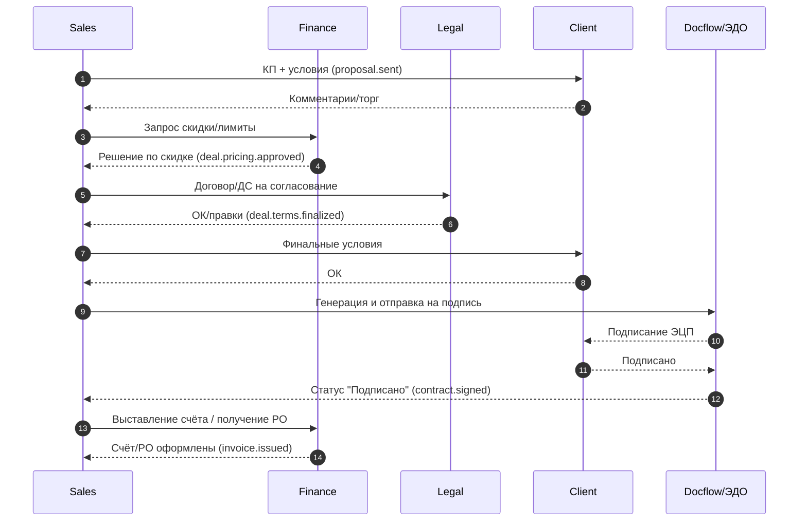
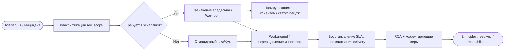
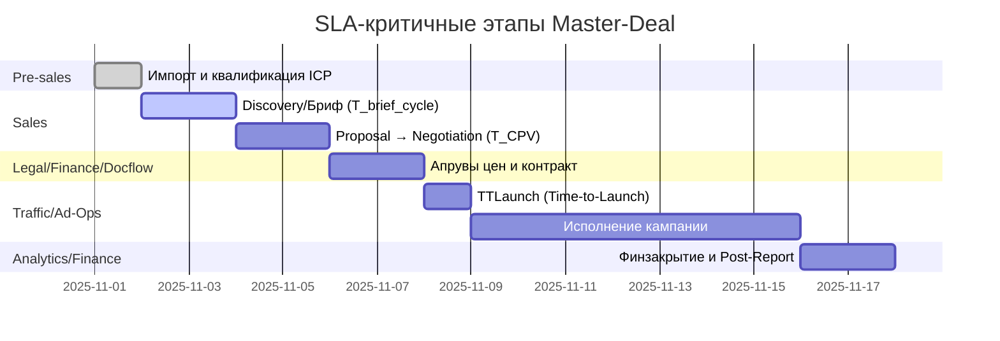
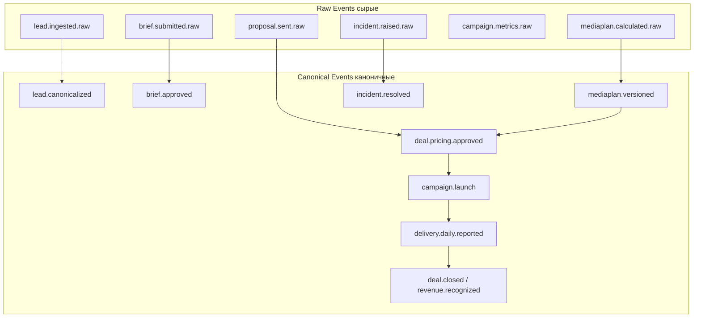

# Пользовательские сценарии*

---

## 1. Импорт и первичная обработка лида (Pre-Sales)

- **Акторы:** Pre-sales, источники лидов, CRM
- **Цель:** Завести валидный лид и связать его с компанией/аккаунтом
- **Триггер:** Поступление лида из источника
- **Предусловия:** Настроены источники, маппинг полей, правила дедупликации
- **Основной поток:** Импорт → нормализация → дедупликация → матч с компанией → черновик Master-Deal
- **Альтернативы:** Конфликт дублей; отсутствие обязательных полей
- **Результат/артефакты:** Лид *New/To Qualify*, черновик Master-Deal
- **Метрики/SLA:** T_inbound→created ≤ 15 мин; % дублей < 3%
- **Интеграции/события:** `lead.ingested.raw`, `lead.canonicalized`

## 2. Квалификация ICP и приоритизация (Pre-Sales)

- **Акторы:** Pre-sales
- **Цель:** Присвоить ICP-оценку и приоритет
- **Триггер:** Лид в статусе *To Qualify*
- **Предусловия:** Правила ICP, доступ к внешним данным
- **Основной поток:** Проверка отрасли/размера → скоринг → решение *Qualified/Disqualified* → запись в Master-Deal
- **Альтернативы:** Недостаточно данных → запрос доп. сведений
- **Результат/артефакты:** Обновлённый приоритет и статус
- **Метрики/SLA:** T_qualify ≤ 1 р.д.; точность скоринга
- **Интеграции/события:** `lead.scored`, `deal.icp.assessed`

## 3. Обогащение и верификация контактов

- **Акторы:** Pre-sales/SDR
- **Цель:** Найти ЛПР/ЛВП и проверить контакты
- **Триггер:** Qualified-лид
- **Предусловия:** Доступ к источникам, валидаторы e-mail/телефонов
- **Основной поток:** Поиск персон → верификация → привязка к компании → фиксация каналов связи
- **Альтернативы:** Низкая валидация → повторная проверка/замена
- **Результат/артефакты:** Валидный набор контактов в Master-Deal
- **Метрики/SLA:** % доставляемости e-mail; % верифицированных телефонов
- **Интеграции/события:** `contact.verified`, `account.personas.linked`

## 4. Создание и инициализация Master-Deal

- **Акторы:** Sales-manager
- **Цель:** Открыть мастер-сделку и связать все сущности
- **Триггер:** Решение о работе с клиентом
- **Предусловия:** Квалифицированный лид и контакты
- **Основной поток:** Создание Master-Deal → связь с лидом/аккаунтом/контактами → роли и стадия Pipeline
- **Альтернативы:** Конфликт с существующей сделкой → merge/отмена
- **Результат/артефакты:** Master-Deal в статусе *Discovery*
- **Метрики/SLA:** T_create ≤ 10 мин
- **Интеграции/события:** `deal.created`, `deal.stage.changed:Discovery`

## 5. Сбор брифа и Discovery

- **Акторы:** Sales, Account, Traffic
- **Цель:** Зафиксировать цели, KPI, ограничения, бюджет
- **Триггер:** Встреча/бриф от клиента
- **Предусловия:** Шаблон брифа, список вопросов
- **Основной поток:** Запись требований → подтверждение клиентом → публикация в Master-Deal
- **Альтернативы:** Неполный бриф → цикл уточнений
- **Результат/артефакты:** Утверждённый бриф (версионирование)
- **Метрики/SLA:** T_brief_cycle; % брифов без доработок
- **Интеграции/события:** `brief.submitted`, `brief.approved`

## 6. Расчёт медиаплана (Traffic)

- **Акторы:** Traffic-manager
- **Цель:** Подготовить медиаплан под бриф
- **Триггер:** Утверждённый бриф
- **Предусловия:** Доступ к инвентарю, CPM/CPC-справочникам
- **Основной поток:** Подбор сегментов → расчёт охватов/стоимости → ревью → публикация версии
- **Альтернативы:** Недоступный инвентарь → замены/перерасчёт
- **Результат/артефакты:** Медиаплан vN с KPI
- **Метрики/SLA:** T_media_plan; % пересогласований
- **Интеграции/события:** `mediaplan.versioned`, `deal.kpi.defined`

## 7. Подготовка и отправка КП

- **Акторы:** Sales, Legal (при необходимости)
- **Цель:** Сформировать и отправить коммерческое предложение
- **Триггер:** Готовый медиаплан
- **Предусловия:** Шаблоны КП, цены, условия оплаты
- **Основной поток:** Генерация → проверка → отправка → трекинг открытия
- **Альтернативы:** Несоответствие условиям → корректировка
- **Результат/артефакты:** Отправленное КП + лог взаимодействий
- **Метрики/SLA:** T_CPV; Open/Reply rate
- **Интеграции/события:** `proposal.sent`, `proposal.viewed`

## 8. Согласование условий и ценообразование

- **Акторы:** Sales, Финансы, Legal, Клиент
- **Цель:** Достигнуть финальных условий
- **Триггер:** Ответ клиента по КП
- **Предусловия:** Политики скидок, лимиты одобрений
- **Основной поток:** Торг → запрос скидки → внутренние апрувы → фиксация условий
- **Альтернативы:** Превышен лимит → эскалация руководителю
- **Результат/артефакты:** Pricebook/скидки, зафиксированные в Master-Deal
- **Метрики/SLA:** Число итераций; T_approve
- **Интеграции/события:** `deal.pricing.approved`, `deal.terms.finalized`

## 9. Контрактование и документооборот

- **Акторы:** Legal, Docflow, Клиент, Финансы
- **Цель:** Подписать договор/ДС и оформить первичку
- **Триггер:** Финальные условия
- **Предусловия:** Шаблоны договоров, ЭДО
- **Основной поток:** Генерация → согласование юристами → ЭЦП → счёт/заказ
- **Альтернативы:** Несоответствие реквизитов → правки
- **Результат/артефакты:** Подписанный договор/ДС, счёт/акт
- **Метрики/SLA:** T_contract; % возвратов из ЭДО
- **Интеграции/события:** `contract.signed`, `invoice.issued`

## 10. Подготовка к запуску (TTLaunch)

- **Акторы:** Traffic, Ad-Ops, Account
- **Цель:** Готовность к старту кампании
- **Триггер:** Договор подписан и оплата/PO
- **Предусловия:** Креативы, трекинг, пиксели, доступы
- **Основной поток:** Чек-лист готовности → бронирование инвентаря → настройка трекинга → go/no-go
- **Альтернативы:** Нет креативов → плейсхолдеры/сдвиг
- **Результат/артефакты:** Статус *Ready to Launch*
- **Метрики/SLA:** Time-to-Launch; % переносов стартов
- **Интеграции/события:** `campaign.ready`, `campaign.launch`

## 11. Запуск и исполнение кампании

- **Акторы:** Traffic/Ad-Ops, Account, Клиент (viewer)
- **Цель:** Провести кампанию по плану
- **Триггер:** Go-решение
- **Предусловия:** Все проверки пройдены
- **Основной поток:** Старт → ежедневный мониторинг KPI/SLA → корректировки
- **Альтернативы:** Отказы площадки/недолив → план реакций
- **Результат/артефакты:** Выполненный или скорректированный медиаплан
- **Метрики/SLA:** Delivery %, отклонение от KPI, инциденты/1000 ч
- **Интеграции/события:** `delivery.daily.reported`, `incident.raised/resolved`

## 12. Изменение объёма/ДС во время кампании

- **Акторы:** Account, Sales, Клиент, Legal
- **Цель:** Зафиксировать изменения условий в ходе исполнения
- **Триггер:** Запрос клиента/изменение инвентаря
- **Основной поток:** Расчёт влияния → согласование → ДС → обновление медиаплана
- **Альтернативы:** Превышение лимитов скидок → апрув руководителя
- **Результат/артефакты:** Новая версия условий и плана
- **Метрики/SLA:** T_change; % изменений с риском SLA
- **Интеграции/события:** `deal.change.approved`, `mediaplan.revised`

## 13. Закрытие сделки и финзакрытие

- **Акторы:** Финансы, Account, Клиент
- **Цель:** Зафиксировать факт услуг и закрыть расчёты
- **Триггер:** Завершение кампании
- **Основной поток:** Финальный отчёт → акты → сверка → закрытие в Master-Deal
- **Альтернативы:** Расхождения → разбор/доп. закрывающие
- **Результат/артефакты:** *Closed Won/Lost*, закрытые документы
- **Метрики/SLA:** DSO; % расхождений
- **Интеграции/события:** `deal.closed`, `revenue.recognized`

## 14. Пост-анализ и NPS

- **Акторы:** Account, Аналитика, Клиент
- **Цель:** Оценить результат и собрать обратную связь
- **Триггер:** Финзакрытие
- **Основной поток:** Post-campaign отчёт → ретро → опрос NPS → backlog улучшений
- **Результат/артефакты:** Отчёт, оценка NPS, backlog
- **Метрики/SLA:** NPS, Retention/Up-sell rate
- **Интеграции/события:** `report.postcampaign.published`, `nps.submitted`

## 15. Эскалации и инциденты SLA

- **Акторы:** ОКК/Support, Account, Traffic, Площадки
- **Цель:** Быстрое восстановление SLA
- **Триггер:** Срабатывание алерта/инцидента
- **Основной поток:** Классификация → владелец → коммуникация → workaround → RCA
- **Результат/артефакты:** Закрытый инцидент с RCA и мерами
- **Метрики/SLA:** MTTA/MTTR; SLA breach count
- **Интеграции/события:** `sla.breach`, `incident.resolved`, `rca.published`

## 16. Управление качеством данных и дедупликация

- **Акторы:** Data Steward, Pre-sales
- **Цель:** Поддерживать чистоту Master-Deal/CRM
- **Триггер:** Найден дубль/расхождение
- **Основной поток:** Выявление → merge → рестейминг связей → аудит
- **Результат/артефакты:** Консистентные записи
- **Метрики/SLA:** % дублей; время исправления
- **Интеграции/события:** `entity.merged`, `dq.issue.closed`

## 17. Управление справочниками и прайс-буками

- **Акторы:** Администратор домена, Финансы
- **Цель:** Актуализировать справочники (площадки, форматы, цены)
- **Триггер:** Изменение рынка/стоимостей
- **Основной поток:** Обновление → валидация → публикация версии
- **Результат/артефакты:** Новые версии справочников
- **Метрики/SLA:** T_publish; доля устаревших значений
- **Интеграции/события:** `catalog.versioned`, `pricebook.updated`

## 18. Аналитика и витрины данных

- **Акторы:** Аналитик, Руководители
- **Цель:** Построить отчёты и витрины по Master-Deal
- **Триггер:** Регулярная отчётность/Ad-hoc запрос
- **Основной поток:** Экспорт каноничных событий → агрегации → дашборды (SLA, воронка, выручка)
- **Результат/артефакты:** BI-дашборды и витрины (DHW/DWH)
- **Метрики/SLA:** Свежесть данных; доступность BI
- **Интеграции/события:** `dataset.refreshed`, `kpi.dashboard.updated`

---

### Примечания к реализации

* **Стадийность (Pipeline):** *Discovery → Solution → Proposal → Negotiation → Contract → Ready → Live → Closed* (переходы через `deal.stage.changed`).
* **Версионирование артефактов:** бриф, медиаплан, КП, условия, договор/ДС — через события `*.versioned`.
* **Событийная модель:** сырые (`*.raw`) и каноничные (`*.canonical`) события для аналитики и контроля SLA.
* **SLA-чувствительные точки:** квалификация, медиаплан, контракт, запуск, инциденты.
---

### Набор диаграмм, которые отражают пользовательские сценарии в стиле BPMN (с дорожками/ролями, событиями и под-процессами)

### 1. Сквозной процесс Master-Deal (swimlanes по ролям)

---

### 2. Состояния мастер-сделки (Pipeline) и ключевые события

---

### 3. Согласование условий и контрактование (взаимодействие акторов)

---

### 4. Инциденты SLA и эскалации (операционный контур)

---

### 5. Gantt по SLA-чувствительным этапам (плановая шкала)

---

### 6. Событийная модель (сырые → каноничные)

