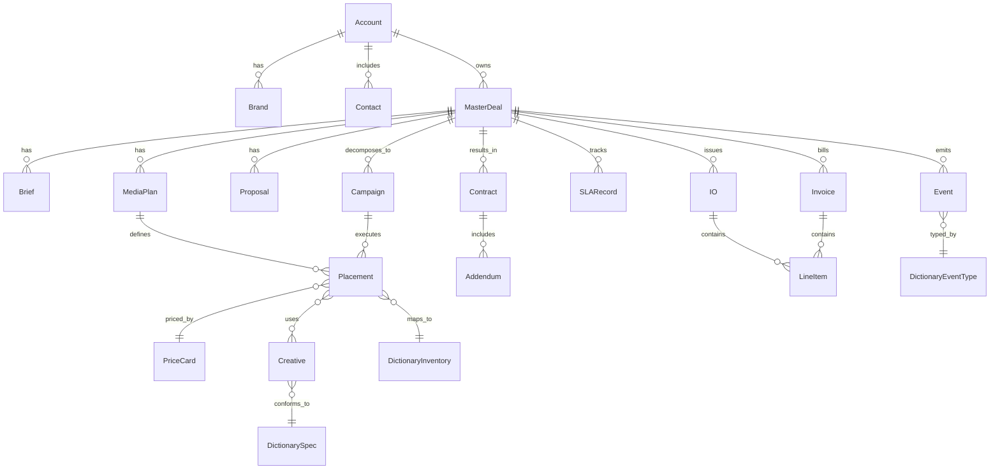
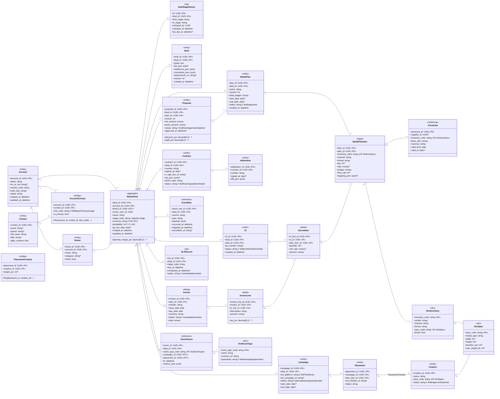

# Функциональная структура предметной области «Master-Deal»

## 1. Иерархия функций

1. **Управление лидами и квалификация**

* Приём лидов (формы, импорт, API), дедупликация
* ICP/fit-скоринг, обогащение данных, валидация контактов
* Передача в проспект/инициацию мастер-сделки

2. **Аккаунты и иерархия клиентов**

* Компания, холдинг, бренды, продукты/линейки
* Контакты и роли (decision maker, buyer, finance)
* Правила консолидации и MDM-идентификаторы

3. **Инициация и жизненный цикл Master-Deal**

* Создание карточки мастер-сделки и версионирование
* Статусы/этапы: Инициация → Пресейл → КП → Переговоры → Подписание → Запуск → Исполнение → Закрытие
* Связи с под-сделками/кампаниями/Work Orders

4. **Бриф и требования клиента**

* Захват брифа (анкеты, файлы), нормализация
* Цели, KPI, гео/аудитории, ограничения (brand safety, частоты)

5. **Медиапланирование**

* Подбор инвентаря/каналов, частоты, даты, бюджеты
* Пакеты размещений, прайс-карты, сценарии оптимизации
* Валидатор медиаплана и конфликты

6. **Коммерческое предложение (КП)**

* Генерация версий КП из медиаплана
* Дисконт-политики, наценки, спецусловия
* История согласований и сравнение версий

7. **Ценообразование и маржинальность**

* Правила прайсинга, нетто/брутто, комиссии
* Плановая/фактическая маржа, пороги эскалаций
* Валюты и курсы

8. **Договоры и юридические артефакты**

* Договор/доп. соглашения, SLA-приложения
* Юр. проверка, E-подпись, хранение шаблонов
* Сопоставление условий договора с КП/медиапланом

9. **Заказы на выполнение (IO/WO) и бронирование инвентаря**

* Формирование IO/Insertion Order, бронь инвентаря
* Разбивка по площадкам/форматам/таймслотам
* Управление изменениями (change orders)

10. **Интеграция с Ad-системами и трейдингом**

* Экспорт кампаний в DSP/AdServer/SSP
* Теги/пиксели, UTM/UTID, согласование трекинга
* Обратный импорт статусов и ограничений площадок

11. **Запуск и исполнение кампаний**

* Чек-листы pre-launch, запуск по календарю
* Оперативные правки (caps, bids, creatives)
* Заморозка/перезапуск по правилам

12. **Управление креативами**

* Приём, модерация, соответствие спецификациям
* Версии, адаптации, хранилище ассетов
* Мэппинг креативов к плейсментам

13. **SLA и контроль исполнения (сквозной)**

* Нормативы по этапам pipeline
* Трекер отклонений, эскалации
* Gantt/борд стадий, time-to-launch

14. **События и телеметрия (сырые/канонические)**

* Приём сырых событий (impression/click/conversion, статусы, ошибки)
* Канонизация/нормализация, словари событий
* Шина событий для триггеров, webhooks

15. **Отчётность и аналитика**

* План-факт по бюджетам, delivery, KPI
* Дэшборды кампаний и мастер-сделок
* Экспорт в BI/DWH, витрины данных

16. **Финансы и биллинг**

* PO/сметы, акты/инвойсы, графики оплат
* Реконсиляция поставщика/клиента, недопоставка/оверделивери
* Налоги, удержания, агентские схемы

17. **Управление рисками и соответствием**

* Лимиты кредитования, KYC/санкционные проверки
* Brand safety, юр. ограничения отраслей
* Журнал инцидентов и пост-морем

18. **Workflow и согласования**

* Маршруты согласования (коммерция, юристы, финансы)
* Правила эскалаций и SLA по задачам
* Комментарии, упоминания, чек-листы

19. **Уведомления и коммуникации**

* Шаблоны писем/уведомлений, мультиканальность
* Триггеры по событиям и дедлайнам
* Ленты активности в карточке сделки

20. **Управление доступом и безопасность**

* Роли и зоны ответственности (RBAC/ABAC)
* Аудит действий и журнал изменений
* Псевдонимизация/шифрование персональных данных

21. **Нормативно-справочная информация (NSI/MDM)**

* Справочники: каналы, форматы, площадки, валюты, единицы измерения
* Контрагенты/реквизиты, прайс-листы поставщиков
* Версионирование и жизненный цикл справочников

22. **Интеграции и шины данных**

* API Gateway (CRUD по сущностям, search, webhooks)
* Event Bus/Kafka темы домена
* Коннекторы к CRM, ERP, DWH, биллингу

23. **Качество данных и соответствие схемам**

* Валидации, дедупликация, правила слияния
* Контроль целостности ссылок (deal → план → IO → отчёт)
* Мониторинг дрейфа схем/контрактов API

24. **Администрирование и конфигурирование домена**

* Настройка стадий, правил прайсинга, SLA, шаблонов
* Импорт/экспорт настроек (environments)
* Управление версиями конфигураций

25. **Помощники на базе LLM/автоматизация**

* Генерация КП/медиапланов/писем на основе брифа
* Объяснения отклонений KPI, подсказки по оптимизации
* Резюмирование переписок и протоколов встреч

26. **Мониторинг и наблюдаемость**

* Метрики приложений/интеграций, алёрты
* Трассировка сквозных сценариев (deal id correlation)
* Здоровье очередей, ретраи, dead-letter

27. **Импорт/миграции и архив**

* Пакетный импорт исторических сделок/документов
* Архивация закрытых сделок, политики хранения
* Удаление/анонимизация по требованиям регуляторов

28. **UX-слой и рабочие места ролей**

* Карточка Master-Deal (360°)
* Борды по стадиям, календари запусков
* Мастер-формы для быстрого онбординга сделок

---

## 2. Ядро доменных сущностей (ER)

Ключевые сущности: `MasterDeal`, `Account`/`Brand`, `Contact`, `Brief`, `MediaPlan`, `Proposal`, `Contract`, `Campaign`, `Placement`, `Creative`, `IO`, `Invoice`, `Event`, `SLARecord`, `PriceCard`, `Dictionary*`.

**Мини-описание сущностей**

* **MasterDeal** — агрегирующая сущность сквозного процесса (ID, статус, владелец, валюты, маржа, ссылки).
* **Brief** — цели/KPI, аудитории, ограничения, вложения.
* **MediaPlan** — каналы, плейсменты, ставки, периоды, бюджеты.
* **Proposal** — версии КП, условия, скидки/наценки, согласования.
* **Contract/Addendum** — условия, SLA-приложения, стороны, подписи.
* **Campaign** — реализации в ad-системах, статусы, трекинг.
* **Placement** — площадка/формат/инвентарь, частоты/капсы.
* **Creative** — ассеты, версии, спецификации/модерация.
* **IO/LineItem** — заказы на выполнение, детализация.
* **Invoice/LineItem** — счет/акт, суммы/налоги/статусы оплат.
* **Event** — сырые/канонические события, корреляция по deal-id.
* **SLARecord** — нормативы/факты по стадиям pipeline.
* **PriceCard** — прайс-карты поставщиков/наценки.
* **Dictionary*** — справочники домена (площадки, форматы, валюты и т.п.).

---

## 3. Точки интеграции и потоки данных

* **CRM ↔ Master-Deal**
  Импорт лидов/аккаунтов/контактов; обратная синхронизация стадий сделки, сумм, вероятностей; webhooks на изменение статусов/согласований.

* **ERP/Биллинг ↔ Финансы**
  PO/инвойсы/акты, платежные статусы, налоги; реконсиляция план-факт.

* **Ad-системы (DSP/AdServer/SSP) ↔ Кампании**
  Экспорт кампаний/плейсментов/креативов; обратные статусы, delivery и ошибки; трекинг-пиксели/UTM.

* **Event Bus (Kafka) ↔ Телеметрия/SLA**
  Темы сырых событий (`ad.raw.*`), канонизированные темы (`ad.canon.*`); триггеры SLA/уведомлений.

* **DWH/BI ↔ Отчётность**
  Инкрементальная выгрузка витрин (deal, plan, io, spend, delivery, kpi); дашборды план-факт, маржа, TtL.

* **MDM/НСИ**
  Справочники контрагентов/площадок/форматов/валют; версии и согласование изменений.

---

# Логическая модель данных для обеспечения функциональной структуры

## Пояснения и принципы логической модели

* **Нормализация:** сущности разделены на агрегаты (MasterDeal), справочники (Dict*), документы (Contract/IO/Invoice), операционные детали (MediaPlanItem/IOLineItem) и телеметрию (EventRaw/EventCanon).
* **Версионирование:** `Brief.version`, `MediaPlan.version`, `Proposal.version`; истории стадий в `DealStageHistory`.
* **M:N связи:** через мосты `AccountContact`, `PlacementCreative`.
* **Справочники и валидация:** `DictInventory`, `DictSpec`, `DictEventType` задают допустимые значения и схемы событий.
* **Согласованность цепочки план-факт:** `MediaPlanItem → IOLineItem → InvoiceLine` обеспечивает трассируемость сумм и delivery.
* **SLA:** `SLARecord` и отметки в `DealStageHistory` позволяют считать TtL и нарушения.
* **Сырые/канонические события:** `EventRaw` хранит входящие payload’ы; `EventCanon` — нормализованные метрики, связанные с сущностями домена.