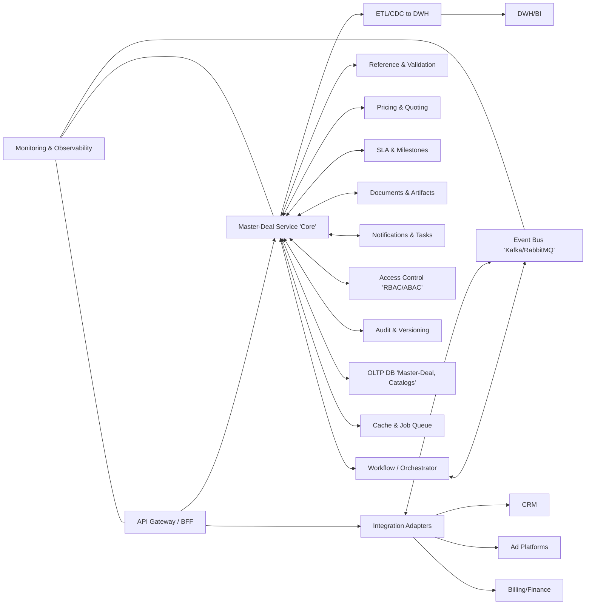

# Функциональная декомпозиция метадомена **Master-Deal** (по технической структуре)

---

## 1) Каркас решений (уровень L0)

* **Каналы и интеграции**: CRM, рекламные платформы, биллинг/финансы, DWH/BI, сервисы аутентификации.
* **Операционный контур Master-Deal**: ядро домена (Master-Deal Service), оркестрация процессов, справочники, валидаторы.
* **Событийная шина и API-шлюз**: публикация/подписка бизнес-событий, внешние/внутренние API.
* **Хранение и кэш**: транзакционное хранилище (OLTP), файлы/артефакты, кэш и очередь задач.
* **Надсистемные сервисы**: безопасность, аудит, мониторинг/логирование, DevOps/CI-CD, наблюдаемость.

---

## 2) Схема 

---

## 3) Декомпозиция функций (L1 → L2/L3)

### 3.1. **API Gateway / BFF**

* **L2:** Унифицированные REST/GraphQL-эндпоинты; лимитирование, кеширование, трансформация; авторизация (JWT/OAuth2).
* **L3:** Версионирование API; адаптация контрактов под фронты (веб/мобайл); защита (WAF, rate-limit, schema validation).

### 3.2. **Master-Deal Service (Core)**

* **L2:** Управление мастером-сделки (жизненный цикл, статусы, атрибуты), агрегирование разрозненных данных, доменные инварианты.
* **L3:** Команды и доменные события (CQRS по необходимости), консистентность через саги, оптимистические блокировки.

### 3.3. **Workflow / Orchestrator**

* **L2:** Моделирование стадий Pipeline, бизнес-правила переходов, саги/компенсации, SLA-таймеры.
* **L3:** BPMN-шаблоны, ручные/автоматические шаги, чек-листы соответствия, эскалации.

### 3.4. **Reference & Validation**

* **L2:** Единые справочники (клиенты, продукты, каналы, роли), нормализация и дедупликация, валидация входных событий.
* **L3:** Канонизация полей (ID, валюты, единицы измерения), профили качества данных, правила соответствия.

### 3.5. **Pricing & Quoting**

* **L2:** Расчёт медиапланов, тарифов и скидок; генерация КП; симуляции.
* **L3:** Правила ценообразования, матрицы бандлов, калькулятор маржинальности, what-if анализ.

### 3.6. **SLA & Milestones**

* **L2:** Контроль сроков по стадиям, чек-поинты качества, блокировки/разблокировки хода работ.
* **L3:** Политики оповещений, авто-эскалации, журналы нарушений, экспорт в дашборды.

### 3.7. **Documents & Artifacts**

* **L2:** Шаблоны брифов, КП, договоров; хранение версий файлов.
* **L3:** Генерация по шаблонам, цифровые подписи, связка артефактов со стадиями.

### 3.8. **Notifications & Tasks**

* **L2:** Инбокс задач, уведомления (email, chat, webhook), напоминания.
* **L3:** Маршрутизация по группам/ролям, SLA-таймауты задач, батч-уведомления.

### 3.9. **Access Control (RBAC/ABAC)**

* **L2:** Роли и атрибутные политики, разделение прав по объектам сделки и стадиям.
* **L3:** Маскирование полей, делегирование прав, временные пропуски.

### 3.10. **Audit & Versioning**

* **L2:** Полный журнал изменений, бизнес-трейсы, воспроизводимость состояния.
* **L3:** Неподменяемые логи, подписи событий, хранение старых версий объекта.

### 3.11. **Event Bus (Kafka/RabbitMQ)**

* **L2:** Публикация/подписка сырых и каноничных событий, ретраи/дед-леттеры.
* **L3:** Схемы (Avro/JSON-Schema), управление совместимостью, реплеи.

### 3.12. **Integration Adapters**

* **L2:** Коннекторы CRM, рекламных платформ, биллинга/финансов, каталогов.
* **L3:** Анти-коррапшн слой, маппинги атрибутов, оркестрация API-квот.

### 3.13. **OLTP DB, Cache & Jobs**

* **L2:** Транзакционное хранилище (Master-Deal, каталоги, справочники), кэш (hot-paths), очереди фоновых задач.
* **L3:** Индексы и шардирование, TTL-кэш, идемпотентность задач.

### 3.14. **ETL/CDC → DWH/BI**

* **L2:** Инкрементальная выгрузка (CDC), витрины для отчётности, метрики SLA.
* **L3:** Линейка данных (data lineage), слой качества, SLO отчётности.

### 3.15. **Security & Compliance**

* **L2:** PII/конфиденциальность, шифрование в покое/в полёте, секрет-менеджмент.
* **L3:** Политики хранения, удаление по сроку, соответствие локальному праву.

### 3.16. **Monitoring & Observability**

* **L2:** Метрики (RED/USE), логи, трейсы; алерты.
* **L3:** Карты зависимостей, SLO/ошибки бюджета, пост-мортемы.

### 3.17. **DevOps / CI-CD**

* **L2:** Конвейеры сборки/тестов/деплоя, миграции БД, управление конфигурациями.
* **L3:** Канареечные релизы, feature-флаги, авто-rollback.

---

## 4) Потоки данных и события (кратко)

* **Сырые события** приходят из интеграций (CRM, Ad-платформы) → проходят нормализацию/валидацию → попадают в шину.
* **Каноничные события** формируются ядром Master-Deal (создание/обновление сделки, изменение стадии, нарушение SLA, выпуск КП) и публикуются в Event Bus для потребителей (DWH, уведомления, сторонние сервисы).
* **CDC/ETL** переносит подтверждённые данные в DWH для аналитики и отчётности.

---

## 5) Границы ответственности (anti-corruption)

* **Master-Deal Service** — единственный источник правды о состоянии мастер-сделки.
* **Integration Adapters** — экранируют внешние контракты, выполняют маппинг/обогащение.
* **Workflow** — отвечает за жизненный цикл и правила переходов, не хранит доменные данные сделки дольше, чем нужно.