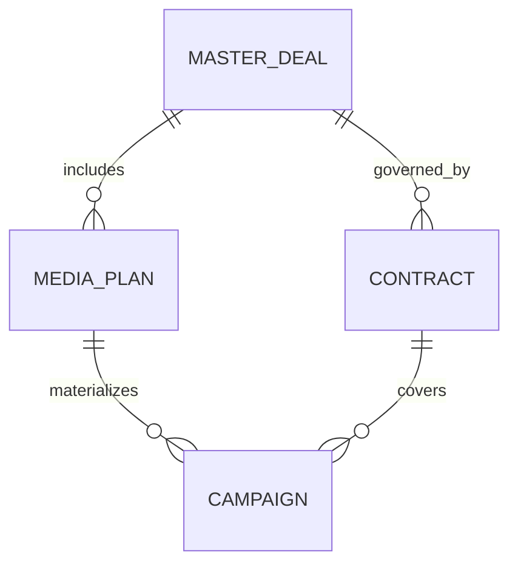

## Слой данных мета-домена Master-Deal (чистовой вариант)

В данном разделе описывается укрупнённая декомпозиция слоя данных для мета-домена **Master-Deal**, сфокусированная только на четырёх ключевых сущностях:

* `master_deal`
* `media_plan`
* `campaign`
* `contract`

---

### 1. Объектное хранилище (нереляционная БД / Data Lake)

В объектном хранилище находятся слабо структурированные и «тяжёлые» данные, связанные с ключевыми сущностями.

**1.1. Файлы по Master-Deal**

* Брифы и исходные материалы (DOCX, PDF, PPTX, XLSX).
* Презентации концепций и стратегий.
* Вложения и согласования по мастер-сделке.

**1.2. Файлы медиапланов (Media Plan)**

* Исходные медиапланы (Excel, PowerPoint).
* Выгрузки из внешних планировщиков и систем медиа-планирования.
* Версии медиапланов для истории согласований.

**1.3. Файлы по кампаниям (Campaign)**

* Отчёты площадок в формате файлов (XLSX, PDF).
* Скриншоты размещений, примеры креативов.
* Медиакарты и спецификации инвентаря.

**1.4. Скан-копии договоров (Contract)**

* Подписанные договоры и дополнительные соглашения (сканы, PDF).
* Приложения к договорам (спецификации, бюджетные приложения).

**1.5. Сырые бизнес-события**

* JSON-сообщения и логи, отражающие:

    * создание/изменение `master_deal`;
    * создание/изменение `media_plan`;
    * создание/изменение `campaign`;
    * создание/изменение `contract`.
* Сырые события из CRM, биллинга, AdServer, ЭДО и других внешних систем.

---

### 2. Реляционная БД Master-Deal

Реляционная БД содержит структурированные данные, необходимые для операционной работы и базовой аналитики по четырём ключевым сущностям и их связям.

#### 2.1. Таблица `master_deal`

**Назначение:** хранение агрегированной информации о мастер-сделке — «зонтичном» объекте, объединяющем набор медиапланов, кампаний и договоров.

**Основные данные:**

* Идентификатор мастер-сделки (`master_deal_id`).
* Клиент, бренд.
* Период действия (дата начала, дата окончания).
* Тип мастер-сделки (годовая, квартальная, спецпроект и т.д.).
* Статус (инициирована, в работе, согласована, запущена, закрыта).
* Суммарный бюджет по мастер-сделке.
* Ключевые целевые KPI (охват, частота, перфоманс-показатели).

#### 2.2. Таблица `media_plan`

**Назначение:** представление структурированных медиапланов, связанных с мастер-сделкой.

**Основные данные:**

* Идентификатор медиаплана (`media_plan_id`).
* Внешние идентификаторы (если есть) для интеграции с планировщиками.
* Связь с мастер-сделкой: `master_deal_id` (FK на `master_deal`).
* Период размещения (дата начала, дата окончания).
* Общий бюджет медиаплана.
* Сводные KPI по медиаплану (охват, частота, CTR/CPA и т.п.).
* Статус медиаплана (черновик, на согласовании, утверждён, в работе, закрыт).

#### 2.3. Таблица `campaign`

**Назначение:** хранение информации о конкретных рекламных кампаниях, реализующих медиапланы.

**Основные данные:**

* Идентификатор кампании (`campaign_id`).
* Связь с медиапланом: `media_plan_id` (FK на `media_plan`).
* Название кампании.
* Канал/тип размещения (Performance, Programmatic, OLV и т.п.).
* Площадка/поставщик инвентаря (DSP, сайт, сеть).
* Период кампании (дата начала, дата окончания).
* Статус кампании (запланирована, активна, остановлена, завершена).
* Бюджет кампании (плановый, при необходимости — фактический).
* Базовые фактические показатели (показы, клики, конверсии, потраченный бюджет).

#### 2.4. Таблица `contract`

**Назначение:** хранение структурированных данных по договорам, связанным с мастер-сделкой и (опционально) отдельными кампаниями.

**Основные данные:**

* Идентификатор договора (`contract_id`).
* Связь с мастер-сделкой: `master_deal_id` (FK на `master_deal`).
* Номер договора, дата заключения, срок действия.
* Стороны договора (клиент, агентство, подрядчик — через внешние ссылки на справочники).
* Бюджетные лимиты и ограничения (максимальный объём, кредитный лимит и т.п.).
* Основные юридические условия (краткое текстовое поле/ссылка на документ).
* При необходимости — связь с кампаниями: `campaign_id` (либо через отдельную таблицу связей `contract_campaign`).

---

### 3. Упрощённая ER-диаграмма ключевых сущностей

Данная диаграмма отражает базовые связи:

* Одна **мастер-сделка** может включать несколько **медиапланов**.
* Один **медиаплан** может материализоваться в нескольких **кампаниях**.
* Одна **мастер-сделка** может регулироваться несколькими **договорами**.
* Один **договор** может покрывать несколько **кампаний**.
