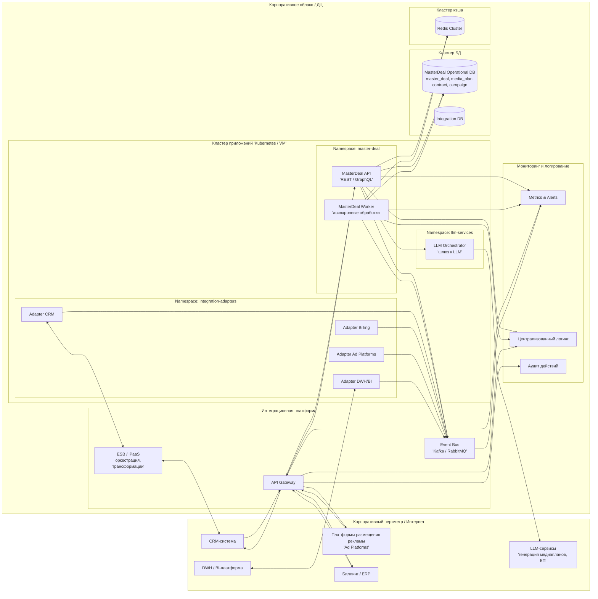

## Диаграмма развертывания

### 1. Снаружи (INTERNET)
* Здесь показаны **внешние системы**: CRM, биллинг/ERP, рекламные платформы, DWH/BI и LLM-сервисы.
* Они обращаются в нашу систему через **API Gateway (APIGW)**.

### 2. Корпоративное облако / ДЦ (DC)
   Внутри DC — несколько логических узлов:

* Интеграционная платформа (INTEGRATION)
    * `API Gateway` — единая входная точка HTTP-запросов.
    * `ESB/iPaaS` — оркестрация и трансформация сообщений.
    * `Event Bus` — шина событий (Kafka/RabbitMQ) для обмена доменными и интеграционными событиями.

* Кластер приложений (APP_CLUSTER)
    * `Namespace master-deal`:
        * `MasterDeal API` — основной сервис, обрабатывает запросы, CRUD по master_deal / media_plan / contract / campaign.
        * `MasterDeal Worker` — фоновые задачи, синхронизация, агрегации.
    * `Namespace integration-adapters`: адаптеры к CRM, Billing, Ad Platforms, DWH/BI.
    * `Namespace llm-services`: `LLM Orchestrator` — шлюз к LLM-сервисам.

* Кластер БД (DB_CLUSTER)
    * `MasterDeal Operational DB` — операционная БД мета-домена (master_deal, media_plan, contract, campaign).
    * `Integration DB` — вспомогательные данные интеграций.

* Кластер кэша (CACHE_CLUSTER)
  * `Redis Cluster` — кэш медиапланов, сессий, чекпоинтов процессов.

* Мониторинг и логирование (OBS)
  * `Metrics & Alerts`, `Logs`, `Audit` — метрики, логи и аудит действий и интеграций.

### 3. Основные потоки
* Внешние системы → `API Gateway` → `MasterDeal API`.
* `MasterDeal API` и `Worker` работают с **БД** и **Redis**, публикуют/читают события через **Event Bus**.
* `MasterDeal API` вызывает `LLM Orchestrator` → внешний LLM для генерации медиапланов и КП.
* Все ключевые компоненты шлют **логи**, **метрики** и **аудит** в OBS-блоки.