## Диаграмм последовательности для ключевых пользовательских сценариев по мета-домену *Master-Deal*

### 1. Создание мастер-сделки из CRM-лида

### 2. Подготовка и согласование медиаплана по мастер-сделке

```mermaid
sequenceDiagram
    autonumber
    participant S as Sales-менеджер
    participant T as Traffic-менеджер
    participant CRM as CRM-система
    participant MD as Master Deal Service
    participant MP as Media Planning Service
    participant C as Клиент

    S->>CRM: Открывает мастер-сделку
    CRM->>MD: Запрос "получить данные мастер-сделки"
    MD-->>CRM: Детали мастер-сделки (цели, бюджет, сроки)
    S->>MD: Запрос "создать медиаплан" по мастер-сделке
    MD->>MP: Инициализация черновика медиаплана<br/>[параметры из мастер-сделки]
    MP-->>MD: Ссылка/ID черновика медиаплана
    MD-->>CRM: Сохранение ссылки на медиаплан в мастер-сделке

    S->>T: Передаёт задачу на проработку медиаплана
    T->>MP: Заполняет инвентарь, каналы, ставки, таргетинг
    MP-->>MD: Сохранение черновика медиаплана (версия 1)

    loop Цикл согласования медиаплана
        S->>C: Отправка КП/медиаплана клиенту
        C-->>S: Комментарии и правки
        S->>T: Передача комментариев клиента
        T->>MP: Вносит изменения в медиаплан (версия N)
        MP-->>MD: Сохранение обновлённой версии медиаплана
    end

    C-->>S: Подтверждение медиаплана (Approve)
    S->>MD: Зафиксировать утверждённый медиаплан
    MD->>MP: Пометить версию как "Approved"
    MD-->>CRM: Обновление статуса мастер-сделки<br/>[Медиаплан утверждён]
```

### 3. Заключение договора и привязка к мастер-сделке

### 4. Запуск рекламной кампании по утверждённому медиаплану

### 5. Отчётность и закрытие мастер-сделки

### 6. Обработка изменений по ходу кампании (change-request)

