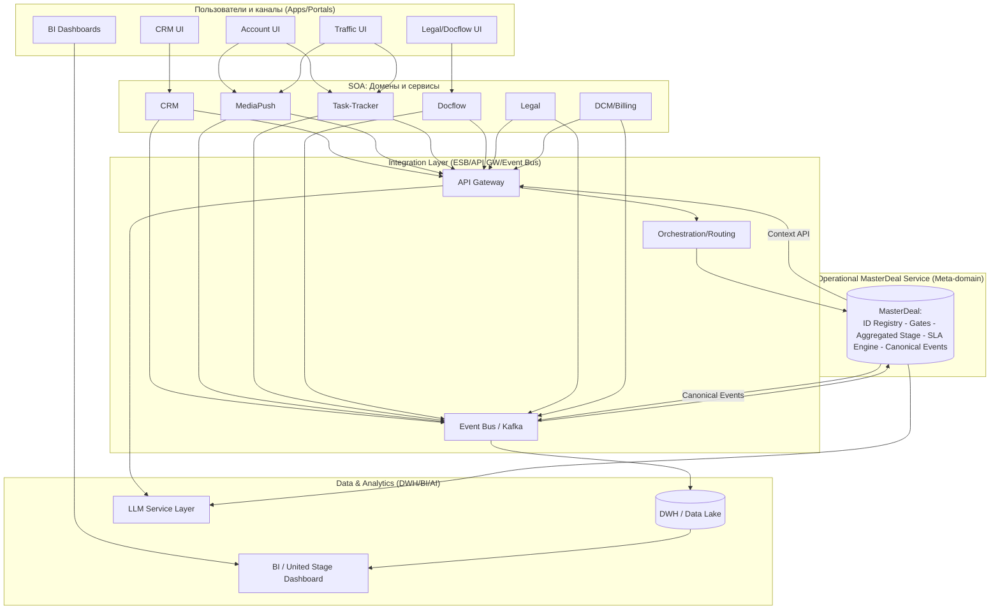

# **2. Архитектурные принципы и драйверы трансформации**

---

## **2.1. Архитектурные принципы**

Архитектура цифровой экосистемы рекламной вертикали **adTech МТС Stream** базируется на корпоративных стандартах МТС и лучших практиках проектирования корпоративных ИТ-систем: SOA, DDD, Event-driven и Data-Centric подходах.

Цель архитектуры — обеспечить **сквозную управляемость рекламным циклом** и **консистентность бизнес-данных** во всех доменах.

---

### **Ключевые архитектурные принципы**

---

#### **1. Service-Oriented Architecture (SOA)**

* Бизнес-функции реализованы в виде независимых сервисов и доменов.
* Каждый домен (CRM, MediaPush, DCM, Task-Tracker, Docflow, Legal) имеет чётко определённые границы ответственности и SLA.
* Взаимодействие сервисов осуществляется через стандартизированные API, управляемые **Integration Platform**.
* Принцип *loose coupling* обеспечивает гибкость и масштабируемость без жёстких зависимостей.

**Роль MasterDeal:**
MasterDeal выступает как **экосистемный бизнес-объект**, объединяющий события и состояния всех доменов в единую сделку.
Он не принадлежит конкретному домену, а является **общей точкой бизнес-согласования** между ними.

---

#### **2. Integration Platform as Enterprise Service Bus (ESB)**

* Междоменная коммуникация реализуется через **Integration Platform** — корпоративную интеграционную шину.
* Поддерживаются два режима обмена:

   * **Event-driven (EDA)** — асинхронные события (`lead_created`, `deal_converted`, `contract_signed`).
   * **REST API** — синхронные запросы для актуализации данных и получения статусов.
* Integration Platform выполняет маршрутизацию, оркестрацию, контроль версий API, централизованное логирование и трансформацию форматов.

**Роль MasterDeal:**
Шина передаёт события, а **MasterDeal Service** интерпретирует их смысл — агрегирует, нормализует и формирует **канонические бизнес-события**, превращая Integration Layer в **бизнес-ориентированную оркестрационную платформу**.

---

#### **3. Modular & Domain-Driven Design (DDD)**

* Архитектура построена по принципу **доменной декомпозиции**: каждый модуль отражает конкретную бизнес-область и имеет собственную команду-владельца.
* Декомпозиция обеспечивает независимое развитие доменов при сохранении общей целостности системы.

**Роль MasterDeal:**
MasterDeal реализует концепцию **Shared Kernel** — общий поддомен, обеспечивающий единое семантическое пространство для всех bounded context.
Благодаря этому CRM, MediaPush, Legal и DCM “понимают” сделку одинаково, синхронно обновляя сквозные статусы и SLA.

---

#### **4. Data-Centric & Single Source of Truth (DWH + MasterDeal)**

* **DWH (Data Warehouse)** агрегирует исторические и аналитические данные из всех доменов.
* **MasterDeal** фиксирует текущее состояние сделки, включая стадии, SLA и KPI, выступая **операционным источником истины**.
* Совместно они формируют **двухуровневую архитектуру данных**:

   * *MasterDeal* — “операционная правда”;
   * *DWH* — “аналитическая правда”.

---

#### **5. SLA-Driven Architecture**

* На каждом этапе жизненного цикла сделки определены SLA-метрики.
* MasterDeal агрегирует статусы всех доменов и рассчитывает **сквозные SLA в реальном времени**.
* Нарушения SLA автоматически фиксируются и транслируются через Integration Platform в системы контроля и мониторинга.
* DWH визуализирует показатели SLA в **United Stage Dashboard**.

---

#### **6. AI-First & Automation-by-Design**

* Архитектура предусматривает использование **LLM и AI-сервисов** для интеллектуальной автоматизации:

   * генерация медиапланов и коммерческих предложений,
   * анализ договоров и брифов,
   * прогнозирование эффективности кампаний.
* MasterDeal предоставляет LLM-сервисам **единый контекст сделки** (бриф, медиаплан, договор, бюджет, стадия),
  что позволяет моделям работать на уровне целостного бизнес-объекта, а не фрагментов данных.

---

#### **7. Security & Data Governance**

* Все взаимодействия проходят через Integration Platform с контролем аутентификации, авторизации и журналирования.
* Управление данными подчинено принципам **Data Governance** — единые политики владения, качества и жизненного цикла данных.
* MasterDeal выступает точкой консистентности и обеспечивает контроль целостности данных между доменами.

---

## **2.2. Бизнес-драйверы**

Цифровая трансформация рекламной вертикали направлена на **ускорение цикла продаж, повышение прозрачности и рост клиентской ценности**.

### **Основные бизнес-драйверы**

| № | Драйвер                                        | Цель / Эффект                                       | Роль MasterDeal                                |
| - | ---------------------------------------------- | --------------------------------------------------- | ---------------------------------------------- |
| 1 | **Скорость запуска кампаний (Time-to-Launch)** | Сократить путь от лида до запуска до 3 рабочих дней | Автоматическая синхронизация стадий и статусов |
| 2 | **Контроль SLA**                               | Прозрачный контроль сроков на всех этапах           | Единый SLA Engine на уровне MasterDeal         |
| 3 | **Рост NPS и прозрачности**                    | Клиент и менеджер видят общий статус сделки         | Сквозной `aggregated_stage` в CRM              |
| 4 | **Операционная эффективность**                 | Исключить дублирование данных и ручную сверку       | Централизация сквозных атрибутов сделки        |
| 5 | **Точность аналитики**                         | Данные о сделках в DWH без расхождений              | Канонические события MasterDeal → DWH          |
| 6 | **Data-driven управление**                     | KPI и SLA в едином окне                             | Единый United Stage Dashboard                  |
| 7 | **AI и когнитивная автоматизация**             | Генерация медиапланов, КП и анализ документов       | LLM использует контекст MasterDeal             |

---

## **2.3. Технологические драйверы**

1. **Integration Platform** — корпоративная шина для событий и REST-запросов.
2. **DWH** — аналитическое ядро, потребляющее поток канонических событий от MasterDeal.
3. **LLM** — слой когнитивной автоматизации, использующий контекст сделок.
4. **SOA + DDD** — масштабируемость и изоляция доменов при сквозной синхронизации.
5. **CI/CD + Automation-first** — автоматическая публикация событий и версионирование API.
6. **Unified Observability** — мониторинг процессов по `master_deal_id` во всех доменах.

---

## **2.4. Организационные драйверы**

1. **Синхронизация ролей**
   Все участники (Sales, Account, Traffic, Legal, Docflow, ОКК) работают в едином информационном поле,
   синхронизируясь через MasterDeal и Integration Platform.

2. **Разграничение ответственности**
   Sales отвечает за клиента, Account — за медиаплан, Legal — за документы,
   при этом MasterDeal объединяет все результаты в одну цифровую сделку.

3. **Прозрачность KPI и SLA**
   Показатели эффективности формируются автоматически на основании событий MasterDeal и отображаются в DWH.

4. **Рост компетенций**
   Работа с MasterDeal развивает data-driven и AI-first культуру — менеджеры учатся управлять сделками через данные, а не интуицию.

---

## 2.5. Слоёная архитектура: SOA + EDA + DWH + MasterDeal

**Смысл:** домены общаются через Integration Layer; **MasterDeal** — семантическое ядро, где вычисляется `aggregated_stage`, ведётся SLA и публикуются канонические события; **DWH/BI/LLM** получают уже согласованный контекст.

---

## 2.6. **Итог по разделу**

**Integration Platform** обеспечивает технологическую связность,
**DWH** — аналитическую прозрачность,
а **MasterDeal** — **бизнес-управляемость и смысловую консистентность**.

Вместе они формируют **устойчивую, SLA-ориентированную, data-driven архитектуру adTech МТС Stream**,
где каждая сделка становится цифровым объектом, проходящим все этапы жизненного цикла — от лида до отчётности — в едином сквозном процессе.