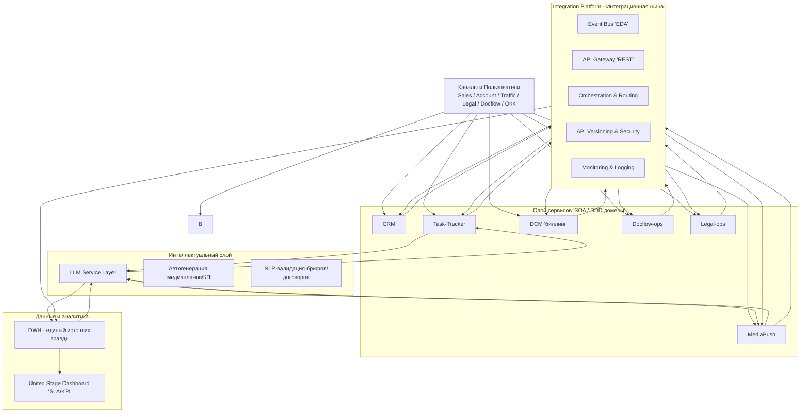

# **2. Архитектурные принципы и драйверы трансформации**

---

## **2.1. Архитектурные принципы**

Архитектура цифровой экосистемы рекламной вертикали adTech МТС Stream формируется на основе корпоративных принципов МТС и общепринятых практик проектирования корпоративных ИТ-систем.

### **Ключевые архитектурные принципы:**

1. **Service-Oriented Architecture (SOA)**

    * Бизнес-функции реализованы в виде независимых сервисов и доменов.
    * Каждый домен (CRM, MediaPush, DCM, Task-Tracker, Docflow, Legal) имеет четко определенные границы ответственности.
    * Сервисы взаимодействуют через стандартизированные API, управляемые **Integration Platform**.
    * Принцип *loose coupling* — слабая связанность сервисов, обеспечивающая масштабируемость и гибкость.

2. **Integration Platform as Enterprise Service Bus (ESB)**

    * Вся междоменная коммуникация осуществляется через **Integration Platform** — интеграционную шину предприятия.
    * Обмен данными реализован в двух режимах:
      • **Event-driven (EDA)** — публикация событий (*lead_created*, *deal_converted*, *campaign_started*).
      • **REST API** — синхронные запросы для мгновенного получения/обновления данных.
    * Integration Platform обеспечивает:

        * маршрутизацию сообщений и оркестрацию процессов,
        * контроль версий API,
        * централизованное логирование и мониторинг интеграций,
        * трансформацию форматов данных (JSON/XML/Avro).

3. **Modular & Domain-driven Design (DDD)**

    * Архитектура построена по принципу **доменной декомпозиции**: каждый модуль отражает конкретную бизнес-область.
    * Декомпозиция позволяет независимо развивать и масштабировать домены без нарушения общей целостности.
    * У каждого домена есть свой **владелец (domain owner)**, отвечающий за бизнес-логику и SLA.

4. **Data-Centric & Single Source of Truth (DWH)**

    * Все данные консолидируются в **DWH (Data Warehouse)**, выступающем единым источником аналитической правды.
    * DWH агрегирует информацию из доменов и Integration Platform, обеспечивая целостность, качество и единую аналитику.
    * DWH используется для построения **United Stage Dashboard** — визуализации сквозных SLA и KPI.

5. **SLA-Driven Architecture**

    * На каждом этапе жизненного цикла сделки определены метрики SLA (время обработки, перехода между стадиями, согласования).
    * SLA контролируется автоматически через Integration Platform и DWH.
    * SLA-индикаторы влияют на приоритет задач, эскалации и отчётность.

6. **AI-First & Automation-by-Design**

    * Архитектура предусматривает использование **LLM и AI-сервисов** для автоматизации когнитивных задач:

        * генерация медиапланов,
        * формирование коммерческих предложений,
        * анализ договоров и брифов,
        * прогнозирование эффективности кампаний.
    * LLM интегрируются в виде сервисного слоя (**LLM Service Layer**), взаимодействующего через REST API.

7. **Security & Governance**

    * Все взаимодействия проходят через **API Gateway**, обеспечивающий аутентификацию, авторизацию и аудит.
    * Управление данными подчиняется принципам **Data Governance** — единые правила владения, качества и жизненного цикла данных.
    * Интеграции защищены с помощью шифрования, токенов и журналирования событий.

---

## **2.2. Бизнес-драйверы**

Цифровая трансформация рекламной вертикали обусловлена ключевыми бизнес-задачами, направленными на повышение эффективности работы с клиентами и рост коммерческих показателей.

### **Основные бизнес-драйверы:**

1. **Скорость запуска рекламных кампаний (Time-to-Launch)**

    * Ускорение перехода от брифа к медиаплану и запуску кампании.
    * Сокращение согласований и ручных операций.
    * Цель: уменьшение времени от получения лида до запуска до **3 рабочих дней**.

2. **Контроль и прозрачность SLA по всем этапам Sales Pipeline**

    * Единый дашборд для отслеживания выполнения SLA и статусов сделок.
    * Уменьшение времени реакции на узкие места в процессе.

3. **Рост клиентского опыта (NPS)**

    * Прозрачная коммуникация между клиентом и менеджерами.
    * Предсказуемость сроков и результативности.
    * Улучшение восприятия сервиса за счёт автоматизированных предложений и персонализации.

4. **Повышение операционной эффективности**

    * Оптимизация загрузки ролей (Sales, Account, Traffic, Legal, Docflow).
    * Исключение дублирования функций.
    * Повышение продуктивности сотрудников через автоматизацию.

5. **Рост точности и управляемости рекламных инвестиций**

    * Благодаря DWH и единой аналитике кампаний.
    * Принятие решений на основе данных, а не экспертных оценок.

---

## **2.3. Технологические драйверы**

### **Ключевые технологические предпосылки проекта:**

1. **Integration Platform как шина предприятия (Enterprise Integration Layer)**

    * Централизованная шина, связывающая все домены.
    * Поддержка **event-driven и REST-взаимодействий**.
    * Единая точка для маршрутизации, оркестрации, мониторинга и логирования.

2. **DWH (Data Warehouse) — аналитическое ядро**

    * Хранение агрегированных данных по лидам, сделкам, медиапланам, SLA, транзакциям.
    * Использование BI-инструментов для дашбордов и аналитики.
    * Основа для SLA-мониторинга и принятия управленческих решений.

3. **LLM и автоматизация бизнес-процессов**

    * Интеграция больших языковых моделей в качестве интеллектуальных помощников:

        * автоформирование медиапланов по брифу клиента;
        * анализ текстов и предложений;
        * автоматическое составление КП;
        * когнитивная поддержка менеджеров (Sales Copilot).

4. **SOA + DDD как основа масштабируемости**

    * Каждый домен независим, имеет собственные сервисы и API.
    * Микросервисный подход позволяет развивать функциональность без зависимости от других систем.

5. **Automation-first и CI/CD**

    * DevOps-практики для ускорения развертывания и обновлений.
    * Контроль качества и версионирования API через Integration Platform.

6. **Unified Observability и логирование**

    * Централизованный мониторинг всех доменов и интеграций.
    * Контроль SLA, производительности и ошибок в едином окне.

---

## **2.4. Организационные драйверы**

Трансформация ориентирована не только на технологию, но и на **перестройку модели взаимодействия ролей и подразделений** внутри рекламной вертикали.

### **Основные организационные драйверы:**

1. **Синхронизация ролей через Integration Platform**

    * Все участники (Sales, Account, Traffic, Legal, Docflow, ОКК) работают в едином информационном поле.
    * Статусы задач и сделок автоматически обновляются через Integration Platform.

2. **Разграничение зон ответственности**

    * Sales — за продажи и клиента.
    * Account — за медиаплан и продукт.
    * Traffic — за каналы и расчёты.
    * Legal и Docflow — за сопровождение документов и юридическую корректность.
    * ОКК — за контроль SLA и качества взаимодействия.

3. **Прозрачность взаимодействия и KPI**

    * Все метрики производительности и SLA собираются в DWH и доступны через дашборды.
    * KPI ролей привязываются к SLA-показателям (время отклика, точность, завершение задач).

4. **Новая модель управления изменениями**

    * Интеграция доменов в единый процесс требует выстраивания координации изменений и их коммуникации.
    * Определяются архитектурные роли: Product Owner домена, Domain Architect, Integration Owner.

5. **Рост компетенций в data-driven и AI-направлениях**

    * Повышение квалификации сотрудников в работе с аналитикой, BI и LLM-инструментами.
    * Формирование культуры принятия решений на основе данных.

---

## **Итог по разделу**

Архитектурные принципы и драйверы создают основу для **устойчивой, масштабируемой и SLA-ориентированной архитектуры adTech МТС Stream**.

**Integration Platform** выступает в роли **центрального звена архитектуры**,
обеспечивая согласованное взаимодействие между доменами по **событийной и REST-модели**,
а **DWH** — в роли **аналитического ядра**, формирующего прозрачность и управляемость бизнес-процессов.

---

## Карта архитектурных драйверов → Архитектурное ядро

```mermaid
flowchart TD
    subgraph BD[Бизнес-драйверы]
      B1(Скорость запуска кампаний)
      B2(Контроль и прозрачность SLA)
      B3(Рост NPS и CX)
      B4(Операционная эффективность)
      B5(Data-driven решения)
    end

    subgraph TDv[Технологические драйверы]
      T1(Integration Platform — шина<br/>Event + REST)
      T2(DWH — единый источник правды)
      T3(LLM/AI & автоматизация)
      T4(SOA/DDD модульность)
      T5(CI/CD & Observability)
    end

    subgraph OD[Организационные драйверы]
      O1(Синхронизация ролей)
      O2(Разграничение ответственности)
      O3(KPI и SLA для ролей)
      O4(Управление изменениями)
      O5(Data/AI компетенции)
    end

    subgraph CORE[Архитектурное ядро adTech]
      C1(SOA & DDD домены)
      C2(Integration Platform:<br/>EDA события + REST)
      C3(DWH & United Stage Dashboard)
      C4(SLA-Driven архитектура)
      C5(AI-First / LLM Service Layer)
      C6(Security & Governance)
    end

    BD --> CORE
    TDv --> CORE
    OD --> CORE

    B1 & B2 & B3 & B4 & B5 --> C4
    T1 --> C2
    T2 --> C3
    T3 --> C5
    T4 --> C1
    T5 --> C6
    O1 & O2 & O3 & O4 & O5 --> C6
```

---

## Методологические слои: SOA + EDA + DWH + AI

