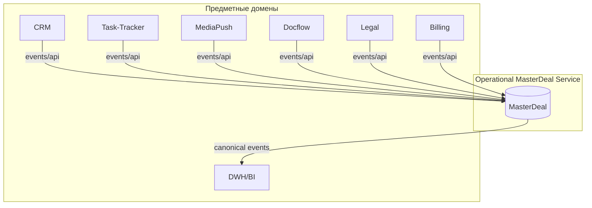
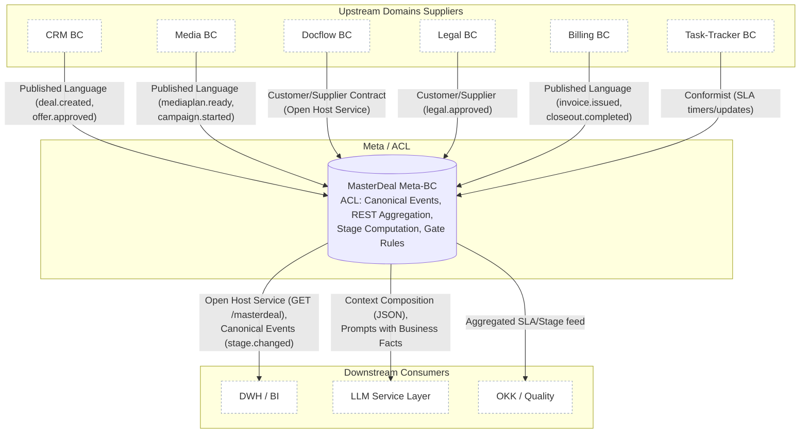
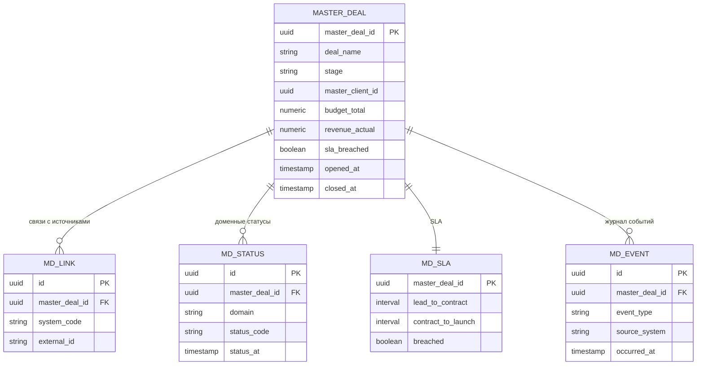
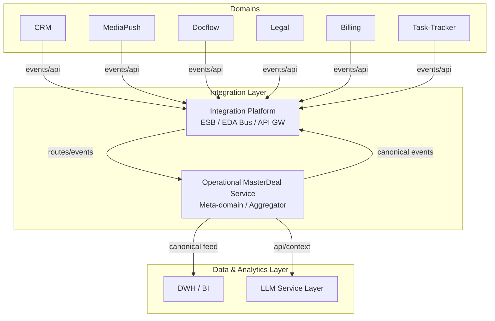
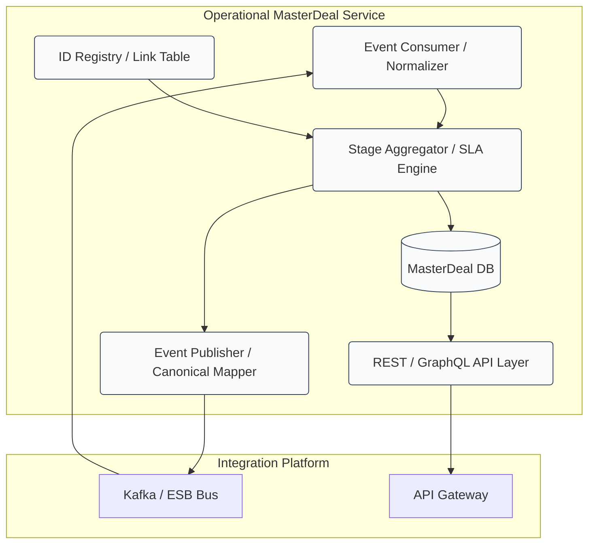
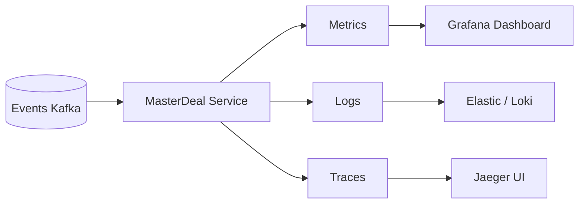

# **3. Мастер-сделка**

---

## **3.1. Концепция**

**Мастер-сделка (MasterDeal)** — это ключевой элемент цифровой архитектуры рекламной вертикали **adTech МТС Stream**,
представляющий собой **единый цифровой объект**, агрегирующий данные, статусы и события всех доменов,
участвующих в жизненном цикле рекламной сделки — от лида до закрытия кампании и отчётности.

Мастер-сделка выполняет роль **операционного центра согласованности**, обеспечивая целостное представление состояния сделки
в реальном времени и создавая технологическую основу для **сквозного SLA-контроля, автоматизации и аналитики**.

---

## **3.2. Архитектурная роль**

В архитектуре проекта **MasterDeal** реализуется в виде самостоятельного сервиса —
**Operational MasterDeal Service**, который размещается в прикладном уровне интеграционной экосистемы
и взаимодействует со всеми предметными доменами через **Integration Platform** (шину событий и API-шлюз).



MasterDeal функционирует как **мета-домен**, синхронизирующий состояние и идентичность сделки между всеми системами,
и предоставляет единый REST- и событийный интерфейс для чтения и публикации агрегированных данных.

---

## **3.3. Предметная область**

**MasterDeal** описывает сделку как целостный бизнес-объект, включающий данные из разных доменов:

| Категория           | Примеры атрибутов                                                   | Источник             |
| ------------------- | ------------------------------------------------------------------- | -------------------- |
| Идентификаторы      | `master_deal_id`, `crm_deal_id`, `contract_id`, `invoice_id`        | CRM, Docflow, DCM    |
| Клиент и контакт    | `master_client_id`, `client_name`, `segment`, `industry`            | CRM                  |
| Финансы             | `budget_total`, `budget_media`, `revenue_planned`, `revenue_actual` | CRM, DCM             |
| Документы           | `contract_number`, `contract_date`, `doc_status`                    | Docflow              |
| Медиа               | `mediaplan_id`, `campaign_id`, `kpi`                                | MediaPush            |
| Юридические аспекты | `legal_flag`, `risk_level`, `review_status`                         | Legal                |
| SLA и этапы         | `aggregated_stage`, `gates[]`, `sla_breached`                       | Все домены           |
| Исполнители         | `sales_owner`, `account_owner`, `traffic_owner`                     | HR/CRM               |
| События и аудит     | `events[]`, `correlation_id`, `timestamps`                          | Integration Platform |

---

## **3.4. Жизненный цикл мастер-сделки**

### **Этапы**

| Этап          | Условия перехода                | Основные источники       |
| ------------- | ------------------------------- | ------------------------ |
| `draft`       | создан лид / сделка в CRM       | CRM                      |
| `briefed`     | получен бриф клиента            | CRM                      |
| `planning`    | медиаплан в разработке          | Task-Tracker / MediaPush |
| `offer_ready` | медиаплан утверждён, КП готово  | MediaPush / CRM          |
| `contracting` | договор в согласовании          | Docflow / Legal          |
| `launching`   | договор подписан                | Docflow                  |
| `running`     | кампания запущена               | MediaPush                |
| `closing`     | выставлены счета / акты         | DCM                      |
| `closed`      | акт закрытия и оплата завершены | DCM                      |

Каждый этап фиксируется через **набор gate-флагов** (ворот), поступающих из доменных событий,
а агрегированный `stage` вычисляется детерминированно по таблице правил.

---

## **3.5. Интеграционная модель**

MasterDeal Service интегрируется с доменами по принципу **SOA + EDA**:

* **Event-driven (EDA):**
  доменные системы публикуют события `deal.created`, `mediaplan.ready`, `contract.signed`, `invoice.issued`,
  которые обновляют состояние MasterDeal.
* **REST API:**
  сервис предоставляет синхронные методы:

    * `GET /masterdeal/{id}` — получить агрегированное состояние сделки;
    * `PATCH /masterdeal/{id}/stage` — изменить stage (в рамках оркестрации);
    * `POST /masterdeal/events` — зарегистрировать событие;
    * `GET /masterdeal/{id}/timeline` — получить хронологию событий.

MasterDeal публикует **канонические события** (`masterdeal.stage.changed`, `masterdeal.sla.updated`)
для аналитики и downstream-процессов (BI, LLM, ОКК).


---

## **3.6. Взаимодействие с другими системами**

| Система          | Направление  | Тип данных                       | Результат                           |
| ---------------- | ------------ | -------------------------------- | ----------------------------------- |
| **CRM**          | → MasterDeal | создание сделки, клиент, бюджет  | инициирует master_deal_id           |
| **Task-Tracker** | → MasterDeal | статусы задач и SLA              | контроль сроков                     |
| **MediaPush**    | ↔ MasterDeal | медиаплан, KPI, статус кампании  | переход на этапы planning / running |
| **Docflow**      | ↔ MasterDeal | договор, УПД, статусы подписания | фиксирует контрактинг               |
| **Legal-ops**    | ↔ MasterDeal | юридические проверки             | legal_ok, risk_level                |
| **DCM**          | → MasterDeal | счета, выручка                   | переход в closing / closed          |
| **DWH**          | ← MasterDeal | канонические события             | аналитика и отчётность              |
| **LLM Layer**    | ↔ MasterDeal | контекст сделки                  | генерация КП, анализ договоров      |

---

## **3.7. Функции и ответственность MasterDeal**

1. **Управление идентичностью сделки**
   — единый `master_deal_id` для всех доменов, таблица связей с `external_id`.
2. **Агрегация статусов и стадий**
   — расчёт `aggregated_stage` по gate-флагам из событий.
3. **Сквозной SLA-контроль**
   — фиксация времени прохождения стадий и метрик SLA.
4. **Управление событиями**
   — идемпотентная приёмка доменных событий, журнал аудита.
5. **Интеграция с LLM-сервисами**
   — формирование контекста сделки (brief + offer + contract + status) для AI-аналитики.
6. **Публикация канонических событий**
   — единый поток событий для DWH, BI, мониторинга и отчётности.
7. **Взаимодействие с Integration Platform**
   — маршрутизация сообщений, контроль консистентности, retries.

---

## **3.8. Модель данных MasterDeal (упрощённо)**



---

## **3.9. Статусная модель и SLA**

MasterDeal использует **детерминированную схему вычисления stage**:
каждый этап активируется при выполнении набора доменных предикатов (gate-флагов).
Это устраняет конкуренцию статусов разных систем и делает переходы прозрачными.

* Стадии: `draft → briefed → planning → offer_ready → contracting → launching → running → closing → closed`
* Таймеры SLA запускаются и останавливаются при переходе между стадиями.
* Нарушения SLA публикуются в виде события `masterdeal.sla.breached`.

---

## **3.10. Взаимодействие с LLM-сервисами**

LLM-модель получает контекст сделки в структурированном виде:

```json
{
  "master_deal_id": "MDL-000234",
  "deal_name": "KION Q4 Performance",
  "client": { "master_client_id": "MCL-1029", "name": "KION", "industry": "Media" },
  "stage": "contracting",
  "priority": "high",
  "opened_at": "2025-09-14T10:22:11Z",
  "links": {
    "crm": { "id": "CRM-8823", "url": "https://crm/deal/8823" },
    "mediapush": { "mediaplan_id": "MP-447", "campaign_id": null },
    "docflow": { "contract_id": "DOC-571", "status": "in_review" },
    "dcm": { "invoice_id": null }
  },
  "finance": {
    "budget_total": 1200000.00,
    "budget_media": 950000.00,
    "services_cost": 120000.00,
    "revenue_planned": 1350000.00,
    "revenue_actual": 0.00,
    "currency": "RUB",
    "margin_pct": 0.125
  },
  "sla": {
    "lead_to_plan": "P2D06H",
    "plan_to_contract": "P1D12H",
    "contract_to_launch": null,
    "sla_breached": false,
    "breach_reasons": []
  },
  "roles": [
    { "role": "sales", "user_id": "u-101", "full_name": "Иван Петров" },
    { "role": "account", "user_id": "u-202", "full_name": "Анна Смирнова" },
    { "role": "traffic", "user_id": "u-303", "full_name": "Денис Орлов" }
  ],
  "documents": [
    { "doc_type": "offer", "doc_id": "OFF-3391", "status": "approved" },
    { "doc_type": "contract", "doc_id": "DOC-571", "status": "in_review" }
  ],
  "media": [
    { "mediaplan_id": "MP-447", "status": "ready", "placements_count": 42, "kpi": { "reach": 4.3e6, "cpm": 210.5 } }
  ],
  "billing": [],
  "ai": [
    { "kind": "next_action", "severity": 2, "summary": "Отправить договор на подписание клиенту." }
  ],
  "events": [
    { "event_type": "deal.created", "source_system": "crm", "occurred_at": "2025-09-14T10:22:11Z" },
    { "event_type": "mediaplan.ready", "source_system": "mediapush", "occurred_at": "2025-09-16T15:05:33Z" }
  ]
}

```

Сценарии использования:

* генерация медиапланов по брифу;
* формирование коммерческих предложений;
* проверка соответствия договора медиаплану;
* анализ SLA и подготовка рекомендаций для Sales/Account.

---

## **3.11. Польза для бизнеса**

| Эффект                        | Как достигается                                               |
| ----------------------------- | ------------------------------------------------------------- |
| **Сквозная прозрачность**     | Все этапы сделки видны в одном объекте.                       |
| **Сокращение Time-to-Launch** | Мгновенная синхронизация между доменами.                      |
| **Контроль SLA**              | Автоматический расчёт времени прохождения стадий.             |
| **Качество данных**           | Единая идентичность и консистентность информации.             |
| **Автоматизация**             | Поддержка LLM-сервисов и роботов на основе единого контекста. |
| **Управляемость**             | Централизованный мониторинг, аудит и аналитика.               |

---

## **3.12. Бизнес-события MasterDeal: сырые и канонические**

---

### **3.12.1. Роль событий в архитектуре**

MasterDeal — это не только агрегат данных, но и **агрегатор событий**,
который принимает сообщения от доменов, нормализует их и публикует в виде **канонических бизнес-событий**.

Так реализуется принцип **Event-Driven Architecture (EDA)**:
каждая система работает автономно, а согласованность достигается через поток событий,
где **MasterDeal выступает переводчиком и координатором** между доменными языками.

---

### **3.12.2. Сырые (Raw) бизнес-события**

**Сырые события** — это сообщения, публикуемые предметными доменами в их “родном” формате.
Они отражают внутренние процессы конкретной системы и не нормализованы под общую схему.

**Характеристики:**

* формируются на уровне доменной модели;
* могут содержать специфические поля и статусы;
* не гарантируют консистентность терминов между доменами;
* служат источником фактов для MasterDeal.

#### Пример сырых событий:

| Источник      | Событие                   | Payload (упрощённо)                                                                                |
| ------------- | ------------------------- | -------------------------------------------------------------------------------------------------- |
| **CRM**       | `crm.deal.created`        | `{ "deal_id": "CRM-1045", "client": "KION", "budget": 1200000, "sales_owner": "ivanov" }`          |
| **MediaPush** | `media.mediaplan.ready`   | `{ "mediaplan_id": "MP-301", "deal_ref": "CRM-1045", "channels": ["KION", "VK"], "reach": 3.2e6 }` |
| **Docflow**   | `docflow.contract.signed` | `{ "contract_id": "C-2024-101", "crm_deal_id": "CRM-1045", "signed_at": "2025-10-20" }`            |
| **DCM**       | `dcm.invoice.issued`      | `{ "invoice_id": "I-0002231", "contract_id": "C-2024-101", "sum": 1200000 }`                       |

Каждое событие имеет собственную схему (Schema Registry), topic и TTL.
MasterDeal не вмешивается в их формат — он **читает, валидирует и трансформирует** их в единую модель.

---

### **3.12.3. Канонические (Canonical) бизнес-события**

**Каноническое событие** — это унифицированное сообщение, которое MasterDeal публикует
после консолидации и нормализации входящих сырых событий.

Каноническая модель устраняет разнородность форматов и позволяет downstream-системам
(например, DWH, LLM, ОКК, BI) получать события в стабильной структуре,
независимо от источников.

**Характеристики:**

* формируются в рамках **MasterDeal Canonical Model**;
* всегда содержат `master_deal_id`;
* имеют стандартизированные типы (`stage.changed`, `sla.updated`, `closed`);
* публикуются в общий topic: `masterdeal.events`.

#### Пример канонического события:

```json
{
  "event_type": "masterdeal.stage.changed",
  "master_deal_id": "MDL-00432",
  "aggregated_stage": "contracting",
  "source_events": [
    "crm.deal.created:CRM-1045",
    "docflow.contract.signed:C-2024-101"
  ],
  "payload": {
    "client": "KION",
    "budget_total": 1200000,
    "contract_id": "C-2024-101",
    "sales_owner": "ivanov",
    "legal_flag": "ok"
  },
  "timestamp": "2025-10-20T15:40:00Z",
  "sla": {
    "lead_to_contract": "P2D",
    "sla_breached": false
  },
  "published_by": "masterdeal-service"
}
```

---

### **3.12.4. Логика преобразования**

| Шаг | Описание                                                                       | Пример                     |
|-----| ------------------------------------------------------------------------------ | -------------------------- |
| 1   | MasterDeal получает сырое событие от домена через Kafka или REST-webhook       | `media.mediaplan.ready`    |
| 2   | Идентифицирует связь с существующим `master_deal_id` (по CRM-ID или контракту) | `CRM-1045 → MDL-00432`     |
| 3   | Обновляет агрегированные поля (`stage`, `gates`, `sla`)                        | `stage = "offer_ready"`    |
| 4   | Генерирует и публикует **каноническое событие**                                | `masterdeal.stage.changed` |
| 5   | DWH, BI, LLM и другие подписчики получают его из единого topic                 | `masterdeal.events`        |

---

### **3.12.5. Пример соответствия “сырое → каноническое”**

| Источник  | Raw event                 | Canonical event            | Stage         | Используется для      |
| --------- | ------------------------- | -------------------------- | ------------- | --------------------- |
| CRM       | `crm.deal.created`        | `masterdeal.created`       | `draft`       | Создание MasterDeal   |
| CRM       | `crm.brief.submitted`     | `masterdeal.briefed`       | `briefed`     | Начало планирования   |
| MediaPush | `media.mediaplan.ready`   | `masterdeal.stage.changed` | `offer_ready` | Готов КП              |
| Docflow   | `docflow.contract.signed` | `masterdeal.stage.changed` | `contracting` | Согласование договора |
| DCM       | `dcm.invoice.issued`      | `masterdeal.stage.changed` | `closing`     | Выставление счёта     |
| DCM       | `dcm.closeout.completed`  | `masterdeal.closed`        | `closed`      | Завершение сделки     |
| DWH       | `sla.breached`            | `masterdeal.sla.breached`  | *любой*       | SLA-событие           |

---

### **3.12.6. Архитектурные преимущества**

| Аспект                             | Польза                                                                        |
| ---------------------------------- | ----------------------------------------------------------------------------- |
| **Унификация интеграций**          | downstream-системы получают единый формат без знания источников               |
| **Идемпотентность и стабильность** | MasterDeal проверяет дубликаты и гарантирует порядок событий                  |
| **Нормализация терминов**          | “offer_ready” значит одно и то же для CRM, Media, Legal                       |
| **Простота аналитики**             | DWH и LLM работают с каноническими событиями как с надёжным источником фактов |
| **Расширяемость**                  | можно добавлять новые домены без изменения модели downstream                  |

---


## **3.13 Роль системы MasterDeal в интеграционном слое**

---

### **3.13.1. Позиционирование MasterDeal Service**

**Operational MasterDeal Service** входит в состав интеграционного слоя корпоративной архитектуры
и выполняет функции **бизнес-координации, агрегации событий и синхронизации статусов** между доменными системами.

Если **Integration Platform** отвечает за транспорт, маршрутизацию и протоколы взаимодействия,
то **MasterDeal** — за **смысловую консистентность бизнес-процессов**,
выступая в роли *“умного слоя согласования”* (Smart Integration Layer).



---

### **3.13.2. Основные функции в составе интеграционного слоя**

| Категория                          | Функции MasterDeal                                                                | Взаимодействие с Integration Platform                                                             |
| ---------------------------------- | --------------------------------------------------------------------------------- | ------------------------------------------------------------------------------------------------- |
| **Оркестрация бизнес-процессов**   | Управление стадиями сделки, SLA-таймерами и переходами (`stage.gates`)            | Integration Platform доставляет события от доменов, MasterDeal определяет бизнес-логику переходов |
| **Семантическая агрегация**        | Консолидация событий и данных по `master_deal_id` из разных источников            | Шина передаёт “сырые” события; MasterDeal нормализует и объединяет их                             |
| **Канонизация данных**             | Формирование **канонической бизнес-модели** (`canonical event schema`)            | Integration Platform маршрутизирует канонические события в DWH, BI и LLM                          |
| **Согласование идентификаторов**   | Создание и хранение реестра связей `external_id ↔ master_deal_id`                 | API и registry-сервисы Integration Platform используют этот реестр при маршрутизации              |
| **Контроль SLA и консистентности** | Расчёт временных метрик, выявление нарушений, публикация `sla.breached`           | Integration Platform выполняет уведомления, retries, эскалации                                    |
| **Наблюдаемость (Observability)**  | Ведение журнала событий, корреляция логов по `correlation_id`, трассировка сделок | Integration Platform агрегирует метрики и логирует системные события                              |
| **AI и Data Integration**          | Формирование полного бизнес-контекста сделки для LLM и DWH                        | Integration Platform обеспечивает доставку контекста и безопасность вызовов                       |

---

### **3.13.3. Место в общей архитектуре интеграционного слоя**

**Integration Platform** и **MasterDeal Service** образуют **двухуровневую интеграционную модель**:

| Уровень                                            | Назначение                                                                                 | Основные компоненты                                                           |
| -------------------------------------------------- | ------------------------------------------------------------------------------------------ | ----------------------------------------------------------------------------- |
| **1. Транспортный уровень (Integration Platform)** | Обеспечивает доставку, маршрутизацию, адаптацию и мониторинг сообщений.                    | Kafka, API Gateway, ESB, Event Router, Monitoring, Security                   |
| **2. Семантический уровень (MasterDeal Layer)**    | Формирует каноническую бизнес-логику сделок, агрегирует события, управляет стадиями и SLA. | MasterDeal Service, Canonical Model, Event Normalizer, SLA Engine, Aggregator |

🔸 Таким образом, **MasterDeal Service — это не просто потребитель событий**,
а **расширение интеграционного слоя**, превращающее техническую шину в **бизнес-ориентированную оркестрационную платформу.**

---

### **3.13.4. Взаимодействие с Integration Platform**

#### **Inbound поток**

* Integration Platform передаёт сырые доменные события из CRM, Media, Docflow, Legal, Billing.
* MasterDeal Service потребляет их из топиков (`crm.*`, `media.*`, `docflow.*`, и т.д.).
* Каждое событие проходит через **Event Normalizer**, где:

    * определяется тип (`created`, `ready`, `signed`, `issued`);
    * извлекается ключ (`external_id`);
    * идентифицируется `master_deal_id`.

#### **Outbound поток**

* После обработки MasterDeal публикует **канонические бизнес-события** (`masterdeal.stage.changed`, `masterdeal.sla.breached`).
* Integration Platform маршрутизирует их в **DWH**, **LLM Layer**, **Monitoring**, **Notification services**.

#### **Синхронные вызовы (REST / GraphQL)**

* Через API-шлюз Integration Platform к MasterDeal обращаются:

    * CRM — для получения состояния сделки;
    * Docflow — для проверки статуса контракта;
    * LLM Layer — для получения контекста сделки при генерации медиапланов или КП.

---

### **3.13.5. Компонентная модель MasterDeal в составе Integration Layer**



---

### **3.13.6. Польза для интеграционного контура**

| Аспект                          | До MasterDeal                            | После MasterDeal                              |
| ------------------------------- | ---------------------------------------- | --------------------------------------------- |
| **Интеграции между доменами**   | Точка-точка, не согласованы по контексту | Единый контекст через MasterDeal              |
| **Мониторинг состояния сделки** | Разрозненные статусы                     | Централизованный `aggregated_stage`           |
| **Контроль SLA**                | Разные таймеры в доменах                 | Единый SLA Engine в MasterDeal                |
| **Форматы событий**             | Несогласованные                          | Каноническая модель событий                   |
| **Интеграция с AI/BI**          | Требует адаптеров                        | Единое API и событийный поток                 |
| **Масштабируемость**            | Ограничена связями доменов               | Шина + MasterDeal обеспечивают loose coupling |

---

# **3.14. Нефункциональные требования и принципы построения MasterDeal Service**

---

## **3.14.1. Цель**

Нефункциональные требования определяют **качество и надежность** работы **Operational MasterDeal Service**,
гарантируя непрерывность бизнес-процессов, сквозной контроль SLA и корректность агрегированных данных.

MasterDeal является частью критического бизнес-контекста — **сквозного Sales Pipeline**,
поэтому требования к доступности, консистентности и наблюдаемости соответствуют корпоративным стандартам МТС.

---

## **3.14.2. Основные принципы архитектуры**

| Принцип                             | Описание                                                                    | Цель                                                        |
| ----------------------------------- | --------------------------------------------------------------------------- | ----------------------------------------------------------- |
| **Event-Sourcing + CQRS**           | Все изменения состояния фиксируются как события; чтение и запись разделены. | Обеспечение прозрачности, аудитируемости и идемпотентности. |
| **Idempotent-by-Design**            | Повторная обработка событий не изменяет результат.                          | Устойчивость к дубликатам и повторной доставке сообщений.   |
| **Eventually Consistent**           | Согласованность данных достигается асинхронно между доменами.               | Баланс между скоростью и надежностью.                       |
| **Stateless Application Layer**     | Основная логика сервиса не хранит состояние в памяти.                       | Масштабируемость и fault tolerance.                         |
| **Loose Coupling & API-first**      | Все интеграции через стандартизированные REST/GraphQL и события.            | Гибкость и независимость от доменов.                        |
| **Observability & Telemetry-first** | Метрики, логи и трассировки на уровне событий.                              | Контроль SLA и оперативная диагностика.                     |
| **Security by Design**              | Аутентификация, авторизация и журналирование всех обращений.                | Соответствие требованиям корпоративной безопасности.        |

---

## **3.14.3. Требования к доступности и производительности**

| Параметр                                        | Целевое значение                | Комментарий                                               |
| ----------------------------------------------- | ------------------------------- | --------------------------------------------------------- |
| **Доступность (Availability)**                  | ≥ 99.9%                         | отказоустойчивое развертывание (HA Cluster)               |
| **Время реакции API**                           | ≤ 300 мс (p95)                  | для `GET /masterdeal/{id}` и `PATCH /stage`               |
| **Обработка событий**                           | ≥ 10k событий/мин               | поддержка потоков Kafka с горизонтальным масштабированием |
| **Время агрегации stage**                       | ≤ 5 сек после получения события | SLA контроля сквозного pipeline                           |
| **Латентность публикации канонических событий** | ≤ 10 сек                        | для `masterdeal.stage.changed`                            |
| **Время восстановления после сбоя**             | ≤ 15 мин                        | warm standby + state replay                               |
| **Срок хранения событий (retention)**           | ≥ 90 дней                       | для аудита и отложенной аналитики                         |

---

## **3.14.4. Требования к консистентности данных**

MasterDeal работает в режиме **eventual consistency**, что означает:

1. События могут приходить в разное время и порядке.
2. Сервис обязан обеспечивать **детерминированный результат** независимо от порядка их обработки.
3. Используется **идемпотентное хранилище** (PostgreSQL / ClickHouse) с контрольными версиями (`version_id`).
4. Все доменные события подписываются `event_id` и `correlation_id` для уникальности и трассировки.
5. При получении дубликата `event_id` — выполняется soft-ignore без побочных эффектов.
6. В случае временной недоступности домена используется **retry с exponential backoff** через Integration Platform.

---

## **3.14.5. Требования к надежности и отказоустойчивости**

| Компонент           | Механизм отказоустойчивости       | Примечание                               |
| ------------------- | --------------------------------- | ---------------------------------------- |
| **API Layer**       | Load Balancer + AutoScaling Group | балансировка входящих запросов           |
| **Event Consumer**  | Consumer Groups (Kafka)           | гарантированная доставка (at-least-once) |
| **Storage (DB)**    | Master-Replica / Multi-AZ         | синхронная репликация данных             |
| **SLA Engine**      | Stateless + Persisted Timers      | переинициализация таймеров после сбоя    |
| **Event Publisher** | Transactional Outbox / Debezium   | публикация событий в точно-одном режиме  |
| **Monitoring**      | Prometheus + Grafana + Loki       | сбор метрик и логов                      |
| **Alerting**        | OpsGenie / PagerDuty              | уведомления по SLA, отказам, задержкам   |

---

## **3.14.6. Требования к наблюдаемости (Observability)**

**MasterDeal Service** должен быть полностью наблюдаемым и поддерживать три вида телеметрии:

1. **Metrics (Prometheus):**

    * количество входящих событий по типу (`event_type`, `source_system`);
    * время обработки;
    * количество ошибок и дубликатов;
    * SLA timers (lead→plan, contract→launch).

2. **Logs (Loki / ELK):**

    * структурированные логи с `master_deal_id`, `event_id`, `correlation_id`;
    * трассировка ключевых переходов `stage.changed`.

3. **Traces (Jaeger / OpenTelemetry):**

    * распределённая трассировка цепочек событий across domains;
    * идентификация узких мест по latency.



---

## **3.14.7. Безопасность и соответствие требованиям**

| Контур                 | Механизмы безопасности                                         |
| ---------------------- | -------------------------------------------------------------- |
| **API Security**       | OAuth 2.0 / JWT; подпись запросов; ограничение по IP; RBAC     |
| **Event Security**     | Подпись сообщений; верификация схем (Schema Registry)          |
| **Data Protection**    | Шифрование в покое (AES-256) и в полёте (TLS 1.3)              |
| **Audit & Compliance** | Логирование действий пользователей и систем; хранение 180 дней |
| **Access Control**     | Сегрегация прав по ролям: `reader`, `publisher`, `admin`       |
| **PII Handling**       | Маскирование персональных данных при передаче в DWH/BI         |

---

## **3.14.8. Масштабирование и развёртывание**

**Deployment Model:**

* Контейнеризация: `Docker` / `Kubernetes (k8s)`
* CI/CD: `GitLab CI`, `ArgoCD`
* Конфигурации: `Helm Charts`
* Observability: `OpenTelemetry`, `Prometheus Operator`

**Horizontal Scaling:**

* AutoScale по количеству сообщений Kafka.
* API-пулы масштабируются независимо от Event Consumers.

**Vertical Scaling:**

* SLA Engine и Aggregator масштабируются по CPU/Memory при пиках.

**Fault Domains:**

* Минимум 2 зоны доступности (AZ) на уровне облака МТС.

---

## **3.14.9. Управляемость и эксплуатация**

* Все артефакты сервиса описаны в виде **Architecture-as-Code** (`/infra/`, `/deploy/`, `/config/`).
* Версионирование API и схем событий через **Semantic Versioning**.
* Автоматическое тестирование сценариев SLA и переходов стадий.
* Репозиторий документации содержит:

    * схемы ER и sequence;
    * контракты API (OpenAPI);
    * контракты событий (AsyncAPI);
    * чек-листы SLA и мониторинга.

---


## **3.15. Итог по разделу**

Мастер-сделка — это **центральный интеграционный элемент операционной архитектуры**,
который объединяет CRM, MediaPush, Docflow, Legal, DCM и другие домены в сквозной процесс.

**Operational MasterDeal Service** обеспечивает:

* единую бизнес-идентичность сделки;
* агрегированное состояние и сквозной SLA;
* интеграцию с аналитикой и AI-сервисами.

Таким образом, **MasterDeal** становится **“цифровым ядром сделки”**,
где сходятся все доменные данные, а аналитика и автоматизация строятся на его основании.
При этом система для работы с **MasterDeal** частью **интеграционного слоя**

* **Сырые события** отражают факты в контексте домена.
* **Канонические события MasterDeal** — единый язык коммуникации между доменами и аналитикой.
* Такая модель превращает MasterDeal в **“центр событийной истины”**,
  обеспечивая детерминированное вычисление стадий, SLA и аналитических метрик.


**MasterDeal Service** является **функциональным расширением интеграционного слоя**,
отвечающим не за транспорт, а за **бизнес-координацию**.

Он:

* принимает сырые доменные события,
* трансформирует их в канонические,
* хранит связи и агрегированные стадии,
* управляет SLA,
* и предоставляет единый API бизнес-контекста для LLM, BI и CRM.

Таким образом, **интеграционный слой** превращается из *“технической шины”* в **“бизнес-оркестратор”**,
где MasterDeal — это **смысловое ядро**, связывающее все процессы в единую логическую сделку.

Нефункциональные характеристики **MasterDeal Service** обеспечивают:

* **высокую надёжность** (99.9% uptime),
* **устойчивость к сбоям и дубликатам**,
* **прозрачную наблюдаемость** процессов,
* **гибкость масштабирования**,
* **безопасность и трассируемость** данных.

Таким образом, MasterDeal становится **операционно зрелым сервисом корпоративного уровня**,
способным выполнять роль центра бизнес-координации и основного источника правды
в сквозной цифровой архитектуре adTech МТС Stream.