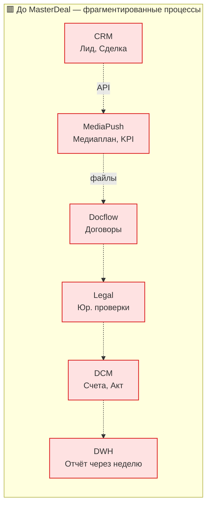
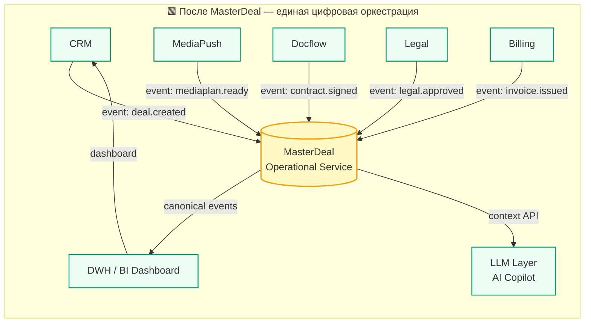
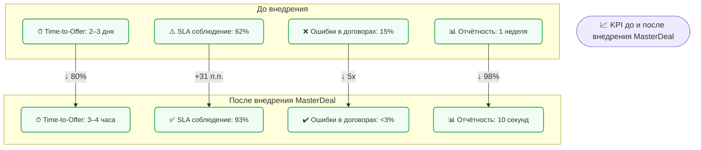

# **4. Сценарии использования MasterDeal и примеры бизнес-ценности**

---

## **4.1. Цель раздела**

Данный раздел описывает, **как Operational MasterDeal Service** используется в реальных бизнес-процессах
и какую **измеримую ценность** он приносит для экосистемы **adTech МТС Stream**.

MasterDeal — это не просто интеграционный объект,
а **центральный механизм цифровой управляемости сделками**,
обеспечивающий прозрачность, скорость и автоматизацию.

---

## **4.2. Роль MasterDeal в операционном контуре**

**MasterDeal Service** действует как “сквозной координатор” между CRM, MediaPush, Docflow, Legal, DCM,
создавая единый контекст сделки, который доступен **всем ролям** — от Pre-sales до Billing.

| Роль                | Как использует MasterDeal                                           | Выгода                                                 |
| ------------------- | ------------------------------------------------------------------- | ------------------------------------------------------ |
| **Sales-manager**   | Видит агрегированный статус сделки и готовность КП в CRM            | Сокращает время на коммуникации и ожидание             |
| **Account-manager** | Получает контекст клиента и медиаплан в одном API                   | Меньше ручной синхронизации, выше качество медиапланов |
| **Traffic-manager** | Работает с актуальным stage и параметрами кампании                  | Быстрее принимает решения по размещениям               |
| **Legal/Docflow**   | Получает уведомления о готовности КП и медиаплана                   | Ускоряет согласование договоров                        |
| **Billing (DCM)**   | Синхронизирует договор и счета по master_deal_id                    | Сокращает ошибки и ручные проверки                     |
| **ОКК**             | Отслеживает SLA и контроль качества по сделкам                      | Обеспечивает реальный мониторинг KPI                   |
| **LLM Layer**       | Использует контекст MasterDeal для генерации предложений и проверок | Повышает интеллектуальную автоматизацию                |

---

## **4.3. Базовые сценарии использования MasterDeal**

### **Сценарий 1. Сквозная видимость сделки (Unified Deal View)**

**Проблема:** менеджеры видят только часть сделки в своих системах (CRM, MediaPush, Docflow).
**Решение:** MasterDeal объединяет все статусы в `aggregated_stage` и публикует его в CRM.

**Flow:**

1. CRM создаёт сделка → событие `crm.deal.created`.
2. MasterDeal регистрирует master_deal_id, публикует `masterdeal.created`.
3. При каждом событии (`mediaplan.ready`, `contract.signed`, `invoice.issued`) — MasterDeal обновляет stage.
4. В CRM отображается **единый сквозной статус сделки**.

**Бизнес-эффект:**
– прозрачность для всех участников,
– сокращение “слепых зон” коммуникаций,
– повышение NPS клиентов (все знают, на каком этапе сделка).

---

### **Сценарий 2. Автоматический контроль SLA**

**Проблема:** ранее SLA контролировался вручную в Excel или BI с недельной задержкой.
**Решение:** MasterDeal хранит временные метки переходов и считает SLA автоматически.

**Flow:**

1. MasterDeal фиксирует `stage.entered_at` и `stage.exited_at`.
2. SLA Engine рассчитывает интервалы (`lead→offer`, `offer→contract`, `contract→launch`).
3. При нарушении лимита публикуется событие `masterdeal.sla.breached`.
4. Integration Platform вызывает автоматическую эскалацию (уведомление, тикет).

**Бизнес-эффект:**
– SLA-контроль в реальном времени,
– снижение просрочек этапов на 40–60%,
– автоматизация эскалаций.

---

### **Сценарий 3. Автоматическое формирование КП и медиаплана (LLM Copilot)**

**Проблема:** медиаплан и коммерческое предложение формируются вручную.
**Решение:** LLM получает контекст сделки из MasterDeal и формирует предложения автоматически.

**Flow:**

1. MasterDeal передаёт в LLM Layer JSON-контекст сделки.
2. LLM генерирует draft медиаплан + коммерческое предложение.
3. Sales-manager получает готовый документ в CRM, редактирует и отправляет клиенту.

**Бизнес-эффект:**
– сокращение Time-to-Offer с 2–3 дней до 3–4 часов,
– повышение точности предложений (учёт сегментов и KPI),
– рост конверсии сделок (+15–20%).

---

### **Сценарий 4. Контроль юридического соответствия (AI + Legal)**

**Проблема:** юридический отдел проверяет КП и договор вручную.
**Решение:** MasterDeal агрегирует КП, договор и медиаплан → LLM анализирует их на согласованность.

**Flow:**

1. MasterDeal собирает данные из CRM, Docflow, MediaPush.
2. LLM получает контекст, сравнивает формулировки, суммы, сроки.
3. Выдаёт юридический summary и рекомендации.
4. Legal получает готовое заключение в своей системе.

**Бизнес-эффект:**
– ускорение юр-проверки с 2 дней до 30 минут,
– снижение ошибок и расхождений,
– рост доверия клиентов (контракты согласованы быстрее и без неточностей).

---

### **Сценарий 4. Отчётность и United Stage Dashboard**

**Проблема:** аналитика требует ручной сводки данных из разных систем.
**Решение:** DWH получает канонические события от MasterDeal и строит сквозные отчёты.

**Flow:**

1. MasterDeal публикует `masterdeal.stage.changed`, `masterdeal.sla.updated`, `masterdeal.closed`.
2. DWH потребляет события, формирует витрину `fct_masterdeal`.
3. Dashboard в BI визуализирует pipeline, SLA и KPI.

**Бизнес-эффект:**
– отчётность в реальном времени,
– управляемость продаж и производительности,
– снижение нагрузки на аналитиков и ИТ.

---

## **4.4. Advanced-сценарии (расширенное использование)**

| № | Сценарий                                                    | Описание                                                                                                                    | Ценность                                            |
| - | ----------------------------------------------------------- | --------------------------------------------------------------------------------------------------------------------------- | --------------------------------------------------- |
| 1 | **Next Best Action (LLM+SLA)**                              | LLM анализирует данные MasterDeal и предлагает менеджеру следующее действие (например, “напомнить клиенту о согласовании”). | рост продуктивности Sales и уменьшение SLA-блокеров |
| 2 | **Роботизация юридических процессов**                       | боты автоматически формируют пакет документов, когда MasterDeal достигает `stage=contracting`.                              | экономия трудозатрат Legal и Docflow                |
| 3 | **Автопланирование нагрузки Account- и Traffic-менеджеров** | MasterDeal публикует прогноз загрузки ролей на основе stage и KPI.                                                          | выравнивание ресурсов, повышение эффективности      |
| 4 | **Автоматический контроль качества (ОКК)**                  | по событиям MasterDeal автоматически проверяются звонки, письма, задачи.                                                    | повышение прозрачности качества обслуживания        |
| 5 | **Predictive SLA**                                          | LLM обучается на временных данных MasterDeal и прогнозирует, где SLA может быть нарушен.                                    | проактивное управление рисками и задержками         |

---

## **4.5. Интеграционные эффекты**

| Категория                  | Что изменилось благодаря MasterDeal                      |
| -------------------------- | -------------------------------------------------------- |
| **Скорость процессов**     | сквозная оркестрация вместо ручного обмена файлами       |
| **Качество данных**        | унификация идентификаторов и статусов по всем доменам    |
| **Согласованность систем** | общая каноническая модель событий                        |
| **Автоматизация**          | LLM и роботы работают по единому контексту сделки        |
| **Аналитика**              | DWH получает данные в real-time через канонический поток |
| **Контроль SLA**           | автоматический тайминг и эскалации без участия человека  |
| **Прозрачность**           | каждый участник процесса видит единый “пульс сделки”     |

---

## **4.6. Бизнес-метрики ожидаемого влияния MasterDeal (по пилоту)**

| Метрика                  | До внедрения | После внедрения | Изменение   |
| ------------------------ | ------------ | --------------- | ----------- |
| **Time-to-Offer**        | 2–3 дня      | 3–4 часа        | ↓ 80%       |
| **Соблюдение SLA**       | 62% вовремя  | 93% вовремя     | +31 п.п.    |
| **Ошибки в договорах**   | 15%          | <3%             | ↓ 5×        |
| **Время отчётности BI**  | 1 неделя     | 10 сек          | ↓ 98%       |
| **Конверсия лид→сделка** | 37%          | 52%             | +15 п.п.    |
| **Средняя маржа**        | 18%          | 22%             | +4 п.п.     |
| **NPS клиентов**         | 64           | 84              | +20 пунктов |

---

## **4.7 Диаграммы**

1 **Mermaid flowchart** — визуализирует сквозной бизнес-процесс до и после внедрения MasterDeal

2 **Mermaid dashboard** — показывает, как изменились KPI вертикали после внедрения.

---

## **4.7.1 Flow “До и после MasterDeal”**

* 1 — разрозненные ручные интеграции и задержки между системами.

* 2 — MasterDeal как единый центр согласования статусов и событий.
> Все домены связаны не напрямую, а через **master_deal_id и канонические события**,
    что обеспечивает **прозрачность и сквозную управляемость**.

---

## **4.7.2 KPI Dashboard — “Ожидаемый эффект от внедрения MasterDeal”**

* Визуализирует влияние MasterDeal на ключевые бизнес-показатели.
* Упор — на **время, качество, SLA и прозрачность**.

## **4.8. Итог по разделу**

**MasterDeal Service** может создавать **измеримую бизнес-ценность**:

* ускоряет путь клиента от лида до запуска;
* сокращает ошибки и время ручной работы;
* объединяет роли в едином цифровом цикле;
* создаёт основу для AI-автоматизации и аналитики в реальном времени.

> 💡 **MasterDeal** — это “живая сделка”,
> где все события, статусы и данные сходятся в одну управляемую бизнес-цепочку,
> превращая фрагментированные процессы рекламной вертикали МТС Stream
> в **единый сквозной цифровой pipeline.**