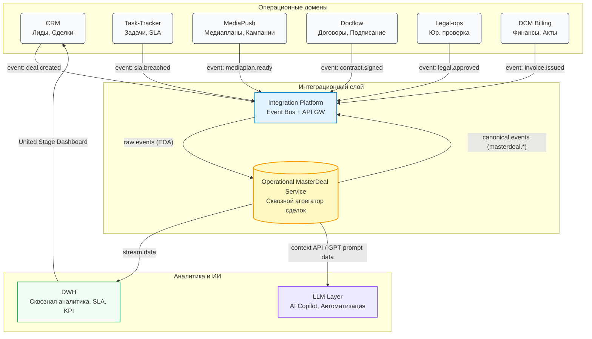

# **5. Доменная модель и ответственность**

---

## **5.1. Перечень доменов**

Цифровая экосистема рекламной вертикали **adTech МТС Stream** построена по принципу **доменного разделения ответственности** (Domain-Driven Design)
и включает операционные, интеграционные и аналитические домены, взаимодействующие через **Integration Platform**.

|  №  | **Домен**                                    | **Назначение**                                                            | **Ключевые объекты**                                     |
| :-: | -------------------------------------------- | ------------------------------------------------------------------------- | -------------------------------------------------------- |
|  1  | **CRM**                                      | Управление клиентами, лидами и сделками                                   | Лид, Сделка, Компания, Контакт, Коммерческое предложение |
|  2  | **Task-Tracker**                             | Постановка и контроль задач между ролями (Sales, Account, Traffic, Legal) | Задача, Подзадача, SLA, Исполнитель                      |
|  3  | **MediaPush**                                | Формирование и запуск медиапланов, управление кампаниями                  | Медиаплан, Кампания, Размещение, Отчёт                   |
|  4  | **DCM (Billing)**                            | Финансовое закрытие и расчёт кампаний                                     | Счёт, Акт, УПД, Сверка, Транзакция                       |
|  5  | **Docflow-ops**                              | Управление договорным документооборотом                                   | Договор, Допсоглашение, Подписание                       |
|  6  | **Legal-ops**                                | Юридическая проверка и сопровождение сделок                               | Заключение, Риски, Юр. статус                            |
|  7  | **DWH (Data Warehouse)**                     | Консолидация данных и аналитика                                           | Факт сделки, SLA, KPI, Финансовая метрика                |
|  8  | **Integration Platform (Integration Layer)** | Интеграционная шина событий и API                                         | Событие, Команда, Оркестрация, API-шлюз                  |
|  9  | **MasterDeal (Operational Service)**         | Единый агрегатор стадий, статусов и идентификаторов сделки                | master_deal_id, Stage, SLA, Links, Finance               |

---

## **5.2. Ответственность доменов**

|   №   | **Домен**                | **Бизнес-ответственность**                     | **Основные сервисы и функции**                                           | **Ключевые события (EDA)**                                                  | **Интеграция с MasterDeal**                                                        |
| :---: | ------------------------ | ---------------------------------------------- | ------------------------------------------------------------------------ | --------------------------------------------------------------------------- | ---------------------------------------------------------------------------------- |
| **1** | **CRM**                  | Управление клиентами и сделками                | Импорт лидов, квалификация (ICP/BANT), создание сделок и КП              | `lead.created`, `deal.created`, `offer.approved`, `deal.updated`            | Инициализирует **MasterDeal** при конверсии лида; передаёт бюджет, клиента, стадии |
| **2** | **Task-Tracker**         | Управление задачами и SLA внутри команд        | Создание задач, контроль SLA, эскалации                                  | `task.status.changed`, `sla.breached`, `task.completed`                     | Передаёт метрики SLA; получает актуальные стадии MasterDeal                        |
| **3** | **MediaPush**            | Построение медиапланов и управление кампаниями | Генерация медиапланов, расчёт охватов и KPI, запуск кампаний             | `mediaplan.ready`, `campaign.started`, `campaign.completed`                 | Передаёт данные медиапланов; обновляет стадию `planning → running`                 |
| **4** | **DCM (Billing)**        | Финансовое сопровождение кампаний              | Выставление счётов и актов, учёт оплат                                   | `invoice.issued`, `payment.received`, `closeout.completed`                  | Завершает сделку (`closing → closed`), передаёт финансовые данные                  |
| **5** | **Docflow-ops**          | Подготовка и согласование договоров            | Создание, подписание, хранение документов                                | `contract.created`, `contract.signed`, `doc.status.changed`                 | Передаёт ID договора; обновляет стадию `contracting`                               |
| **6** | **Legal-ops**            | Проверка документов и рисков                   | Проверка КП и договоров, выставление флагов риска                        | `legal.review.completed`, `legal.approved`, `legal.rejected`                | Сигнализирует о юридическом статусе; влияет на стадию `legal_check`                |
| **7** | **DWH**                  | Аналитика и SLA-мониторинг                     | Хранение фактов, расчёт метрик, формирование витрин                      | Подписка на все `masterdeal.*` события                                      | Формирует **United Stage Dashboard** и аналитические отчёты                        |
| **8** | **Integration Platform** | Транспорт событий и API                        | Маршрутизация, трансформация, мониторинг                                 | `masterdeal.stage.changed`, `masterdeal.sla.updated`, `masterdeal.created`  | Обеспечивает доставку событий; маршрутизирует REST-запросы                         |
| **9** | **MasterDeal**           | Центр оркестрации сделки                       | Агрегация стадий, расчёт SLA, связка ID, публикация канонических событий | `masterdeal.created`, `masterdeal.stage.changed`, `masterdeal.sla.breached` | Координирует домены; хранит агрегированное состояние сделки                        |

---

## **5.3. Владельцы доменов и роли**

| **Домен**                | **Роли**                      | **Зона ответственности**   | **Связь с MasterDeal**                 |
| ------------------------ | ----------------------------- | -------------------------- | -------------------------------------- |
| **CRM**                  | Sales-manager, Pre-sales      | Лиды, сделки, клиенты      | Создаёт и обновляет MasterDeal         |
| **MediaPush**            | Account-, Traffic-manager     | Медиаплан и кампания       | Обновляет `planning/running` стадии    |
| **DCM**                  | Finance, Billing              | Финансовое закрытие        | Завершает `closing → closed`           |
| **Docflow-ops**          | Docflow-manager               | Договоры и подписание      | Стадия `contracting`                   |
| **Legal-ops**            | Legal-manager                 | Юридическая экспертиза     | Стадия `legal_check`                   |
| **Task-Tracker**         | Internal users                | Внутренние SLA и задачи    | Поставщик SLA-показателей              |
| **DWH**                  | Data analyst, ОКК             | Аналитика и BI             | Потребляет `masterdeal.*` события      |
| **Integration Platform** | Integration Owner, Architect  | Интеграция и маршрутизация | Оркестрация вызовов MasterDeal         |
| **MasterDeal**           | Архитектор бизнес-оркестраций | Сквозное состояние сделки  | Ядро бизнес-координации и SLA-контроля |

---

## **5.4. Взаимодействие через Integration Layer**

**Integration Platform (Integration Layer)** обеспечивает транспорт и оркестрацию взаимодействий между доменами,
а **MasterDeal Service** выполняет роль *семантического координатора*, который связывает все события в единую бизнес-цепочку.

### **Типы взаимодействий:**

* **Event-driven (EDA):**
  Каждый домен публикует события о ключевых изменениях:
  `deal.created`, `mediaplan.ready`, `contract.signed`, `invoice.issued`.
  → MasterDeal агрегирует их, определяет актуальный stage и SLA,
  → публикует каноническое событие `masterdeal.stage.changed`.

* **REST API (Sync):**
  Системы могут синхронно получать состояние MasterDeal:
  `GET /masterdeal/{id}` — текущее состояние сделки,
  `PATCH /masterdeal/{id}/stage` — обновление стадии вручную или LLM.

* **Event Choreography:**
  MasterDeal не управляет доменами напрямую, а **координирует через события**,
  сохраняя слабую связанность систем и высокую масштабируемость.

* **Correlation & Idempotency:**
  Все сообщения содержат `correlation_id` и `event_id`;
  повторные события игнорируются, а порядок обработки не влияет на результат.

---

## **5.5. Сводная карта ответственности и данных**

| **Домен**        | **Источник данных (SSOT)** | **Отдаёт**                                           | **Получает**               |
| ---------------- | -------------------------- | ---------------------------------------------------- | -------------------------- |
| **CRM**          | Клиент, Сделка             | Raw events (`deal.created`, `offer.approved`)        | Stage, SLA                 |
| **MediaPush**    | Медиаплан, KPI             | `mediaplan.ready`, `campaign.started`                | Stage `planning → running` |
| **Docflow**      | Договор                    | `contract.signed`                                    | Stage `contracting`        |
| **Legal**        | Юр. заключение             | `legal.approved`                                     | Stage `legal_check`        |
| **DCM**          | Финансы, УПД               | `invoice.issued`, `closeout.completed`               | Stage `closing → closed`   |
| **Task-Tracker** | SLA                        | `sla.breached`, `task.completed`                     | Stage SLA metrics          |
| **DWH**          | Аналитика                  | BI-витрины, KPI                                      | Подписка на `masterdeal.*` |
| **MasterDeal**   | Метаданные сделки          | `masterdeal.stage.changed`, `masterdeal.sla.updated` | Сырые события доменов      |

---

## **5.6. Диаграмма контекста доменов и MasterDeal**

---

### **Пояснение к диаграмме**

| Слой                                 | Назначение                                       | Основные потоки                                                                         |
| ------------------------------------ | ------------------------------------------------ | --------------------------------------------------------------------------------------- |
| **Операционные домены**              | Источники сырых бизнес-событий                   | Публикуют `raw events` в Integration Platform                                           |
| **Integration Platform**             | Унифицированный транспорт и маршрутизация        | Передаёт события в MasterDeal и обратно                                                 |
| **MasterDeal (Operational Service)** | Семантический слой, который связывает все домены | Агрегирует статусы, рассчитывает SLA, публикует `canonical events`                      |
| **DWH (Analytics)**                  | Центр аналитической истины                       | Подписан на `masterdeal.*` события, формирует витрины                                   |
| **LLM Layer (AI)**                   | Интеллектуальный слой автоматизации              | Получает контекст сделки через API MasterDeal для генерации КП, медиапланов и прогнозов |

---

### **Интерпретация**

* **MasterDeal Service** находится **на стыке интеграционного и бизнес-уровня**:
  он не только потребляет события, но и **формирует единый контекст сделки**.
* **Integration Platform** обеспечивает транспорт и оркестрацию,
  а **MasterDeal** — смысловую и SLA-согласованную консистентность.
* **DWH и LLM** работают поверх MasterDeal,
  формируя замкнутый контур *«операция → аналитика → рекомендация»*.

---

## **5.7. Итог раздела**

Архитектура **adTech МТС Stream** основана на **доменной изоляции** и **согласованности через MasterDeal**.
Каждый домен независим, владеет своей бизнес-логикой и данными,
но объединён через **Integration Platform** и **Operational MasterDeal Service**,
который формирует **единый контекст сделки** — её стадии, SLA, финансы и связи.

> **MasterDeal** — это “сквозная бизнес-шина”,
> превращающая набор доменных сервисов в управляемую экосистему,
> где каждая сделка живёт единым цифровым жизненным циклом от лида до отчёта.
