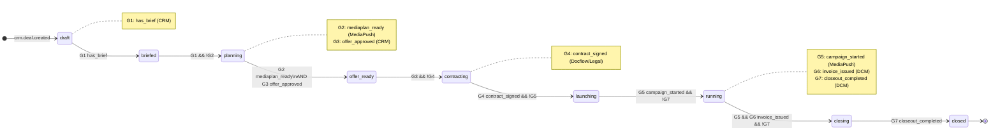
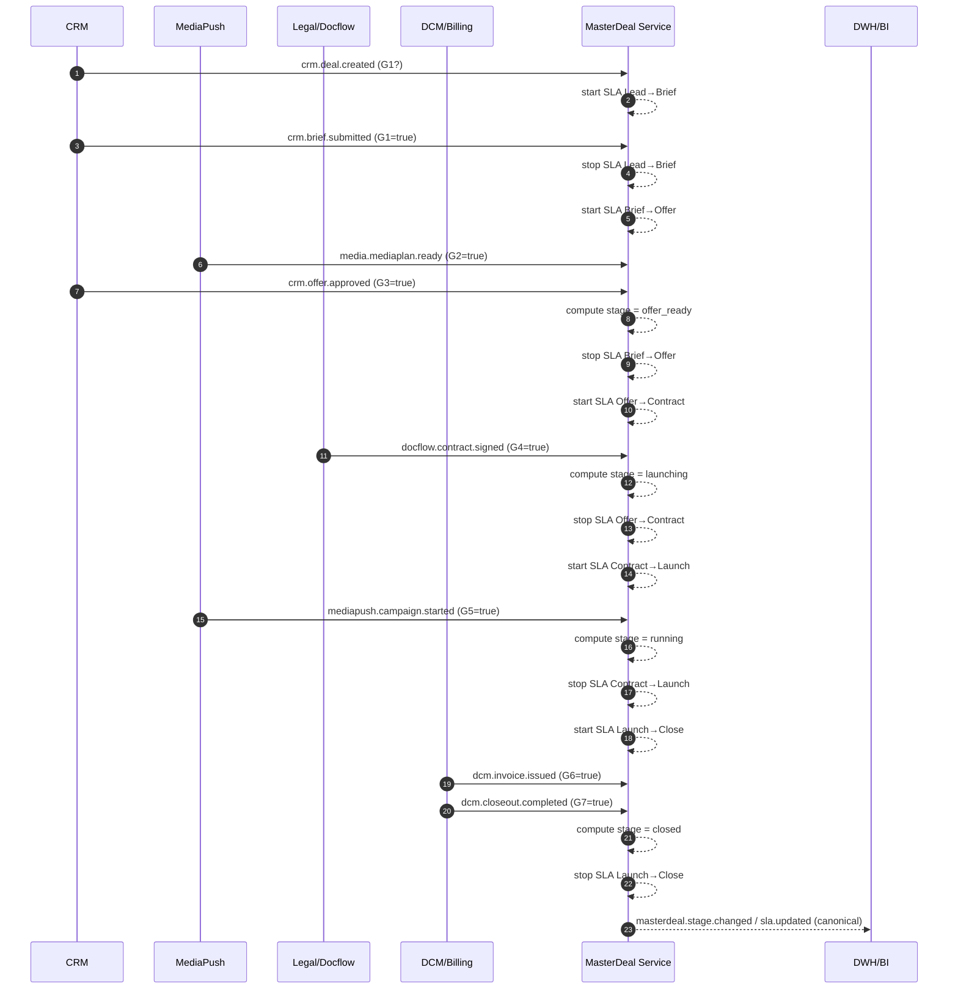
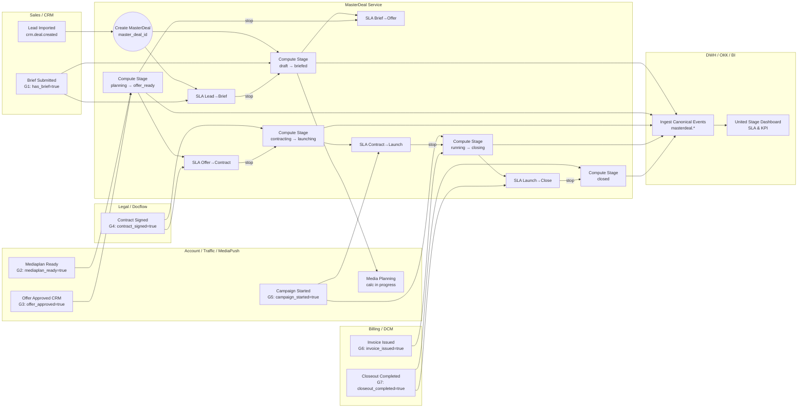
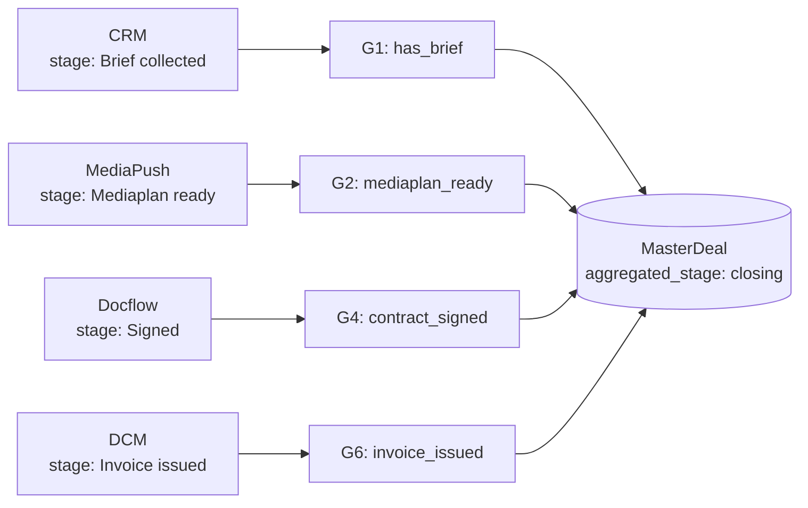

# **6. Стратегия построения Sales-Pipeline**

---

## **6.1. Обоснование стратегии**

Стратегия построения **Sales-Pipeline** в рекламной вертикали **adTech МТС Stream**
базируется на принципах **Account-Based Management (ABM)**,
адаптированных методологиях **BANT**, **CHAMP**, **ICP**,
и архитектурных принципах **SLA-driven** и **Automation-by-Design**.

### **Выбор модели: Account-Based Management (ABM)**

* Экосистема ориентирована на **корпоративных заказчиков и крупные рекламные бюджеты**,
  где успех сделки зависит от **персонализации, согласованности ролей и скорости отклика**.
* Модель ABM обеспечивает:

  * фокус на ключевых аккаунтах, а не массовые лиды;
  * точечную настройку коммуникаций и предложений;
  * согласованность действий между Sales, Account, Traffic и Legal;
  * единое управление стадиями сделки через MasterDeal.

### **Методологии квалификации и приоритизации**

| Методология | Назначение                             | Ключевые параметры                           |
| ----------- | -------------------------------------- | -------------------------------------------- |
| **BANT**    | Проверка готовности клиента к сделке   | Budget, Authority, Need, Timing              |
| **CHAMP**   | Качественная оценка потребности        | Challenges, Authority, Money, Prioritization |
| **ICP**     | Определение идеального профиля клиента | Отрасль, размер, активность, потенциал       |

Методики встроены в **CRM-домен**, а их обработка частично автоматизирована через **LLM Copilot**,
который анализирует открытые данные, историю сделок и цифровой след клиента
для подсказки приоритетов и этапов nurturing.

---

## **6.2. Описание стадий Sales-Pipeline**

Жизненный цикл сделки в adTech МТС Stream охватывает **10 стадий** — от импорта лида до постаналитики.

| №  | Стадия                        | Ключевые действия                       | Ответственная роль      | Цель / результат           |
| -- | ----------------------------- | --------------------------------------- | ----------------------- | -------------------------- |
| 1  | **Lead Imported**             | Импорт лида, очистка, дедубликация      | Pre-Sales               | Валидный лид в CRM         |
| 2  | **Lead Qualified (ICP/BANT)** | Квалификация клиента по ICP/BANT        | Sales                   | Целевой лид определён      |
| 3  | **Brief Received**            | Сбор и регистрация брифа клиента        | Sales → Account         | Зафиксированы цели клиента |
| 4  | **Media Planning**            | Формирование медиаплана (LLM + Traffic) | Account / Traffic       | Готов медиаплан            |
| 5  | **Offer Formed**              | Подготовка и защита КП                  | Sales / Account         | КП согласовано             |
| 6  | **Contracting**               | Подписание договора                     | Sales / Legal / Docflow | Договор подписан           |
| 7  | **Campaign Launching**        | Настройка и запуск кампании             | Account / Traffic       | Кампания запущена          |
| 8  | **Running**                   | Мониторинг и оптимизация кампании       | Account / MediaPush     | KPI выполняются            |
| 9  | **Closing**                   | Акты, счета, закрытие сделки            | DCM / Docflow           | Финансовое закрытие        |
| 10 | **Post Analysis**             | Аналитика, SLA, NPS                     | DWH / ОКК               | Цикл завершён              |

---

### **Роль MasterDeal в Pipeline**

* Каждая стадия и событие сделки фиксируются по **единому `master_deal_id`**.
* MasterDeal агрегирует статусы доменов (CRM, MediaPush, Legal, Docflow, DCM) и формирует **единый “aggregated stage”**.
* Это превращает цепочку систем в **сквозной управляемый бизнес-процесс** с контролем SLA и аналитикой в реальном времени.
* LLM и BI-сервисы получают контекст сделки именно через MasterDeal API.

---

## **6.3. Распределение стадий по доменам**

| Этап                         | Домен                        | Основные процессы                      | Ответственные роли |
| ---------------------------- | ---------------------------- | -------------------------------------- | ------------------ |
| Lead Imported / Qualified    | **CRM**                      | Импорт, нормализация, квалификация     | Pre-Sales, Sales   |
| Brief Received               | **CRM + Task-Tracker**       | Регистрация брифа, назначение задач    | Sales, Account     |
| Media Planning               | **MediaPush + Task-Tracker** | Расчёт медиаплана, подключение Traffic | Account, Traffic   |
| Offer Formed                 | **CRM + MediaPush**          | Подготовка и согласование КП           | Account, Sales     |
| Contracting                  | **Docflow-ops + Legal-ops**  | Подписание и верификация договора      | Sales, Legal       |
| Campaign Launching / Running | **MediaPush**                | Настройка, выполнение кампаний         | Account, Traffic   |
| Closing                      | **DCM**                      | Счета, акты, УПД                       | Billing, Docflow   |
| Post Analysis                | **DWH + ОКК**                | Аналитика, SLA, отчётность             | Data Analyst, ОКК  |

### **Интеграция через MasterDeal**

Каждый домен публикует события (`lead.created`, `brief.submitted`, `offer.approved`, `contract.signed`, `campaign.started`, `invoice.issued`, `closeout.completed`),
а **MasterDeal Service** агрегирует их, вычисляя `aggregated_stage` и SLA.
Таким образом обеспечивается **единая логика стадий и их временной согласованности** между доменами.

---

## **6.4. Сквозной SLA**

### **Принцип**

**SLA** — это временные рамки между ключевыми стадиями Pipeline,
измеряемые автоматически на основе событий MasterDeal.

| Этап SLA          | Начало             | Завершение           | Целевое время | Контроль        |
| ----------------- | ------------------ | -------------------- | ------------- | --------------- |
| Lead → Brief      | `lead.created`     | `brief.submitted`    | ≤ 8 ч         | CRM             |
| Brief → Offer     | `brief.submitted`  | `offer.approved`     | ≤ 2 дня       | MediaPush       |
| Offer → Contract  | `offer.approved`   | `contract.signed`    | ≤ 3 дня       | Legal / Docflow |
| Contract → Launch | `contract.signed`  | `campaign.started`   | ≤ 2 дня       | MediaPush       |
| Launch → Close    | `campaign.started` | `closeout.completed` | ≤ 30 дней     | DCM / DWH       |

### **Механизм контроля**

* Все события с `master_deal_id` фиксируются через **Integration Platform (EDA + REST)**.
* MasterDeal записывает таймштампы `stage_started_at` / `stage_completed_at`.
* DWH рассчитывает SLA по витрине `FactSLA`.
* При нарушении лимита MasterDeal публикует `masterdeal.sla.breached`,
  а Integration Platform инициирует эскалацию через Task-Tracker.

---

## **6.5. DWH как центр SLA и аналитики**

**DWH** (Data Warehouse) — аналитическое ядро, консолидирующее данные всех доменов.

Формируются аналитические витрины:

* `FactDeal` — факты сделок;
* `FactSLA` — тайминги стадий;
* `DimStage` — иерархия стадий;
* `FactKPI` — результативность кампаний;
* `FactNPS` — оценка клиентского опыта.

### **United Stage Dashboard**

* Отображает динамику всех сделок, среднее время по SLA и узкие места.
* Поддерживает сегментацию по отрасли, бюджету, типу клиента.
* Использует данные, поступающие **в реальном времени** из MasterDeal.

> MasterDeal = операционная точка истины
> DWH = аналитическая точка истины

Эта связка обеспечивает как **реактивное управление**, так и **стратегическую оптимизацию** продаж.

---

## **6.6. Роль LLM и автоматизации в Pipeline**

* **LLM Copilot** подключается на стадиях Brief → Offer и Offer → Contract.
* Использует контекст из MasterDeal для:

  * генерации медиапланов и КП;
  * анализа брифов;
  * проверки юридических рисков.
* Взаимодействие происходит через REST API Integration Platform.

Эти функции сокращают “ручное время” Sales и Account-менеджеров
и создают интеллектуальную надстройку над Sales-Pipeline.

---

## 6.7. Жизненный цикл MasterDeal и SLA-контроль

### 6.7.1 State-диаграмма: стадии и гейты (gate-predicates)



**Идея:** агрегированный `stage` считается детерминированно по набору истинных гейтов (фактов из доменных событий).
Регрессия стадий запрещена, кроме явных компенсирующих событий (например, `contract.revoked`).

---

### 6.7.2 Sequence-диаграмма: событийный поток и старт/стоп SLA-таймеров



---

### 6.7.3 Мини-легенда (для подписи на слайде)

* **G1..G7** — гейты (факты из доменных событий): `has_brief`, `mediaplan_ready`, `offer_approved`, `contract_signed`, `campaign_started`, `invoice_issued`, `closeout_completed`.
* **SLA-таймеры**:

  * Lead→Brief, Brief→Offer, Offer→Contract, Contract→Launch, Launch→Close.
* **Правила**: таймер **стартует** при входе в стадию-источник и **останавливается** при достижении целевой стадии; при нарушении лимита MasterDeal публикует `masterdeal.sla.breached`.

---

супер — вот **swimlane-схема** (Mermaid) с “дорожками” ролей/систем.
Она показывает: кто “зажигает” какой **гейт (G1–G7)**, где старт/стоп каждого **SLA-таймера**, и как это агрегирует **MasterDeal**.

---

## Swimlane: роли × гейты × SLA



**Легенда:**

* **G1–G7** — гейты (факты из доменных событий), которые “зажигают” соответствующие системы.
* **SLA-блоки (S1–S5)** — стартуются на входной стадии и **останавливаются** при достижении целевой; при нарушении лимита MasterDeal публикует `masterdeal.sla.breached`.
* **MasterDeal Service** агрегирует факты, вычисляет **aggregated stage** и шлёт **канонические события** в DWH/BI.


---

# **6.8. Связь stage доменов, агрегированного stage MasterDeal и гейтов**

---

## **6.8.1. Концепция**

В архитектуре **adTech МТС Stream** каждая доменная система (CRM, MediaPush, Docflow, Legal, DCM и др.)
имеет собственную **stage-модель** — последовательность локальных статусов,
которые отражают прогресс задачи внутри домена.

Однако бизнесу нужно понимать **единый статус сделки**, независимо от того,
в каком состоянии находится каждая подсистема.
Эту задачу решает **MasterDeal**, который вводит уровень **агрегированного stage (aggregated_stage)**.

---

### 🔁 Три уровня управления стадиями

| Уровень              | Что описывает                                                | Кто управляет                           | Хранение / источник |
| -------------------- | ------------------------------------------------------------ | --------------------------------------- | ------------------- |
| **Domain Stage**     | Локальные статусы домена (CRM, MediaPush и т.д.)             | Система-домен                           | Source System       |
| **Gate**             | Факт выполнения бизнес-события (например, “медиаплан готов”) | MasterDeal (через Integration Platform) | MasterDeal registry |
| **Aggregated Stage** | Сквозной статус сделки в бизнес-терминах                     | MasterDeal                              | MasterDeal DB / DWH |

---

## **6.8.2. Механизм связи**

1. Каждый домен публикует **события изменений своих stage** в Integration Platform (через Kafka или REST).
2. **MasterDeal Service** подписывается на эти события.
3. Каждое событие транслируется в **гейт (gate)** — бинарный флаг “факт наступил / нет”.
4. Когда набор гейтов удовлетворяет правила перехода, MasterDeal вычисляет новый **aggregated_stage**.
5. При изменении агрегированного stage — публикуется **каноническое событие** `masterdeal.stage.changed`.

---

### 🧩 Пример логики гейтов

```yaml
G1: has_brief                ← crm.brief.submitted
G2: mediaplan_ready          ← media.mediaplan.ready
G3: offer_approved           ← crm.offer.approved
G4: contract_signed          ← docflow.contract.signed
G5: campaign_started         ← mediapush.campaign.started
G6: invoice_issued           ← dcm.invoice.issued
G7: closeout_completed       ← dcm.closeout.completed
```

**MasterDeal Rule Engine** вычисляет stage как детерминированную функцию:

```
aggregated_stage = f(G1..G7)
```

---

## **6.8.3. Таблица соответствия**

| Aggregated Stage (MasterDeal) | Gate-предикаты (должны быть выполнены) | Domain Stage примеры                            | Домены-источники        |
| ----------------------------- | -------------------------------------- | ----------------------------------------------- | ----------------------- |
| **draft**                     | нет активных гейтов                    | CRM: `New`                                      | CRM                     |
| **briefed**                   | G1 (has_brief)                         | CRM: `Brief collected`                          | CRM                     |
| **planning**                  | G1=true, G2=false                      | MediaPush: `In planning`                        | MediaPush               |
| **offer_ready**               | G1, G2, G3                             | CRM: `Offer approved`, MediaPush: `Plan ready`  | CRM, MediaPush          |
| **contracting**               | G4                                     | Docflow: `Contract in sign`, Legal: `In review` | Docflow, Legal          |
| **launching**                 | G4=true, G5=false                      | MediaPush: `Pending start`                      | MediaPush               |
| **running**                   | G5                                     | MediaPush: `Active`, Traffic: `Running`         | MediaPush, Task-Tracker |
| **closing**                   | G5, G6                                 | DCM: `Billing`, Docflow: `Act preparation`      | DCM, Docflow            |
| **closed**                    | G7                                     | DCM: `Closed`, CRM: `Completed`                 | DCM                     |
| **cancelled** *(optional)*    | событие отмены (contract.revoked)      | CRM: `Lost`, Legal: `Terminated`                | CRM, Legal              |

---

## **6.8.4. Пример сценария: “жизнь сделки через гейты”**

**1 Клиент зарегистрирован в CRM**
→ CRM публикует `crm.deal.created` → MasterDeal создаёт `master_deal_id`, stage = `draft`.

**2 Продажа собрала бриф**
→ CRM публикует `crm.brief.submitted` → G1 = true → MasterDeal переходит в `briefed`.

**2 Account и Traffic сформировали медиаплан**
→ MediaPush публикует `media.mediaplan.ready` → G2 = true.
→ После подтверждения Sales → G3 = true → MasterDeal переходит в `offer_ready`.

**4 Подписан договор**
→ Legal публикует `docflow.contract.signed` → G4 = true → stage = `contracting`.

**5 Кампания запущена**
→ MediaPush публикует `mediapush.campaign.started` → G5 = true → stage = `running`.

**6 Сформирован счёт и УПД**
→ DCM публикует `dcm.invoice.issued` → G6 = true → stage = `closing`.

**7 Кампания закрыта**
→ DCM публикует `dcm.closeout.completed` → G7 = true → stage = `closed`.
→ MasterDeal публикует финальное `masterdeal.closed`.

---

## **6.8.5. Как MasterDeal поддерживает консистентность**

* Для каждого события хранится:

  * `source_system`,
  * `event_id`,
  * `gate_name`,
  * `gate_status` (true/false),
  * `event_timestamp`.
* При каждом апдейте MasterDeal вычисляет новый `aggregated_stage` по DSL-правилам:

  ```sql
  CASE
    WHEN G7 THEN 'closed'
    WHEN G6 AND G5 THEN 'closing'
    WHEN G5 THEN 'running'
    WHEN G4 THEN 'contracting'
    WHEN G3 AND G2 THEN 'offer_ready'
    WHEN G1 THEN 'briefed'
    ELSE 'draft'
  END
  ```
* Состояние MasterDeal всегда идемпотентно:
  при переотправке события stage не пересчитывается повторно, если нет изменений в гейтах.

---

## **6.8.6. Визуальная схема связи**



---

## **6.8.7. Архитектурный вывод**

* **Domain stage** → отражает состояние задачи *внутри системы*.
* **Gate** → факт, который “разрешает” переход сделки вперёд в бизнес-процессе.
* **Aggregated stage (MasterDeal)** → результат применения правил над гейтами, отражающий *глобальное состояние сделки*.

Так MasterDeal превращает разрозненные локальные workflow систем в **единый сквозной бизнес-процесс**,
в котором:

* события → гейты,
* гейты → агрегированный stage,
* агрегированный stage → контроль SLA и аналитика.

---

## **6.9. Итог по разделу**

**Sales-Pipeline adTech МТС Stream** — это цифровой сквозной процесс,
в котором объединены все роли, домены и события.

**MasterDeal** обеспечивает:

* консолидацию стадий и SLA;
* оркестрацию бизнес-событий;
* управление жизненным циклом сделки в реальном времени;
* аналитику и автоматизацию принятия решений через LLM и DWH.

> В результате Sales-Pipeline становится **прозрачным, управляемым и самообновляемым контуром**,
> где каждая сделка живёт в цифровом виде — от лида до постанализа —
> под управлением MasterDeal как ядра экосистемы **adTech МТС Stream**.