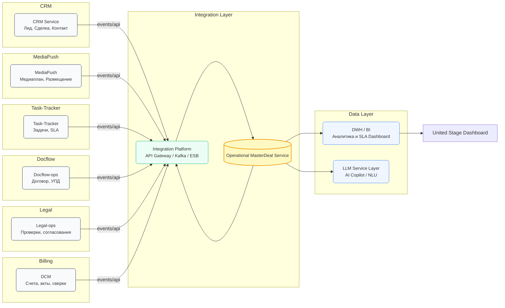
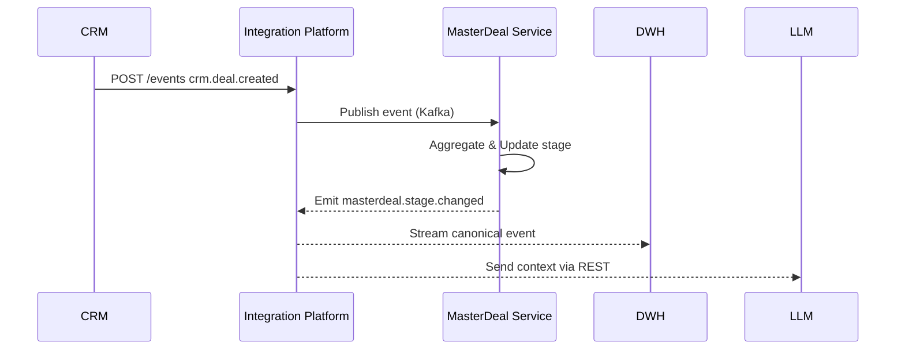
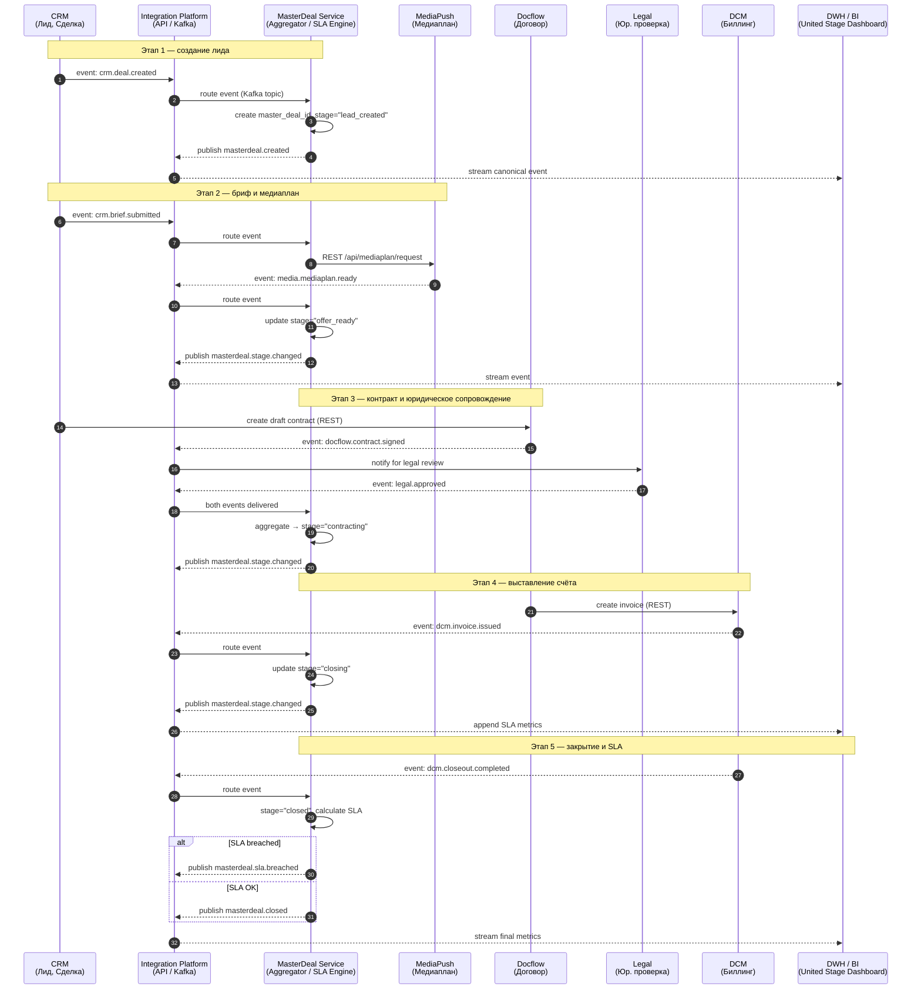

# **7. Архитектура интеграций**

---

## **7.1. Диаграмма взаимодействия доменов**

В рекламной экосистеме **adTech МТС Stream** интеграции между доменами реализованы в виде **сервисных связей**
через единый **Integration Layer (Enterprise Integration Platform)**,
который обеспечивает **обмен событиями, REST-вызовами и мониторингом**.

Ключевым оркестратором бизнес-смыслов выступает **Operational MasterDeal Service**,
который связывает между собой доменные события, агрегирует статусы и обеспечивает бизнес-контроль процесса.

**Ключевые потоки данных:**

* Системы доменов передают “сырые” события в Integration Platform.
* MasterDeal Service агрегирует, нормализует и публикует канонические события.
* DWH и LLM потребляют эти события для аналитики и автоматизации.
* CRM и Task-Tracker используют REST-вызовы для получения актуальных стадий и SLA.

---

## **7.2. Архитектура Integration Layer**

**Integration Layer** — это **многоуровневая интеграционная шина предприятия**,
обеспечивающая техническую и семантическую связанность всех систем.

Архитектура построена по принципам **Service-Oriented + Event-Driven Architecture**
и включает следующие компоненты:

| Компонент                  | Назначение                                        | Технологический стек                |
| -------------------------- | ------------------------------------------------- | ----------------------------------- |
| **API Gateway**            | Управление REST и GraphQL-вызовами между доменами | Kong / Apigee / MTS API GW          |
| **Message Broker**         | Асинхронная доставка событий между сервисами      | Kafka / RabbitMQ                    |
| **Schema Registry**        | Хранение и валидация схем сообщений               | Confluent Schema Registry           |
| **Event Router / ESB**     | Оркестрация и маршрутизация событий               | Apache Camel / Mulesoft             |
| **Integration Monitoring** | Мониторинг, логирование, трассировка              | Prometheus / ELK / Jaeger           |
| **MasterDeal Service**     | Семантическая агрегация и канонизация             | Custom Service + PostgreSQL + Kafka |
| **DWH Connector**          | Репликация событий и метрик в BI                  | Debezium / StreamSets / Airflow     |

Архитектура обеспечивает **два типа взаимодействий**:

1. **Синхронные (REST / GraphQL):**

    * быстрые запросы состояний, данных, KPI;
    * используется API Gateway;
    * SLA ответа ≤ 300 мс.

2. **Асинхронные (Event / Queue):**

    * уведомления о событиях (`created`, `updated`, `closed`);
    * используется Kafka;
    * SLA доставки ≤ 10 сек.

---

## **7.3. Механизмы обмена**

Интеграции реализованы по трём ключевым механизмам обмена данными:

| Тип обмена       | Протокол / Технология | Используется для                                     | Формат данных   | Пример                     |
| ---------------- | --------------------- | ---------------------------------------------------- | --------------- | -------------------------- |
| **REST API**     | HTTPS / JSON          | Синхронные запросы (CRM → MasterDeal, Docflow → CRM) | JSON / GraphQL  | `GET /masterdeal/{id}`     |
| **Event-driven** | Kafka / Avro          | Асинхронные уведомления и канонические события       | Avro / JSON     | `masterdeal.stage.changed` |
| **Async Queue**  | RabbitMQ / Kafka      | Отложенные задачи, SLA-триггеры                      | JSON            | `sla.breached`             |
| **ETL / Stream** | Debezium / CDC        | Интеграция с DWH / BI                                | Parquet / Delta | `stream_masterdeal_sla`    |

**Поток событий:**

1. Домен → Integration Platform → MasterDeal Service.
2. MasterDeal Service публикует каноническое событие (`masterdeal.*`).
3. Событие передаётся в DWH, LLM, Task-Tracker и CRM.

---

## **7.4. Синхронизация статусов и ошибок**

Чтобы обеспечить согласованность данных между доменами, используется многоуровневая схема синхронизации:
**eventual consistency + retry + reconciliation**.

### **7.4.1. Синхронизация статусов**

* Каждый домен управляет **своей локальной статусной моделью** (например, `CRM: "Offer Sent"`, `MediaPush: "Plan Ready"`).
* MasterDeal агрегирует их в единый `aggregated_stage`.
* При изменении состояния домена:

    * публикуется событие в Integration Platform,
    * MasterDeal обновляет агрегированный stage и публикует `masterdeal.stage.changed`,
    * downstream-системы получают обновлённый статус через подписку или API.

**Пример сопоставления статусов:**

| CRM               | MediaPush    | Docflow           | Aggregated Stage (MasterDeal) |
| ----------------- | ------------ | ----------------- | ----------------------------- |
| `Deal Created`    | –            | –                 | `lead_created`                |
| `Brief Submitted` | –            | –                 | `briefed`                     |
| `Offer Sent`      | `Plan Ready` | –                 | `offer_ready`                 |
| –                 | –            | `Contract Signed` | `contracting`                 |
| –                 | –            | `Invoice Issued`  | `closing`                     |
| –                 | –            | `Act Completed`   | `closed`                      |

---

### **7.4.2. Обработка ошибок и рассинхронизаций**

Интеграционный слой реализует **4-уровневую модель надёжности**:

| Уровень                  | Тип механизма                | Назначение                                      |
| ------------------------ | ---------------------------- | ----------------------------------------------- |
| **1. Delivery-level**    | Kafka / RabbitMQ ack / retry | Гарантия доставки сообщений (at-least-once)     |
| **2. Application-level** | Идемпотентность MasterDeal   | Исключение повторной обработки событий          |
| **3. Business-level**    | Reconciliation Jobs          | Ежедневная сверка стадий между CRM и MasterDeal |
| **4. Monitoring-level**  | Alerts & Dashboards          | Автоматическое уведомление о сбоях и SLA breach |

#### 🔧 Пример обработки ошибки:

1. CRM публикует `crm.deal.updated`, но сообщение теряется.
2. Integration Platform фиксирует недоставку (DLQ).
3. Retry через 3 попытки → при неудаче создаётся `error.event` → логируется в Observability Dashboard.
4. Reconciliation Job сверяет `CRM.deal_stage` и `MasterDeal.stage`, выполняет автоисправление.

---

### **7.4.3. Observability и трассировка**

Каждое событие снабжено:

* `event_id` — уникальный UUID,
* `correlation_id` — общий идентификатор цепочки событий,
* `master_deal_id` — бизнес-ключ агрегации.

Эти параметры используются для **трассировки сделок “end-to-end”** через все домены.
Monitoring Dashboard отображает:

* активные события по типам,
* задержки публикаций,
* рассинхроны статусов,
* количество SLA-пересечений.

---

## **7.5. Итог по разделу**

**Архитектура интеграций** обеспечивает:

* **единообразие взаимодействия** между доменами,
* **гибридную модель обмена** (REST + event-driven),
* **устойчивость к сбоям и дубликатам**,
* **сквозную синхронизацию статусов и SLA** через MasterDeal,
* и полную **наблюдаемость бизнес-процессов**.
---

## **7.6. Сквозной Event Pipeline (CRM → Media → Docflow → DWH)**

---

### **Пояснение к диаграмме**

| Этап | Домен-инициатор | Событие                                        | Действие MasterDeal             | Результат         |
| ---- | --------------- | ---------------------------------------------- | ------------------------------- | ----------------- |
| 1    | CRM             | `crm.deal.created`                             | Регистрирует `master_deal_id`   | Создан MasterDeal |
| 2    | CRM / MediaPush | `crm.brief.submitted`, `media.mediaplan.ready` | Обновляет stage → `offer_ready` | Готово КП         |
| 3    | Docflow / Legal | `docflow.contract.signed`, `legal.approved`    | Stage → `contracting`           | Подписан договор  |
| 4    | DCM             | `dcm.invoice.issued`                           | Stage → `closing`               | Счёт выставлен    |
| 5    | DCM             | `dcm.closeout.completed`                       | Stage → `closed`, SLA оценено   | Завершение сделки |

---

### **Особенности реализации**

* **Integration Platform** маршрутизирует события между доменами, не смешивая их бизнес-логику.
* **MasterDeal** управляет только бизнес-смыслом (агрегацией стадий и SLA), не вмешиваясь в доменные процессы.
* **DWH** получает все `masterdeal.*` события для аналитики и United Stage Dashboard.
* **LLM и BI** могут подписываться на те же канонические события для когнитивной автоматизации.

---