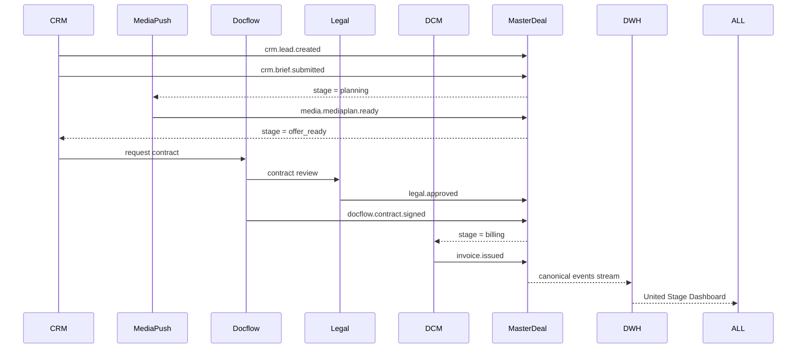
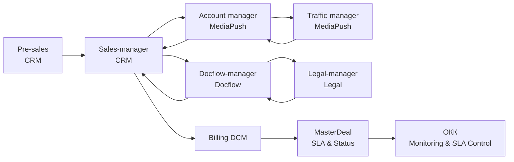

# **8. Функциональная декомпозиция**

---

## **8.1. Декомпозиция по процессам (от лида до отчёта)**

Функциональная декомпозиция по процессам описывает **сквозную цепочку действий**,
в рамках которой происходит обработка лида, формирование медиаплана, заключение договора,
запуск кампании и последующий пост-анализ результатов.

---

### **8.1.1. Сквозной бизнес-процесс Sales-Pipeline**

| № | Этап                                            | Основные действия                                        | Домен            | Ответственная роль                | Ключевое событие                               |
| - | ----------------------------------------------- | -------------------------------------------------------- | ---------------- | --------------------------------- | ---------------------------------------------- |
| 1 | **Лидогенерация**                               | Импорт лидов, нормализация, дедубликация, проверка ICP   | CRM              | Pre-sales                         | `crm.lead.created`                             |
| 2 | **Квалификация**                                | Проверка BANT/CHAMP, оценка бюджета и потенциала         | CRM              | Sales-manager                     | `crm.lead.qualified`                           |
| 3 | **Формирование брифа**                          | Сбор требований клиента, согласование формата            | CRM              | Sales-manager                     | `crm.brief.submitted`                          |
| 4 | **Формирование медиаплана**                     | Создание медиаплана по каналам, расчет охвата и бюджета  | MediaPush        | Account-manager / Traffic-manager | `media.mediaplan.ready`                        |
| 5 | **Согласование коммерческого предложения (КП)** | Генерация КП, согласование с клиентом                    | CRM / MediaPush  | Sales-manager                     | `crm.offer.approved`                           |
| 6 | **Договорная стадия**                           | Формирование договора, юр-проверка, подписание           | Docflow / Legal  | Legal-manager / Docflow-manager   | `docflow.contract.signed`                      |
| 7 | **Запуск кампании**                             | Размещение рекламы, контроль публикаций                  | MediaPush        | Account-manager / Traffic-manager | `media.campaign.started`                       |
| 8 | **Исполнение и отчётность**                     | Подготовка промежуточных и итоговых отчётов, акты, счета | DCM / MediaPush  | Docflow / Account-manager         | `dcm.invoice.issued`, `dcm.closeout.completed` |
| 9 | **Аналитика и SLA-контроль**                    | Агрегация метрик, контроль SLA, пост-анализ              | DWH / MasterDeal | ОКК / BI / AI                     | `masterdeal.closed`, `sla.breached`            |

---

### **8.1.2. Сквозной поток (в разрезе MasterDeal)**

---

## **8.2. Декомпозиция по ролям**

Каждая роль выполняет функции в своём домене, но взаимодействует с другими через MasterDeal и Integration Platform.
Ниже — матрица зон ответственности.

| Роль                           | Основные функции                                               | Домен              | Используемые системы     |
| ------------------------------ | -------------------------------------------------------------- | ------------------ | ------------------------ |
| **Pre-sales**                  | Импорт, очистка, квалификация лидов, проверка ICP              | CRM                | CRM, DWH                 |
| **Sales-manager**              | Ведение сделки, формирование брифа, КП, инициирование договора | CRM                | CRM, MasterDeal, Docflow |
| **Account-manager**            | Подготовка медиаплана, взаимодействие с Traffic, защита КП     | MediaPush          | MediaPush, Task-Tracker  |
| **Traffic-manager**            | Расчет размещений, выбор каналов, медиапланирование            | MediaPush          | MediaPush                |
| **Docflow-manager**            | Подготовка и отправка договоров, контроль подписания           | Docflow            | Docflow, Legal           |
| **Legal-manager**              | Проверка договоров, правовых аспектов, согласование            | Legal              | Legal-ops                |
| **ОКК (контроль качества)**    | Мониторинг SLA, контроль коммуникаций                          | CRM / DWH          | DWH, BI                  |
| **Консультационная поддержка** | Ответы клиентам, контроль исполнения услуг                     | CRM / Task-Tracker | CRM, DWH                 |
| **AI/LLM Copilot**             | Автоматическая генерация КП, медиапланов, SLA-анализ           | AI Layer           | LLM Service Layer        |

---

## **8.3. Матрица RACI (инициирует, исполняет, утверждает, информируется)**

| Этап процесса                  | Pre-sales | Sales   | Account | Traffic | Legal   | Docflow | ОКК     | MasterDeal |
| ------------------------------ | --------- | ------- | ------- | ------- | ------- | ------- | ------- | ---------- |
| **Импорт и квалификация лида** | **R**     | **A**   | I       | I       | I       | I       | I       | C          |
| **Формирование брифа**         | C         | **R/A** | I       | I       | I       | I       | I       | C          |
| **Медиапланирование**          | I         | A       | **R**   | **C**   | I       | I       | I       | C          |
| **Генерация КП**               | I         | **R/A** | C       | C       | I       | I       | I       | C          |
| **Подготовка договора**        | I         | A       | C       | I       | **R/A** | **C**   | I       | C          |
| **Юридическое согласование**   | I         | C       | C       | I       | **R/A** | C       | I       | C          |
| **Запуск кампании**            | I         | A       | **R**   | **C**   | I       | I       | I       | C          |
| **Биллинг и отчётность**       | I         | C       | C       | I       | I       | **R/A** | I       | C          |
| **Контроль SLA и качества**    | I         | C       | I       | I       | I       | I       | **R/A** | **C**      |

**Легенда:**

* **R (Responsible)** — выполняет задачу
* **A (Accountable)** — несёт ответственность за результат
* **C (Consulted)** — консультирует / участвует
* **I (Informed)** — информируется о результате

MasterDeal (MD) во всех процессах находится в роли **C — Consulted**,
так как он синхронизирует данные, стадии и статусы между доменами.

---

## **8.4. Потоки задач (Task Flows)**

Потоки задач формируют **маршрутизацию действий между ролями и доменами**,
основанную на событиях и правилах SLA.
MasterDeal и Task-Tracker обеспечивают прозрачность исполнения.

---

### **8.4.1. Поток задач (в Event-driven логике)**

| Инициатор       | Получатель      | Действие                         | Условие перехода           | Домен-источник | Событие                      |
| --------------- | --------------- | -------------------------------- | -------------------------- | -------------- | ---------------------------- |
| Pre-sales       | Sales-manager   | Передача квалифицированного лида | `lead.status=qualified`    | CRM            | `crm.lead.qualified`         |
| Sales-manager   | Account-manager | Создание задачи на медиаплан     | `brief.submitted=true`     | CRM            | `crm.brief.submitted`        |
| Account-manager | Traffic-manager | Расчет каналов                   | `mediaplan.stage=planning` | MediaPush      | `media.task.created`         |
| Traffic-manager | Account-manager | Возврат расчета охвата и бюджета | `calc.status=ready`        | MediaPush      | `media.mediaplan.ready`      |
| Account-manager | Sales-manager   | Формирование КП                  | `mediaplan.approved=true`  | CRM            | `crm.offer.ready`            |
| Sales-manager   | Docflow-manager | Инициирование договора           | `offer.status=approved`    | Docflow        | `docflow.contract.requested` |
| Legal-manager   | Docflow-manager | Подтверждение юр-согласования    | `contract.legal=ok`        | Legal          | `legal.approved`             |
| Docflow-manager | Sales-manager   | Уведомление о подписании         | `contract.status=signed`   | Docflow        | `docflow.contract.signed`    |
| DCM             | Sales-manager   | Выставлен счет / акт             | `invoice.status=issued`    | DCM            | `dcm.invoice.issued`         |
| MasterDeal      | ОКК             | SLA breach notification          | `sla.breached=true`        | MasterDeal     | `masterdeal.sla.breached`    |

---

### **8.4.2. Визуализация потока задач**

---

### **8.4.3. Особенности маршрутизации**

| Механизм                 | Реализация                      | Примечание                                       |
| ------------------------ | ------------------------------- | ------------------------------------------------ |
| **Task Orchestration**   | через Task-Tracker и MasterDeal | задачи создаются по событиям, а не вручную       |
| **SLA-мониторинг**       | MasterDeal SLA Engine           | контролирует время между стадиями                |
| **Эскалации**            | через Integration Platform      | уведомления и алерты при задержке                |
| **LLM-помощники**        | Sales / Account Copilot         | предлагают следующее действие (Next Best Action) |
| **Кросс-доменные связи** | через master_deal_id            | обеспечивает связь всех задач одной сделки       |

---

## **8.5. Итог по разделу**

Функциональная декомпозиция демонстрирует, что:

* процессы от **лида до отчёта** стандартизированы и событийно связаны;
* **роль MasterDeal** — обеспечивать непрерывность и сквозную видимость;
* все **участники (Sales, Account, Legal, Traffic, Docflow)** работают в едином контуре;
* **задачи и SLA** автоматически маршрутизируются и контролируются;
* **AI/LLM** встроены в процесс как интеллектуальные подсказки, а не отдельные системы.
