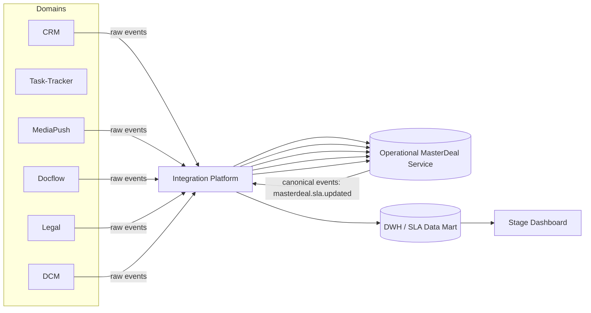
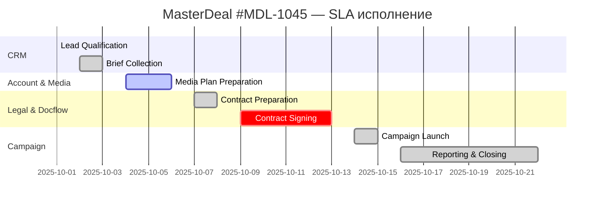
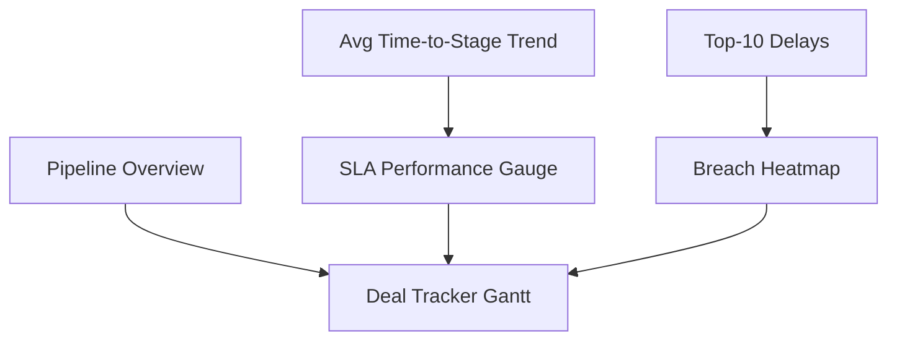
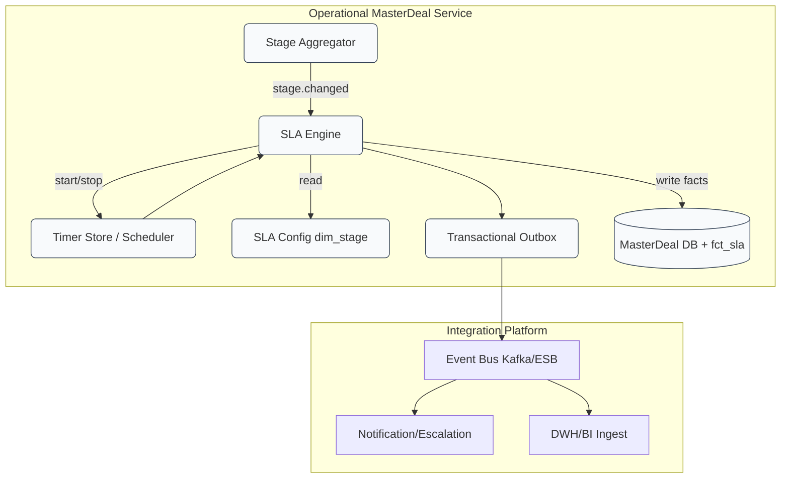
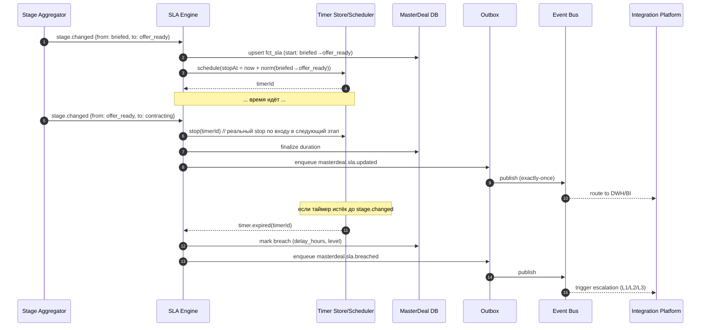

# **10. Сквозной SLA и контроль исполнения**

---

## **10.1. SLA на этапах Pipeline**

### **Цель**

Определить нормативы времени прохождения сделки по основным стадиям **Sales Pipeline**
и установить метрики, по которым измеряется эффективность всех участников процесса.

**SLA (Service Level Agreement)** — это целевые интервалы времени, в течение которых
задачи или этапы сделки должны быть завершены.
Они обеспечивают контроль дисциплины исполнения и прозрачность в управлении сделками.

---

### **Основные SLA по стадиям Sales Pipeline**

| № | Этап (Stage)                  | Ответственный домен / роль     | SLA (время выполнения) | Метрика контроля              | Тип SLA          |
| - | ----------------------------- | ------------------------------ | ---------------------- | ----------------------------- | ---------------- |
| 1 | **Lead Qualification**        | CRM / Pre-sales                | ≤ 1 рабочий день       | `lead→qualified`              | Процессный       |
| 2 | **Brief Collection**          | CRM / Sales-manager            | ≤ 2 рабочих дня        | `qualified→briefed`           | Процессный       |
| 3 | **Media Plan Preparation**    | Task-Tracker / Account-manager | ≤ 3 рабочих дня        | `briefed→offer_ready`         | Производственный |
| 4 | **Traffic Calculation**       | MediaPush / Traffic-manager    | ≤ 1 день               | `offer_ready→validated`       | Подэтап          |
| 5 | **Contract Preparation**      | Docflow / Legal                | ≤ 2 рабочих дня        | `validated→contracting`       | Юридический      |
| 6 | **Contract Signing**          | Docflow / Client               | ≤ 3 дня                | `contracting→contract_signed` | Внешний          |
| 7 | **Campaign Launch**           | MediaPush / Operations         | ≤ 2 дня                | `contract_signed→launched`    | Производственный |
| 8 | **Campaign Running / Report** | DCM / Billing                  | ≤ 7 дней               | `launched→closed`             | Финансовый       |

> Все SLA фиксируются в MasterDeal и публикуются в DWH через события `masterdeal.sla.updated`.

---

### **Расширенные показатели SLA**

| Показатель                   | Описание                                              |
| ---------------------------- | ----------------------------------------------------- |
| **SLA Target (%)**           | Процент сделок, завершённых в норматив. Цель — ≥ 90%. |
| **SLA Breach (%)**           | Процент нарушений по этапам.                          |
| **Avg Time-to-Stage (часы)** | Среднее время перехода между стадиями.                |
| **Median Time (часы)**       | Медиана времени для устранения влияния аномалий.      |
| **Escalation Level**         | Уровень критичности нарушения (L1–L3).                |

---

## **10.2. Механизм агрегации SLA**

### **Архитектурная роль**

Механизм SLA реализован через связку:
**MasterDeal Service → Integration Platform → DWH (Data Warehouse).**



---

### **Механизм вычисления SLA**

1. **Регистрация событий.**
   MasterDeal фиксирует временные метки при изменении стадий (`stage.entered_at`, `stage.exited_at`).

2. **Расчёт SLA-интервалов.**
   SLA Engine вычисляет длительность переходов (`t_exit - t_entry`) и сравнивает с нормативом.

3. **Агрегация данных.**
   В MasterDeal хранится таблица `SLA_FACT` с полями:

   ```
   master_deal_id | stage_from | stage_to | duration | sla_norm | status | breach_flag | updated_at
   ```

4. **Публикация события.**
   Если зафиксировано нарушение — формируется событие:

   ```json
   {
     "event_type": "masterdeal.sla.breached",
     "master_deal_id": "MDL-1045",
     "stage": "contracting",
     "duration": "P4D",
     "norm": "P2D",
     "delay_hours": 48,
     "responsible": "Docflow"
   }
   ```

5. **Передача в DWH.**
   DWH получает все события `sla.updated` и `sla.breached` и сохраняет в витрину `fct_sla_masterdeal`.

6. **Построение аналитики.**
   BI-инструмент визуализирует SLA в виде Gantt и KPI-дашбордов.

---

### **Особенности хранения в DWH**

| Таблица              | Назначение                                      | Обновление |
| -------------------- | ----------------------------------------------- | ---------- |
| `dim_stage`          | Справочник стадий и нормативов SLA              | Статично   |
| `fct_sla_masterdeal` | Факт выполнения SLA по каждой сделке и переходу | Потоково   |
| `agg_sla_summary`    | Агрегированные показатели по ролям и доменам    | Ежечасно   |
| `vw_sla_breached`    | Представление нарушений для ОКК и уведомлений   | Реалтайм   |

---

## **10.3. Gantt-диаграмма SLA**

**Gantt-диаграмма** используется для визуализации времени выполнения стадий сделки
и выявления узких мест процесса.

### **Пример визуализации (одна сделка)**



🟨 *Жёлтый (active)* — текущий этап
🟥 *Красный (crit)* — нарушение SLA
🟩 *Зелёный (done)* — этап выполнен в срок

---

### **Параметры визуализации Gantt**

| Атрибут              | Значение                | Источник              |
| -------------------- | ----------------------- | --------------------- |
| `start_date`         | `stage.entered_at`      | MasterDeal            |
| `end_date`           | `stage.exited_at`       | MasterDeal            |
| `sla_norm`           | Норматив из `dim_stage` | DWH                   |
| `breach_flag`        | Boolean                 | MasterDeal SLA Engine |
| `responsible_domain` | Ответственный домен     | CRM, Media, Docflow   |
| `stage_name`         | Название этапа          | Canonical Model       |

---

## **10.4. Единый Stage Dashboard**

### **Назначение**

**Stage Dashboard** — это аналитический дашборд в BI,
построенный на данных `DWH`, который отображает текущее состояние сделок и SLA по всем доменам.

---

### **Основные компоненты Dashboard**

| Виджет                      | Назначение                           | Источник данных      |
| --------------------------- | ------------------------------------ | -------------------- |
| **Pipeline Overview**       | Кол-во сделок на стадиях (bar chart) | `fct_stage_status`   |
| **SLA Performance Gauge**   | % соблюдения SLA по этапам           | `agg_sla_summary`    |
| **Breach Heatmap**          | Карта нарушений SLA по ролям/доменам | `vw_sla_breached`    |
| **Avg Time-to-Stage Trend** | Динамика времени прохождения стадий  | `fct_sla_masterdeal` |
| **Deal Tracker (Gantt)**    | Визуализация сделок по стадиям       | `fct_sla_masterdeal` |
| **Top-10 Delays**           | Наиболее проблемные сделки           | `vw_sla_breached`    |

---

### **Пример структуры Stage Dashboard**



---

### **Функциональность Dashboard**

* Фильтрация по: `домену`, `роли`, `клиенту`, `stage`, `периоду`.
* Цветовое кодирование:

    * 🟩 в срок, 🟨 риск, 🟥 нарушение.
* Drill-down до конкретной сделки и её истории событий.
* Экспорт SLA-отчёта в PDF/Excel.
* Интеграция с MasterDeal API для получения “живого” статуса (`real-time refresh`).

---

### **Пример показателей в Dashboard**

| Метрика                      | Формула                    | Целевое значение |
| ---------------------------- | -------------------------- | ---------------- |
| **SLA Compliance (%)**       | `(on_time / total) * 100`  | ≥ 90%            |
| **Avg Time-to-Contract (ч)** | `Σ(contract_time) / count` | ≤ 72 ч           |
| **Avg Time-to-Launch (ч)**   | `Σ(launch_time) / count`   | ≤ 48 ч           |
| **SLA Breach Count**         | `count(breach_flag=true)`  | —                |
| **Escalations Level 2+**     | `count(level>=2)`          | ≤ 5% от всех     |


---

## **10.5. Архитектура SLA Engine**

### **10.5.1. Назначение**

**SLA Engine** — компонент Operational MasterDeal Service, который:

* стартует/останавливает таймеры при входе/выходе сделки из агрегированных стадий;
* рассчитывает длительности, сравнивает с нормативами;
* публикует события `masterdeal.sla.updated` / `masterdeal.sla.breached`;
* пробрасывает эскалации (L1/L2/L3) через Integration Platform.

---

### **10.5.2. Компонентная схема**



**Ключевые элементы**

* **Stage Aggregator** — вычисляет aggregated stage (гейты → этап).
* **SLA Engine** — чистая бизнес-логика SLA (таймеры, сравнение, эскалации).
* **Timer Store/Scheduler** — надёжные таймеры (persisted timers / delayed jobs).
* **Transactional Outbox** — гарантированная публикация событий в шину.
* **dim_stage** — каталог нормативов (SLA цели, уровни эскалации).

---

### **10.5.3. Последовательность: старт/стоп таймера и breach**



---

### **10.5.4. Данные и нормативы**

**Каталог SLA (dim_stage):**

* `stage_from`, `stage_to`
* `norm_duration` (ISO 8601, напр. `P2D`, `PT8H`)
* `working_calendar` (учёт рабочих часов/праздников)
* `escalation_levels`: `{L1: 80% norm, L2: 100%, L3: 120%}`

**Факты SLA (fct_sla_masterdeal):**

```
master_deal_id | stage_from | stage_to | start_at | stop_at
duration_sec   | norm_sec   | status(OK/BREACH) | breach_level(L1..L3)
owner_domain   | owner_user | updated_at
```

---

### **10.5.5. Алгоритмы (вкратце)**

**A. Старт таймера**

1. На `stage.changed(to = X)` ищем правило `prev→X` в `dim_stage`.
2. Если правило есть — фиксируем `start_at = now`, планируем таймер на `now + norm(X)`.
3. Сохраняем запись `status=PENDING`.

**B. Остановка таймера**

1. На `stage.changed(from = X)` для активного перехода `prev→X`:

   * `stop_at = now`, `duration = stop-start`.
   * Если `duration ≤ norm` → `OK`, иначе `BREACH` и уровень по порогам.
   * Публикуем `masterdeal.sla.updated`.

**C. Истечение таймера (breach)**

1. По сигналу `timer.expired`:

   * Проверяем, не завершён ли уже переход.
   * Если нет — помечаем `BREACH`, считаем `delay_hours`, определяем `L1..L3`.
   * Публикуем `masterdeal.sla.breached`.

**D. Учёт рабочего календаря**

* При расчёте плановой даты используем календарь: `add_business_duration(start, norm, calendar)`.

---

### **10.5.6. Пример событий**

**`masterdeal.sla.updated`**

```json
{
  "event_type": "masterdeal.sla.updated",
  "master_deal_id": "MDL-1203",
  "transition": {"from":"briefed","to":"offer_ready"},
  "duration_sec": 46800,
  "norm_sec": 57600,
  "status": "OK",
  "owner": {"domain":"Account","team":"MediaOps"},
  "timestamp": "2025-10-28T08:55:21Z"
}
```

**`masterdeal.sla.breached`**

```json
{
  "event_type": "masterdeal.sla.breached",
  "master_deal_id": "MDL-1203",
  "transition": {"from":"contracting","to":"launching"},
  "delay_hours": 16,
  "breach_level": "L2",
  "owner": {"domain":"Docflow","team":"Contracts"},
  "actions": ["notify.owner","open.ticket","escalate.L2"],
  "timestamp": "2025-10-29T12:03:00Z"
}
```

---

### **10.5.7. Отказоустойчивость и гарантии**

| Риск                             | Митигирующая мера                                                      |
| -------------------------------- | ---------------------------------------------------------------------- |
| Дубликаты событий                | Идемпотентность (`event_id`, inbox, upsert)                            |
| Потеря публикации                | Transactional Outbox + ретраи в шину                                   |
| Падение инстанса                 | Persisted timers; повторный подъём подберёт таймеры                    |
| Несогласованность времени        | Серверное время сервиса + `occurred_at` из события, нормализация в UTC |
| Неверный расчёт из-за праздников | Календарь рабочих дней в конфиге и юнит-тесты на вычисления            |

---

### **10.5.7. Метрики наблюдаемости (Prometheus)**

* `sla_active_timers_total` — активные таймеры.
* `sla_transition_duration_seconds{from,to}` — распределение длительностей.
* `sla_breach_total{level,from,to,domain}` — количество нарушений.
* `sla_publish_lag_seconds` — задержка публикации в шину.
* `sla_compute_latency_ms` — p50/p95 расчёта.

---

## **10.6. Итог по разделу**

Система **сквозного SLA и контроля исполнения** обеспечивает:

* прозрачное измерение производительности всех участников процесса;
* автоматическую фиксацию и агрегацию SLA на уровне MasterDeal;
* интеграцию с DWH для аналитики и мониторинга в реальном времени;
* визуализацию в виде Gantt и Stage Dashboard для руководителей;
* механизм автоматических эскалаций при нарушениях.

> **MasterDeal + DWH + Stage Dashboard** создают цифровой контур “операционного зрения”,
> где каждая сделка видна, измеряема и управляемая в реальном времени.

SLA Engine превращает агрегированный stage в **управляемое время**:

* надёжные таймеры и нормативы,
* детерминированные расчёты,
* real-time события и эскалации,
* прозрачная аналитика в DWH.