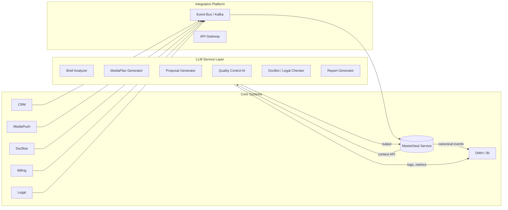
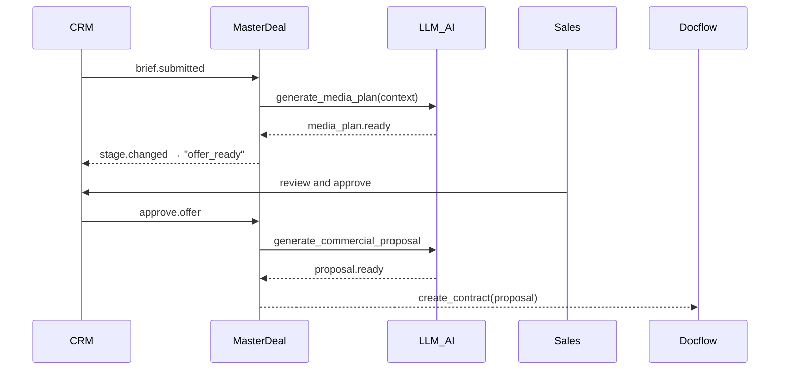
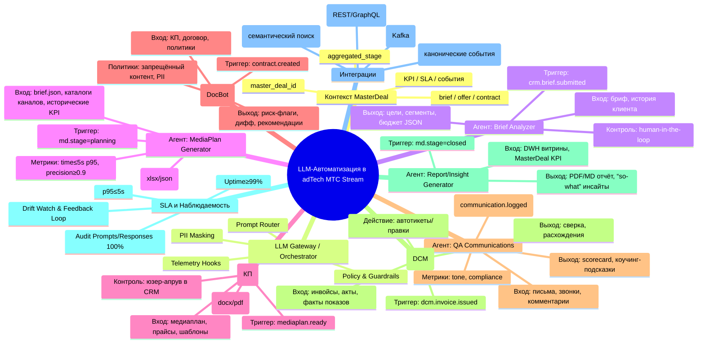

# **11. Карта автоматизации и использование LLM**

---

## **11.1. Зоны автоматизации**

Автоматизация бизнес-процессов рекламной вертикали реализуется по принципу **AI-first & Human-in-the-loop**,
где **LLM-модели** (Large Language Models) и **роботы (RPA)** дополняют человеческие роли,
снижая ручные операции и повышая качество и скорость обслуживания клиентов.

| Зона автоматизации                                                | Описание                                                                             | Основной источник данных                                 | Тип результата                                 |
| ----------------------------------------------------------------- | ------------------------------------------------------------------------------------ | -------------------------------------------------------- | ---------------------------------------------- |
| **Генерация медиапланов (AI Media Planner)**                      | Автоматическое формирование структуры медиаплана на основе брифа и истории кампаний. | MasterDeal (brief, KPI, client profile, historical data) | draft медиаплан (.xlsx / JSON)                 |
| **Формирование коммерческих предложений (AI Proposal Generator)** | Составление КП из медиаплана, шаблонов и продуктовых тарифов.                        | MasterDeal + DWH + Product Catalog                       | docx/pdf КП с расчётом стоимости               |
| **Обработка брифов (AI Brief Analyzer)**                          | Извлечение целей, каналов и бюджетов из текстового брифа клиента.                    | CRM + Docflow                                            | структурированный JSON (цели, сегменты, сроки) |
| **Контроль качества коммуникаций (AI QA)**                        | Анализ писем, звонков и комментариев Sales- и Account-менеджеров.                    | CRM + Task-Tracker + записи ОКК                          | отчёт о соответствии стандартам NPS            |
| **Документооборот (DocBot)**                                      | Генерация и проверка договоров, УПД, актов, сверок.                                  | Docflow + DCM + MasterDeal                               | автоматический договор / акт                   |
| **Финансовые сверки (Reconciliation Bot)**                        | Автоматическая сверка транзакций между DCM и CRM.                                    | DCM + DWH                                                | таблица расхождений                            |
| **Отчётность и BI Insight Bot**                                   | Генерация аналитических summary и слайдов по результатам кампаний.                   | DWH + LLM                                                | pdf/markdown-отчёт                             |
| **SLA Control Assistant**                                         | Прогноз нарушений SLA по историческим паттернам.                                     | MasterDeal events + DWH                                  | предупреждение / рекомендация                  |

**Роль MasterDeal:**
все LLM и RPA используют контекст из MasterDeal как **единый источник бизнес-истины (SSOT)**
— модель сделки, стадии, KPI, SLA, контракты и медиапланы.

---

## **11.2. Архитектура LLM-сервисов**

### **Общая схема интеграции LLM в архитектуру adTech Stream**

### **Основные компоненты LLM-уровня**

| Компонент                       | Назначение                                                                                  | Взаимодействие                           |
| ------------------------------- | ------------------------------------------------------------------------------------------- | ---------------------------------------- |
| **LLM Gateway**                 | Централизованный шлюз для маршрутизации запросов между бизнес-системами и моделями.         | REST / gRPC через Integration Platform   |
| **Prompt Orchestrator**         | Управление промптами, валидация контекста, фильтрация чувствительных данных.                | Получает данные из MasterDeal API        |
| **AI Agents (Microservices)**   | Микросервисы, выполняющие конкретные бизнес-функции (Brief Analyzer, MediaPlanner, QA Bot). | Публикуют события в Integration Platform |
| **LLM Runtime**                 | Подсистема выполнения моделей (например, OpenAI, MTS Cloud LLM, SberNova).                  | Через защищённый API                     |
| **Knowledge Store / Vector DB** | Хранение векторных представлений медиапланов, брифов, шаблонов договоров.                   | FAISS / Pinecone / Qdrant                |
| **AI Feedback Loop**            | Контур обратной связи для обучения на действиях пользователей.                              | CRM и DWH метрики (accept / reject)      |

---

## **11.3. SLA LLM-сервисов**

LLM- и RPA-сервисы подчиняются **SLA-контролю** наравне с доменами,
с чётко определёнными параметрами надёжности, скорости и качества ответов.

| Показатель                           | Норма SLA                           | Комментарий                                            |
| ------------------------------------ | ----------------------------------- | ------------------------------------------------------ |
| **Доступность (Uptime)**             | ≥ 99%                               | Контейнерная среда + health-checks                     |
| **Время отклика (Response Time)**    | ≤ 5 секунд (p95)                    | включая получение контекста из MasterDeal              |
| **Достоверность (Precision)**        | ≥ 90% корректных выводов            | проверяется по фидбэку пользователей                   |
| **Контроль качества (Human Review)** | ≥ 20% выборочная проверка           | для медиапланов и КП                                   |
| **Реакция на сбой**                  | ≤ 10 минут                          | автоматический fallback на ручную обработку            |
| **Аудит обращений**                  | 100% логирование промптов и ответов | хранение 180 дней                                      |
| **Безопасность данных**              | PII-safe / mask-level-2             | исключение передачи персональных данных в облачные LLM |

Все SLA фиксируются в **MasterDeal SLA Dashboard**,
где события типа `llm.task.completed`, `llm.error`, `llm.sla.breached`
входят в общую аналитику по pipeline.

---

## **11.4. Роботизация процессов**

Помимо LLM, в экосистеме используется **RPA (Robotic Process Automation)** и **workflow-боты**,
которые исполняют предсказуемые шаги в доменах без участия человека.

| Автоматизация      | Описание                                                                               | Системы                           | Триггер                    |
| ------------------ | -------------------------------------------------------------------------------------- | --------------------------------- | -------------------------- |
| **Docflow Robot**  | Автоматически создаёт договор и отправляет клиенту на подпись при `stage=contracting`. | Docflow + MasterDeal              | `masterdeal.stage.changed` |
| **Finance Bot**    | Выполняет сверку счетов и актов в DCM, закрывает транзакции.                           | DCM + MasterDeal                  | `dcm.invoice.issued`       |
| **Data Sync Bot**  | Проверяет целостность связей между доменами (CRM ↔ MediaPush ↔ DCM).                   | Integration Platform + MasterDeal | по расписанию / SLA breach |
| **Report Builder** | Формирует отчёт о результатах кампаний из DWH по событию `masterdeal.closed`.          | DWH + LLM Layer                   | `masterdeal.closed`        |
| **Compliance Bot** | Проверяет юридические документы и текст КП на соответствие шаблонам.                   | Legal + LLM                       | при `contract.created`     |

Роботы действуют по принципу:
**“Event → Decision → Action → Confirmation”**,
а все их действия логируются в MasterDeal как `robot.action.completed`
для трассировки и SLA.

---

## **11.5. Цепочка интеграции LLM и MasterDeal**

Здесь **LLM не автономна**, а встроена в процесс через MasterDeal —
вся коммуникация идёт через стандартизированные события и API,
что обеспечивает контроль, SLA и безопасность.

---

## 11.6. **Карта LLM-автоматизации**

---

---

## 11.7. **Итог по разделу**

Использование LLM и роботизации в архитектуре **adTech МТС Stream** обеспечивает:

* автоматизацию до **65% когнитивных операций** (анализ, генерация, проверка);
* сокращение Time-to-Offer и Time-to-Contract в 3–5 раз;
* консистентность данных и документов по всему Sales Pipeline;
* повышение точности решений и прозрачности KPI;
* создание цифровых ассистентов для Sales, Account, Legal и Docflow.
