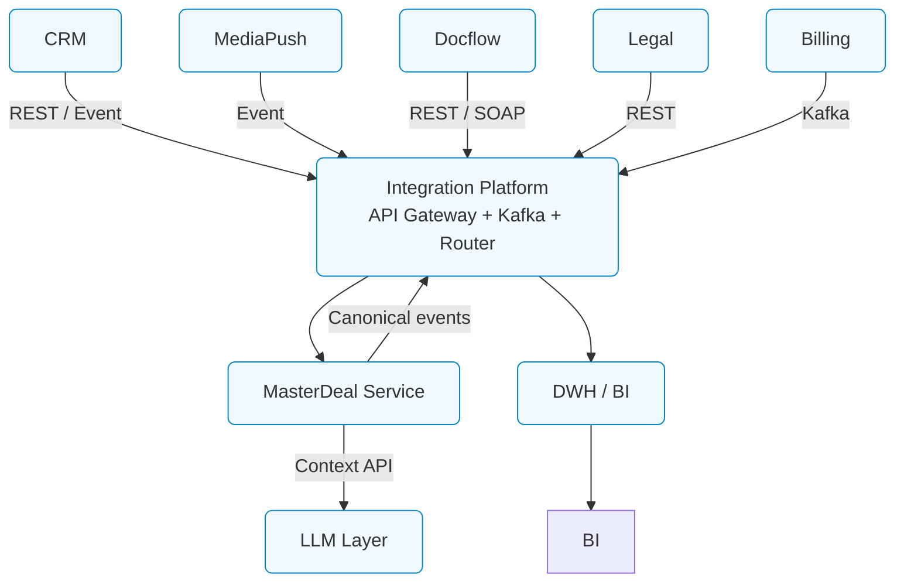

# **12. Технологический стек и инфраструктура**

---

## **12.1. Применяемые технологии и платформы**

Архитектура рекламной вертикали **adTech МТС Stream** строится на основе корпоративного технологического ландшафта МТС
и принципов **Service-Oriented Architecture (SOA)** с событийной моделью обмена данными (**EDA**).
Каждый домен реализован как независимый сервис или платформа, взаимодействующая через **Integration Platform**.

| Слой                               | Система / Платформа                                                  | Технологии                          | Назначение                                                        |
| ---------------------------------- |----------------------------------------------------------------------| ----------------------------------- | ----------------------------------------------------------------- |
| **CRM-домен**                      | **Salesforce / Microsoft Dynamics / Битрикс24 (интеграция CRM API)** | REST API, Webhooks                  | Управление лидами, сделками, контактами, КП, брифами              |
| **MediaPush-домен**                | Custom Web-сервис на Node.js / Golang                                | REST, Kafka                         | Формирование медиапланов, запуск рекламных кампаний               |
| **Task-Tracker**                   | Jira / YouTrack / Custom BPMN engine                                 | REST, Webhooks                      | Управление задачами между ролями (Sales, Account, Traffic, Legal) |
| **Docflow-ops**                    | Directum / Docsvision / ЭДО API                                      | SOAP/REST                           | Управление документами, договорами, УПД                           |
| **Legal-ops**                      | 1C:ЮрОтдел / Custom Legal Portal                                     | REST                                | Проверка и согласование документов                                |
| **DCM (Billing)**                  | 1С / SAP / Custom Billing API                                        | Kafka, REST                         | Финансовые операции, сверки, счета, УПД                           |
| **Integration Platform (ESB)**     | **MTS Integration Hub** / WSO2 / MuleSoft / Apache Camel             | Kafka, REST, Avro                   | Транспорт и маршрутизация событий между доменами                  |
| **Operational MasterDeal Service** | Custom Service (Golang + PostgreSQL)                                 | REST, Kafka Streams, Outbox Pattern | Агрегация стадий, SLA, канонические события                       |
| **Data Warehouse (DWH)**           | ClickHouse / Greenplum / PostgreSQL / Hadoop                         | Kafka Connect, Airflow              | Консолидация данных и аналитика SLA / KPI                         |
| **AI / LLM Layer**                 | OpenAI API / MTS GPT / HuggingFace / LangChain                       | REST / gRPC                         | Генерация медиапланов, анализ брифов и документов                 |
| **BI и мониторинг**                | Power BI / Grafana / Superset                                        | SQL, PromQL                         | Визуализация KPI, SLA, NPS и метрик процессов                     |

---

## **12.2. Интеграционный слой**

Интеграционный слой объединяет все домены, обеспечивая **единое информационное пространство**
и стандартизированный обмен событиями и API.
Он реализован на корпоративной платформе **Integration Platform**, которая включает несколько ключевых компонентов.

### **12.2.1. Компоненты интеграционного слоя**

| Компонент                      | Технология                                              | Назначение                                                               |
| ------------------------------ | ------------------------------------------------------- | ------------------------------------------------------------------------ |
| **API Gateway**                | Kong / Apigee / WSO2 API Manager                        | Централизованный доступ к API доменов, управление версиями, безопасность |
| **Event Bus (Message Broker)** | Apache Kafka (основной) / RabbitMQ (синхронные очереди) | Асинхронный обмен событиями между доменами                               |
| **Schema Registry**            | Confluent Schema Registry                               | Хранение схем сообщений (Avro / JSON Schema)                             |
| **Event Router**               | Apache Camel / Spring Cloud Stream                      | Маршрутизация событий и трансформация форматов                           |
| **Integration Registry**       | PostgreSQL + GraphQL API                                | Реестр интеграций, доменных связей и master_deal_id                      |
| **Monitoring Layer**           | Prometheus + Grafana + Loki                             | Мониторинг API, событий и SLA                                            |
| **Security Gateway**           | Keycloak / MTS IAM                                      | Авторизация, аутентификация, контроль доступа (RBAC, OAuth2)             |

---

### **12.2.2. Потоки данных в интеграционном слое**

🧩 **Смысловая логика:**

* Integration Platform обеспечивает **двустороннюю коммуникацию**:
  → от доменов к MasterDeal (сырые события)
  ← от MasterDeal к DWH / BI / AI (канонические события).
* Все события проходят через **схемную валидацию и версионирование**,
  что гарантирует совместимость систем и минимизирует регрессы при изменениях.

---

## **12.3. Безопасность, аутентификация и аудит**

Безопасность данных — обязательный элемент архитектуры.
Для всей экосистемы применяются **корпоративные стандарты безопасности МТС**,
включая **Zero Trust Architecture**, шифрование, токены и централизованный аудит.

### **12.3.1. Аутентификация и авторизация**

| Компонент                   | Механизм                                    | Примечание                                                |
| --------------------------- | ------------------------------------------- | --------------------------------------------------------- |
| **API Gateway**             | OAuth 2.0 / OpenID Connect (Keycloak / IAM) | Авторизация и управление доступом к API                   |
| **Event Bus**               | ACL / SASL / TLS                            | Доступ к Kafka-топикам только для авторизованных сервисов |
| **MasterDeal API**          | JWT Tokens, RBAC                            | Разграничение ролей: reader, publisher, admin             |
| **Integration Platform UI** | SSO / LDAP Integration                      | Единая точка входа в интерфейсы администрирования         |

### **12.3.2. Аудит и контроль доступа**

* Все события и API-запросы содержат `correlation_id`, `event_id` и `user_id`.
* Ведение **журнала действий** (audit log) с хранением 180 дней.
* **PII-маскирование** при передаче данных в DWH или LLM.
* **Security Monitoring** через SIEM-платформу (например, QRadar / Splunk).
* **Реестр разрешённых сервисных учётных записей (Service Accounts Registry)**.

### **12.3.3. Защита данных**

* Шифрование “в покое” (AES-256) и “в полёте” (TLS 1.3).
* Контроль целостности сообщений и проверка подписи (HMAC).
* Лимитирование запросов (Rate Limiting) на уровне API Gateway.
* Использование **mTLS** для критичных сервисов (MasterDeal ↔ DWH ↔ Kafka).
* Изоляция сетей (VPC, Security Groups, VPN между доменами).

---

## **12.4. DevOps-подход (CI/CD, мониторинг, observability)**

### **12.4.1. CI/CD и управление релизами**

| Этап                              | Инструменты                              | Описание                                      |
| --------------------------------- | ---------------------------------------- | --------------------------------------------- |
| **Сборка и тестирование**         | GitLab CI / Jenkins                      | Unit, API, Integration тесты                  |
| **Контейнеризация**               | Docker / Podman                          | Унификация окружений                          |
| **Развертывание**                 | Kubernetes / ArgoCD / Helm               | Автоматизация rollout, blue-green деплой      |
| **Управление конфигурациями**     | Helm Charts / ConfigMaps / Secrets       | Хранение параметров окружения                 |
| **Контроль версий API и событий** | OpenAPI / AsyncAPI + Semantic Versioning | Предотвращение несовместимости между доменами |
| **Rollback и Feature Flags**      | Argo Rollouts / LaunchDarkly             | Безопасное управление изменениями             |

---

### **12.4.2. Observability и мониторинг**

Инфраструктура построена по принципу **Observability-first**,
чтобы обеспечивать **видимость бизнес-процессов и SLA в реальном времени**.

| Категория                | Инструменты                                 | Метрики                                           |
| ------------------------ | ------------------------------------------- | ------------------------------------------------- |
| **Metrics**              | Prometheus + Grafana                        | Количество событий, SLA-таймеры, задержки, ошибки |
| **Logs**                 | Loki / ELK                                  | Журналы по master_deal_id, event_id, user_id      |
| **Traces**               | Jaeger / OpenTelemetry                      | Распределённая трассировка цепочек между доменами |
| **Alerting**             | OpsGenie / PagerDuty                        | Уведомления при сбоях SLA, задержках или ошибках  |
| **Synthetic Monitoring** | K6 / Postman Monitors                       | Проверка доступности API и Kafka-топиков          |
| **Business Dashboards**  | Grafana / Power BI / United Stage Dashboard | Визуализация pipeline, SLA и KPI                  |

---

### **12.4.3. Управление окружениями**

| Окружение | Назначение                    | Особенности                                     |
| --------- | ----------------------------- | ----------------------------------------------- |
| **DEV**   | Разработка и unit-тесты       | Mock API, автогенерация событий                 |
| **STAGE** | Интеграционное тестирование   | Полный набор доменов и Kafka-топиков            |
| **UAT**   | Пользовательское тестирование | Проверка SLA и сценариев                        |
| **PROD**  | Боевая эксплуатация           | Автоматическое масштабирование, мониторинг 24×7 |

---

## **12.5. Итог по разделу**

Технологический стек рекламной вертикали **adTech МТС Stream**
построен на принципах **сервисности, событийности, безопасности и автоматизации**.

* **Integration Platform** обеспечивает маршрутизацию, API-менеджмент и транспорт событий.
* **MasterDeal Service** координирует бизнес-логику и сквозные стадии.
* **DWH и BI** формируют аналитическую правду и KPI-дэшборды.
* **LLM Layer** — добавляет интеллектуальную автоматизацию.
* **CI/CD и Observability** гарантируют управляемость и надёжность поставки изменений.

> 💡 Таким образом, технологическая инфраструктура не просто поддерживает бизнес,
> а становится **катализатором скорости, прозрачности и инноваций** в экосистеме МТС Stream.