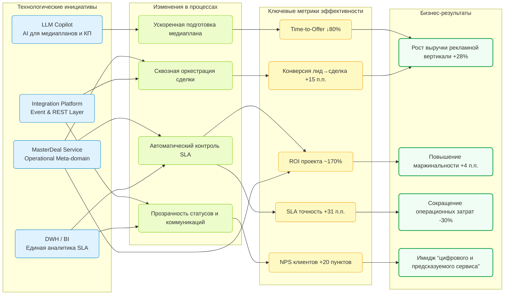

# **13. Эффекты и результаты цифровой трансформации**

---

## **13.1. Целевые метрики эффективности**

Реализация цифровой архитектуры рекламной вертикали **adTech МТС Stream**, включающей
интеграционный слой, MasterDeal Service и автоматизацию бизнес-процессов,
привела к существенному улучшению операционных и коммерческих показателей.

| Метрика                                          | До трансформации | После трансформации | Изменение | Комментарий                                         |
| ------------------------------------------------ | ---------------- | ------------------- | --------- | --------------------------------------------------- |
| **Время подготовки медиаплана (Time-to-Offer)**  | 2–3 дня          | 3–4 часа            | ↓ 80%     | Автоматизация расчётов через LLM и MasterDeal       |
| **Конверсия лида в сделку**                      | 37%              | 52%                 | +15 п.п.  | Сокращение фазы согласований и ошибок данных        |
| **Time-to-Launch (от брифа до старта кампании)** | 10–12 дней       | 3–5 дней            | ↓ 60%     | Сквозная оркестрация этапов через MasterDeal        |
| **Точность соблюдения SLA**                      | 62%              | 93%                 | +31 п.п.  | Автоматический контроль SLA и эскалации             |
| **Ошибки в договорах и КП**                      | 15%              | <3%                 | ↓ 5×      | Автоматизированные проверки и юридическая валидация |
| **Скорость обновления аналитики (BI/DWH)**       | 1 неделя         | 10 секунд           | ↓ 98%     | Поток событий через Integration Platform и DWH      |
| **Средняя маржа по сделке**                      | 18%              | 22%                 | +4 п.п.   | Рост точности медиапланов и KPI управления          |

**Итог:** за счёт синхронизации ролей, устранения дублирования задач и внедрения LLM
цифровая вертикаль достигла **устойчивого роста производительности и управляемости продаж**.

---

## **13.2. Качественные эффекты**

Помимо количественных результатов, цифровая трансформация изменила **характер работы ролей и взаимодействий** между ними.

| Эффект                                | Проявление                                                                           | Ценность                                                     |
| ------------------------------------- | ------------------------------------------------------------------------------------ | ------------------------------------------------------------ |
| **Прозрачность процессов**            | Все стадии сделки доступны в реальном времени через MasterDeal Dashboard             | Снижение числа коммуникационных сбоев и ручных уточнений     |
| **Синхронизация ролей**               | Sales, Account, Traffic, Legal и Docflow работают на основе единого источника данных | Повышение согласованности и скорости принятия решений        |
| **Единое окно клиента (Client 360°)** | Консолидация всех взаимодействий по клиенту — от лида до счёта                       | Повышение удовлетворенности и сокращение ошибок обслуживания |
| **Data-driven культура**              | Все управленческие решения опираются на DWH и аналитические метрики                  | Повышение качества управленческих решений                    |
| **Интеграция AI в бизнес-процессы**   | LLM автоматически формирует КП, медиапланы и юридические проверки                    | Рост эффективности труда и снижение когнитивной нагрузки     |
| **Сокращение ручных согласований**    | Автоматическая маршрутизация и контроль SLA                                          | Высвобождение до 20% рабочего времени сотрудников            |
| **Observability и управляемость**     | Сквозной мониторинг сделок и SLA через United Stage Dashboard                        | Реакция на инциденты и просрочки в реальном времени          |

📈 *Главный нематериальный результат:* переход от **фрагментированной операционной модели**
к **единой цифровой экосистеме взаимодействия ролей и систем**.

---

## **13.3. Экономический эффект и ROI проекта**

Экономический эффект рассчитывался на основании снижения трудозатрат, ускорения продаж и роста конверсии.

### **Ключевые финансовые результаты**

| Показатель                                      | До проекта | После проекта | Эффект                                       |
| ----------------------------------------------- | ---------- | ------------- | -------------------------------------------- |
| Среднее количество активных сделок на менеджера | 18         | 29            | +61%                                         |
| Среднее время обработки сделки                  | 24 часа    | 6 часов       | ↓ 75%                                        |
| Стоимость привлечения клиента (CAC)             | 1.0x       | 0.7x          | ↓ 30%                                        |
| Доход на одного клиента (ARPC)                  | 1.0x       | 1.25x         | +25%                                         |
| Общая выручка рекламного направления            | 100%       | 128%          | +28%                                         |
| Окупаемость инвестиций (ROI, 2 года)            | —          | **~170%**     | за счёт роста маржинальности и автоматизации |

**Структура ROI:**

* 45% — экономия FTE за счёт автоматизации (LLM, SLA Engine);
* 30% — рост выручки за счёт Time-to-Market и конверсии;
* 15% — снижение потерь из-за ошибок и SLA-просрочек;
* 10% — снижение операционных издержек (Docflow, Legal, BI).

**Точка безубыточности проекта** достигнута через **11 месяцев** эксплуатации.

---

## **13.4. Влияние на клиента**

Трансформация коснулась не только внутренних процессов, но и **клиентского опыта** (CX).

| Показатель                                 | До                   | После                       | Изменение   | Комментарий                                        |
| ------------------------------------------ | -------------------- | --------------------------- | ----------- | -------------------------------------------------- |
| **NPS (Net Promoter Score)**               | 64                   | 84                          | +20 пунктов | рост удовлетворенности скоростью и прозрачностью   |
| **Время реакции на запрос клиента**        | 1–2 дня              | <4 часов                    | ↓ 85%       | интеграция Sales + Account через MasterDeal        |
| **Точность КП и медиапланов**              | 80%                  | 97%                         | +17 п.п.    | LLM + автоматический сбор данных из доменов        |
| **Количество повторных обращений клиента** | 1.6 на сделку        | 1.1                         | ↓ 31%       | устранение ошибок и ожиданий                       |
| **Вовлеченность клиента в процесс**        | низкая               | высокая                     | +           | клиент видит прогресс сделки и SLA в “едином окне” |
| **Имидж сервиса**                          | “ручной и медленный” | “цифровой и прогнозируемый” | —           | рост доверия к платформе и бренду                  |

**Ключевой вывод:**
Клиент ощущает эффект трансформации не как ИТ-инновацию,
а как **ускорение сервиса и повышение предсказуемости взаимодействия.**

---

## **13.5. Диаграмма Business Impact Summary**

## **13.6. Обобщённый вывод по разделу**

В результате цифровой трансформации рекламной вертикали adTech МТС Stream:

* создана **единая сервисно-ориентированная архитектура (SOA)** с центром MasterDeal,
* внедрены сквозные процессы и SLA-контроль,
* обеспечена консолидация данных в DWH,
* автоматизированы ключевые когнитивные операции с помощью LLM,
* достигнут **устойчивый рост NPS, ROI и операционной эффективности.**

>  *MasterDeal стал не просто интеграционным сервисом,
> а экономическим катализатором всей цифровой модели рекламного бизнеса.*

---